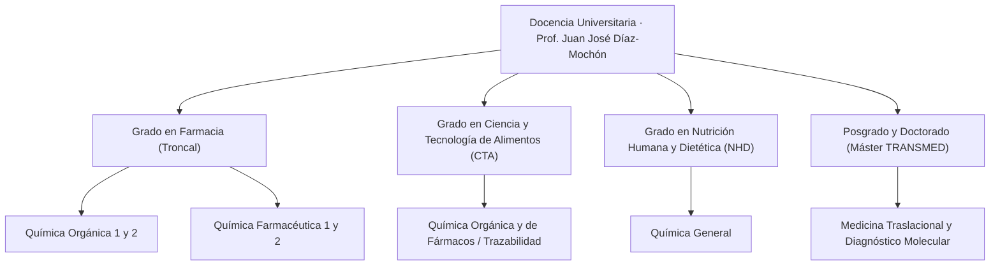

# Marco y Filosofía Docente Universitaria: Prof. Dr. Juan José Díaz-Mochón

## 1. Introducción y Compromiso Docente
La actividad docente del **Prof. Dr. Juan José Díaz-Mochón** en la Universidad de Granada abarca más de dos décadas de dedicación ininterrumpida a la formación de profesionales farmacéuticos, científicos biomédicos y tecnólogos de alimentos. 

Su modelo pedagógico se fundamenta en trasladar la investigación de frontera y la experiencia industrial en química traslacional a las aulas universitarias, sustituyendo el aprendizaje memorístico por la deducción lógica a partir de primeros principios fisicoquímicos.

---

## 2. Acreditación de Calidad y Rendimiento Docente

- **5 Quinquenios Docentes**: Reconocidos oficialmente por la Universidad de Granada, acreditando 25 años de labor universitaria evaluada favorablemente.
- **Calificación DOCENTIA UGR: 4,78 / 5,00**: Puntuación media histórica en las encuestas de opinión de los estudiantes (95,6% de satisfacción), situando su docencia de forma continuada en el percentil superior de excelencia docente.
- **Innovación y Digitalización**: Pionero en la integración de plataformas de evaluación formativa continua en la UGR, empleando herramientas web interactivas, cuadernos de laboratorio digitales y análisis de datos clínicos reales.

---

## 3. Principios Pedagógicos Fundamentales

1. **La Química como Código Predictivo**: En lugar de exigir la memorización pasiva de cientos de reacciones heterogéneas, se enseña al estudiante a identificar centros nucleófilos y electrófilos, tensiones conformacionales y balances termodinámicos (entalpía vs. entropía).
2. **Conexión Directa con la Farmacología y la Clínica**: Cada transformación química de un grupo funcional se conecta con su implicación biológica: permeabilidad a través de barreras biológicas, solubilidad acuosa, metabolismo oxidativo por citocromos P450 o formación de metabolitos reactivos.
3. **Evaluación Formativa y Continua**: El aprendizaje se monitoriza semana a semana mediante casos clínicos reales, resolución guiada de problemas en seminarios y talleres de diseño molecular asistido por ordenador.
4. **Desarrollo del Sentido Crítico en el Laboratorio**: Las prácticas de laboratorio no son recetas automáticas; se estructuran para que el alumno aprenda a aislar, caracterizar por RMN/HPLC y justificar el rendimiento y pureza de cada compuesto sintetizado.

---

## 4. Estructura del Catálogo Docente

- `[[QO_UGR]]`: Química Orgánica (2º Grado en Farmacia). Fundamentos estereoquímicos y mecanismos de reacción.
- `[[QFUNO]]`: Química Farmacéutica I (3º Grado en Farmacia). Diseño molecular de fármacos, dianas y farmacocinética ADME.
- `[[QFDOS]]`: Química Farmacéutica II (4º Grado en Farmacia). Quimioterapia antiinfecciosa, oncológica y fármacos del sistema nervioso y cardiovascular.
- `[[TRANSMED]]`: Máster en Medicina Traslacional. Biopsia líquida, validación diagnóstica, normativa ISO 13485 y transferencia al paciente.
