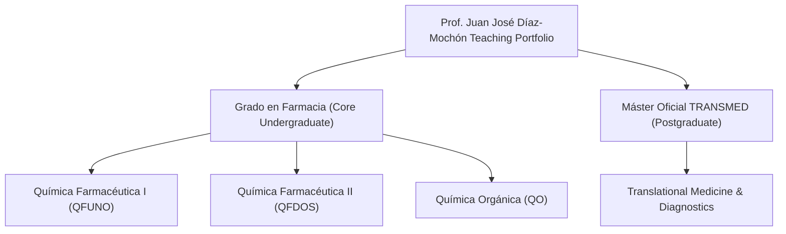

# Courses and Teaching Overview: Prof. Juan José Díaz-Mochón

## Overview
Dr. Juan José Díaz-Mochón teaches organic, medicinal, and translational chemistry in the Faculty of Pharmacy at the Universidad de Granada (UGR). 

His pedagogical framework is structured around a central thesis: **Biology is a processing system, and Chemistry is the low-level code that programs it.** Rather than forcing students to memorize thousands of biochemical reactions and structures as static trivia, his courses teach students to read, debug, and compile chemical structures to interface with biological systems.

---

## Core Pedagogy & Teaching Principles
1. **First-Principles Thinking**: Break down complex biological responses to simple electrostatic interactions, thermodynamic equilibria, and nucleophile-electrophile dynamics.
2. **From Bench to Bedside**: Bridge the gap between a chemical structure on paper and its real-world pharmacological, regulatory, and commercial fate.
3. **Active/Digital Evaluation**: Integration of interactive educational tools, continuous evaluation systems (e.g., Google Sites, custom web tools), and real-world case studies (e.g., analyzing clinical trial data).
4. **Demystifying the "Magic"**: Tackle common student misconceptions (such as treating enzymes as magical actors rather than chemical catalysts subject to standard physical organic laws).

---

## 🏆 Calidad y Trayectoria Docente Reconocida
- **Quinquenios Docentes**: **5 Quinquenios** reconocidos por la Universidad de Granada (25 años de labor docente universitaria evaluada favorablemente).
- **Satisfacción Estudiantil (DOCENTIA)**: **4.78 sobre 5.00** (95.6% de valoración media histórica en las encuestas de calidad docente de la UGR, situándose en el rango de excelencia).
- **Proyectos de Innovación Docente (PID)**: Incorporación continua de metodologías activas y plataformas digitales interactivas.

---

## Curriculum Structure

The teaching portfolio consists of four main pillars:

### 1. Química Farmacéutica I (QFUNO) & II (QFDOS)
* **Focus**: Designing, synthesizing, and understanding the mechanisms of active pharmaceutical ingredients (APIs). QFUNO focuses on target validation, pharmacodynamics, pharmacokinetics (ADME), and lead optimization. QFDOS delves into specific therapeutic classes (e.g., anti-infectives, oncologics, cardiovascular agents).
* **Target Audience**: Third and fourth-year Grado en Farmacia students.

### 2. Química Orgánica (QO)
* **Focus**: Building the synthetic toolkit. Understanding functional group reactivity, stereochemistry, and reaction mechanisms (substitution, elimination, addition). Integrates modern techniques like microwave-assisted synthesis and solid-phase synthesis.
* **Target Audience**: Second-year Grado en Farmacia students.

### 3. Máster Universitario en Investigación y Desarrollo de Medicamentos & Máster TRANSMED
* **Focus**: The translational pathway. Bridging laboratory-scale molecular diagnostics (like liquid biopsy miR-122 panels) to commercialization and clinical regulation (ISO 13485 standards, clinical validation checklists, and patent filings).
* **Target Audience**: Postgraduate and PhD students.

---

## Connections
- **Related Profile**: `[[Professor_Profile]]`, `[[Research_Overview]]`
- **Related Courses**: `[[QFUNO]]`, `[[QFDOS]]`, `[[QO_UGR]]`, `[[TRANSMED]]`
- **Related Methods**: `[[Dynamic_Chemical_Labeling]]`, `[[drug2cell_Pipeline]]`
