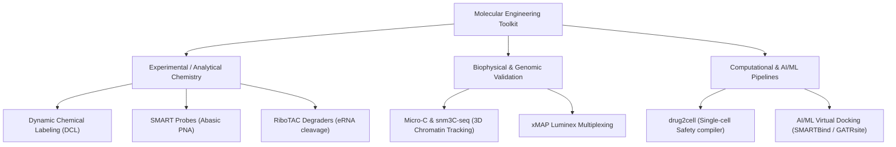

# Methods, Protocols, and Technologies Overview

## Overview
This section catalogues the foundational experimental and computational methodologies that power Dr. Juan José Díaz-Mochón's research. 

By framing these biological and chemical techniques through an engineering lens, we analyze the biological cell as a complex distributed system, where:
- **Macromolecules** are physical datasets and instructions.
- **Diagnostics** are targeted pattern-matching queries.
- **Therapeutics (like degraders)** are garbage collection scripts designed to purge pathologically elevated instruction loops.

---

## Detailed Catalog

### 1. Experimental & Chemical Synthesis Methods
- `[[Dynamic_Chemical_Labeling]]`: Reversible thermodynamic reaction to selectively label DNA/RNA single nucleotide polymorphisms (SNVs) without enzymes.
- `[[SMART_Probes]]`: Designing Peptide Nucleic Acid (PNA) sequences containing an abasic site, acting as a molecular template to direct DCL reactions.
- `[[RiboTAC_Degraders]]`: Synthesizing heterobifunctional molecules that bind a target non-coding RNA (eRNA) and recruit endogenous RNase L for catalytic degradation.

### 2. Biophysical & Spatial Genomic Methods
- `[[Micro_C_snm3C_seq]]`: Tracking three-dimensional genomic architectures (Enhancer-Promoter loops) and capturing chromatin conformation changes following eRNA depletion.
- `[[DNA_Encoded_Libraries]]`: Constructing and screening chemical libraries (>10^8 members) on DNA tags to identify high-affinity tertiary RNA binders.

### 3. Computational & Single-Cell Genomics Methods
- `[[drug2cell_Pipeline]]`: An analytical pipeline that maps drug-target (and eRNA-target) interactions across millions of human single-cell transcriptomes, acting as an off-target safety compiler.

---

## Connections
- **Related Profile**: `[[Professor_Profile]]`, `[[Research_Overview]]`
- **Related Projects**: `[[LIQBIOPSENS]]`
- **Related Courses**: `[[QFUNO]]`, `[[TRANSMED]]`
