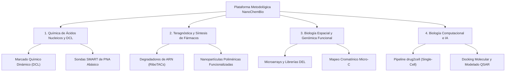

# Catálogo Metodológico y Tecnológico: Laboratorio NanoChemBio

## 1. Visión General de la Plataforma Metodológica
El grupo de investigación codirigido por el **Prof. Dr. Juan José Díaz-Mochón** en la Universidad de Granada y el Centro GENYO integra herramientas multidisciplinares que combinan la **química orgánica sintética**, la **nanobiotecnología**, la **biología celular** y la **bioinformática de célula única**.

---

## 2. Metodologías Clave Documentadas en el LLM-Wiki

### 1. Química Bioorgánica y Detección Molecular Directa
- `[[Dynamic_Chemical_Labeling]]`: Tecnología de detección de variaciones genéticas y microRNAs basada en química covalente reversible sin enzimas de amplificación.
- `[[SMART_Probes]]`: Diseño y síntesis en fase sólida de sondas de Ácido Nucleico Peptídico (PNA) dotadas de una cavidad abásica catalítica.

### 2. Terapias Dirigidas al Transcriptoma y Nanomedicina
- `[[RiboTAC_Degraders]]`: Quimeras bifuncionales que reclutan la ribonucleasa endógena RNasa L para la degradación selectiva de ARNs no codificantes y transcritos oncogénicos.
- `[[DNA_Encoded_Libraries]]`: Síntesis y cribado de quimiotecas moleculares de gran diversidad (>10^8 miembros) marcadas con códigos de barras de ADN.

### 3. Epigenómica Estructural y Cribado Computacional
- `[[Micro_C_snm3C_seq]]`: Cartografiado a resolución de nucleosoma de la arquitectura tridimensional de la cromatina y del colapso de bucles enhancer-promotor.
- `[[drug2cell_Pipeline]]`: Plataforma bioinformática que cruza transcriptomas de célula única con bases de datos de afinidad fármaco-diana para evaluar la seguridad toxicológica in silico.
