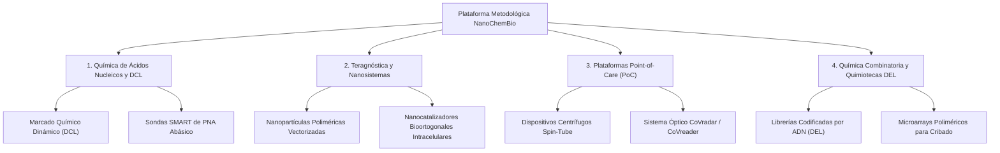

# Catálogo Metodológico y Tecnológico: Laboratorio NanoChemBio

## 1. Visión General de la Plataforma Metodológica
El grupo de investigación codirigido por el **Prof. Dr. Juan José Díaz-Mochón** en la Universidad de Granada y el Centro GENYO integra herramientas multidisciplinares consolidadas que combinan la **química orgánica sintética**, la **química biológica de ácidos nucleicos**, la **nanobiotecnología** y el **desarrollo de dispositivos de diagnóstico molecular**.

```mermaid
graph TD
    A["Plataforma Metodológica NanoChemBio"] --> B["1. Química de Ácidos Nucleicos y DCL"]
    A --> C["2. Teragnóstica y Nanosistemas"]
    A --> D["3. Plataformas Point-of-Care (PoC)"]
    A --> E["4. Química Combinatoria y Quimiotecas DEL"]
    
    B --> F["Marcado Químico Dinámico (DCL)"]
    B --> G["Sondas SMART de PNA Abásico"]
    
    C --> H["Nanopartículas Poliméricas Vectorizadas"]
    C --> I["Nanocatalizadores Bioortogonales Intracelulares"]
    
    D --> J["Dispositivos Centrífugos Spin-Tube"]
    D --> K["Sistema Óptico CoVradar / CoVreader"]
    
    E --> L["Librerías Codificadas por ADN (DEL)"]
    E --> M["Microarrays Poliméricos para Cribado"]
```

---

## 2. Metodologías Clave Documentadas en el LLM-Wiki

### 1. Química Bioorgánica y Detección Molecular Directa (PCR-Free)
- [[Dynamic_Chemical_Labeling]]: Tecnología de detección de variaciones genéticas y microRNAs basada en química covalente reversible sin necesidad de enzimas de amplificación ni retrotranscripción.
- [[SMART_Probes]]: Diseño y síntesis en fase sólida de sondas de Ácido Nucleico Peptídico (PNA) dotadas de una cavidad abásica catalítica para la incorporación selectiva de nucleobases funcionalizadas (*SMART bases*).

### 2. Química Combinatoria y Quimiotecas Codificadas
- [[DNA_Encoded_Libraries]]: Síntesis en soporte sólido y cribado de quimiotecas moleculares de gran diversidad (>10^8 miembros) codificadas mediante etiquetas moleculares y ADN/PNA para identificación de ligandos de alta afinidad.

### 3. Nanomedicina y Teragnóstica Farmacéutica
- **Nanopartículas Poliméricas Monodispersas**: Plataformas de transporte y liberación dirigida de fármacos y agentes de imagen, funcionalizadas con anticuerpos y ligandos bioespecíficos (desarrolladas en tesis doctorales y patentes internacionales).
- **Nanocatalizadores Bioortogonales**: Nanosistemas catalíticos basados en metales de transición (paladio) capaces de catalizar reacciones bioortogonales de liberación de profármacos en el interior de células tumorales vivas.

### 4. Dispositivos Diagnósticos Portátiles (Point-of-Care)
- **Plataforma Spin-Tube**: Cartuchos miniaturizados adaptados a tubos de centrífuga estándar para la purificación y análisis directo de biomarcadores en entornos de recursos limitados.
- **Sistema CoVradar / CoVreader**: Integración de química de marcado rápido con lectura óptica y procesamiento en smartphones para detección in situ de patógenos y biomarcadores clínicos.
