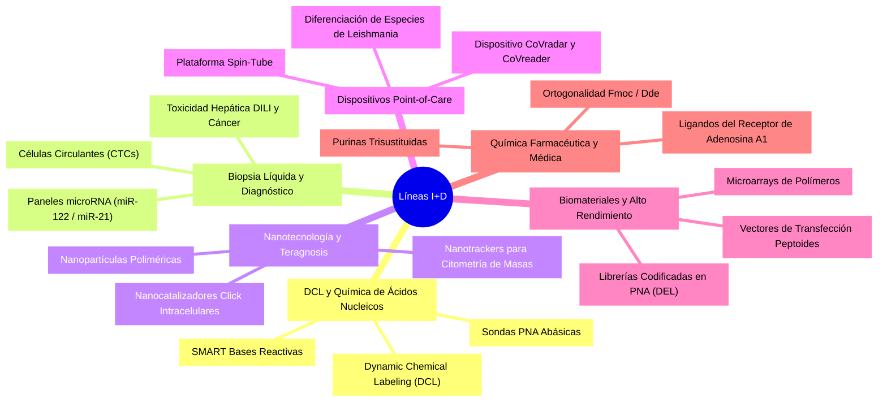

# Research Overview: Dr. Juan José Díaz-Mochón

## Overview
Dr. Juan José Díaz-Mochón’s research operates at the interface of chemistry, biology, and medicine. By treating nucleic acid hybridization and chemical reactions as a **highly selective molecular code**, the lab designs tools that read, translate, and therapeutic-modify biological systems without relying on bulky enzymatic amplification steps (like PCR).

His research program is organized into 6 core axes (Líneas de Investigación):

---

## Key Points
- **Amplification-Free Molecular Diagnostics**: Replacing PCR with direct chemical labeling (DCL) to reduce assay cost, runtime, and enzyme susceptibility to clinical serum inhibitors.
- **Translational Pipeline**: Moving from fundamental organic synthesis of purines and PNAs to clinical trials in acute liver injury and point-of-care infectious disease diagnostics.
- **Multidisciplinary Synergy**: Chemical synthesis, nanotechnology-driven delivery, smartphone-based reading algorithms, and computational modeling.

---

## The 6 Research Axes

### 1. Dynamic Chemistry & Nucleic Acid Analysis (DCL)
- **Scope**: Developing chemical methods to read genomic sequences at single-nucleotide resolution.
- **Core Technology**: **Dynamic Chemical Labeling (DCL)**. When an abasic PNA probe binds to a target DNA/RNA, it leaves a "blank" space directly opposite the single nucleotide variation (SNV) of interest. A reactive fluorescent or biotinylated base (SMART base) is introduced, which dynamically pairs with the target base and is chemically ligated into the PNA backbone under thermodynamic control.
- **Impact**: Enables mutation calling and microRNA profiling directly in human serum with zero PCR.
- **Key Papers**: Bowler et al. - 2010 (Angew. Chem.), Marín-Romero et al. - 2018 (Analyst).

### 2. Liquid Biopsy & Circulating Biomarkers
- **Scope**: Non-invasive tracking of diseases (cancer, liver toxicity) using blood/plasma.
- **Key Targets**:
  * **microRNA-122 (miR-122)**: Highly sensitive liver injury marker used to diagnose paracetamol hepatotoxicity (DILI).
  * **microRNA-21 (miR-21)**: Well-known oncology biomarker.
  * **Circulating Tumor Cells (CTCs) & Circulating Lung Cells**: Visualizing tissue damage and cellular shedding in cancer and severe COPD/COVID-19.
- **Clinical Integration**: Working with the NHS (Edinburgh) and Andalusian Health Service (SAS) to validate panels on Luminex MAGPIX and Quanterix platforms.
- **Key Papers**: López-Longarela et al. - 2020 (Anal. Chem.), Alzeer et al. - 2025 (Br. J. Clin. Pharmacol.).

### 3. Nanotechnology & Theranostics
- **Scope**: Building multifunctional carrier nanoparticles that double as diagnostics (imaging) and targeted therapeutics (drug delivery).
- **Core Reagents**: Polymer nanoparticles functionalized with antibodies (e.g., anti-EGFR) for selective uptake in tumor co-cultures; palladium-based hybrid nanotrackers for mass spectrometry barcoding of live cells.
- **Intracellular Catalysis**: Tracker nanocatalysts capable of screening and driving copper-catalyzed click chemistry (CuAAC) inside living cells.
- **Key Papers**: Cano-Cortes et al. - 2021 (Nanoscale), Rodríguez-Segura et al. - 2025 (Small).

### 4. Point-of-Care (PoC) & Rapid Diagnostics
- **Scope**: Creating low-cost diagnostic hardware readable by entry-level mobile devices, optimized for low-resource settings.
- **Key Platforms**:
  * **DestiNA Spin-Tube**: A centrifuge tube diagnostic combining membrane-bound PNA probes and colorimetric output.
  * **CoVradar & CoVreader**: Smartphone-based reading system for rapid SARS-CoV-2 RNA detection directly in centrifuge tubes.
  * **Leishmaniasis Assay**: Differentiating mucocutaneous (severe) from cutaneous Leishmania species by targeting single nucleotide differences in the hsp70 gene.
- **Key Papers**: Martín-Sierra et al. - 2023 (Biosens. Bioelectron.), Villao et al. - 2025 (Talanta).

### 5. High-Throughput Biomaterials & Combinatorial Chemistry
- **Scope**: Printing and screening massive chemical libraries to discover novel cell-culture substrates and target ligands.
- **Core Technologies**:
  * **Polymer Microarrays**: Printing hundreds of distinct polymer formulations on a single glass slide to identify substrates for stem cell growth or macrophage phagocytosis.
  * **PNA-Encoded Peptide Libraries**: Synthesizing 10,000-member peptide libraries on beads where each peptide is "barcoded" by a PNA sequence, decoded after cell-binding assays by simple PCR.
- **Key Papers**: Pernagallo et al. - 2008 (Biomed. Mater.), Svensen et al. - 2011 (Chem. Biol.).

### 6. Organic Synthesis & Medicinal Chemistry
- **Scope**: De novo synthesis of heterocyclic drug candidates and optimized coupling protocols.
- **Key Achievements**:
  * **Trisubstituted Purines**: One-pot syntheses of 6-, 8-, 9-substituted adenines acting as selective adenosine A1 receptor antagonists with antiproliferative or antiparasitic (trypanocidal) activity.
  * **Fmoc/Dde Orthogonality**: Synthesizing PNA-peptide conjugates using microwave-assisted organic chemistry with fully orthogonal protecting groups.
- **Key Papers**: Pineda de las Infantas et al. - 2015 (Org. Biomol. Chem.), Córdoba-Gómez et al. - 2025 (Bioorg. Chem.).

---

## Key Collaborators & Institutions
- **Prof. Mark Bradley** (University of Edinburgh): High-throughput synthesis, polymer arrays, biomaterials.
- **Prof. James W. Dear** (University of Edinburgh / Royal Infirmary): Clinical toxicology, paracetamol overdose cohorts, DILI biomarker validation.
- **Prof. Angel Orte** (Universidad de Granada, Dept. Química Física): Time-gated fluorescence, lifetime filtering imaging, multiplexed microRNA biosensors.
- **Prof. Rosario María Sánchez-Martín** (UGR, Faculty of Pharmacy): Nanoparticle design, intracellular delivery, theranostic formulation.
- **Dr. Francisco Martín** (GENYO / SAS): Gene editing, CRISPR-Cas13 tools, CRISPNA platform.

---

## Connections
- **Related Pages**: `[[Professor_Profile]]`, `[[Universidad_de_Granada]]`, `[[GenYo]]`, `[[DestiNA_Genomica]]`
- **Related Methods**: `[[Dynamic_Chemical_Labeling]]`, `[[RiboTAC_Degraders]]`, `[[drug2cell_Pipeline]]`
