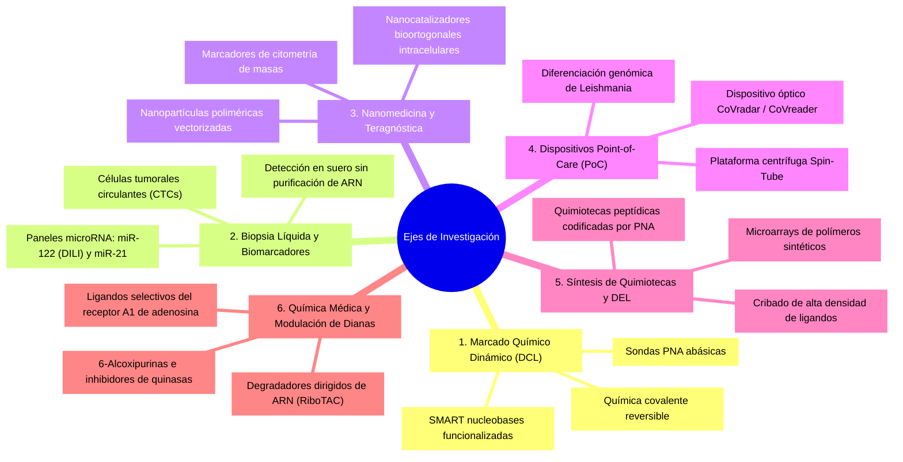

# Líneas de Investigación y Producción Científica: Prof. Dr. Juan José Díaz-Mochón

## 1. Visión General del Programa Científico
La actividad investigadora del Prof. Dr. Juan José Díaz-Mochón se sitúa en la frontera convergente entre la **química orgánica sintética**, la **química biológica** y la **medicina molecular traslacional**. 

El pilar central de su investigación consiste en emplear las reacciones orgánicas reversibles y el reconocimiento molecular de ácidos nucleicos como un sistema de alta precisión química, permitiendo detectar, monitorizar y modular dianas genómicas y transcriptómicas patológicas **sin recurrir a enzimas de amplificación (libre de PCR)**.

---

## 2. Descripción Detallada de los 6 Ejes Científicos

### Eje 1: Marcado Químico Dinámico (Dynamic Chemical Labeling - DCL)
- **Objetivo**: Diseñar metodologías químicas que permitan interrogar secuencias de ADN y ARN a nivel de variación de nucleótido único (SNVs) sin reactivos enzimáticos.
- **Mecanismo**: Una sonda de Ácido Nucleico Peptídico (PNA) con una posición abásica hibrida con la hebra diana, generando una cavidad frente a la base mutada. Una nucleobase modificada (**SMART nucleobase**) provista de un aldehído reacciona dinámicamente con la amina del monómero abásico. El emparejamiento Watson-Crick correcto desplaza el equilibrio termodinámico, y una posterior reducción química sella covalentemente la marcación con fluoróforo o biotina.
- **Publicaciones clave**: Bowler et al. (*Angew. Chem. Int. Ed.*, 2010); Marín-Romero et al. (*Analyst*, 2018); Robles-Remacho et al. (*ACS Sens.*, 2020).

### Eje 2: Biopsia Líquida y Cuantificación de microRNAs Circulantes
- **Objetivo**: Monitorización no invasiva de patologías agudas y crónicas directamente en biofluidos clínicos (plasma y suero).
- **Dianas destacadas**:
  * **miR-122-5p**: Biomarcador ultratemprano de toxicidad hepática inducida por fármacos (DILI / intoxicación por paracetamol), validado clínicamente junto al *Royal Infirmary of Edinburgh* y el NHS.
  * **miR-21 y miR-1246**: Biomarcadores de progresión en cáncer colorrectal y carcinomas sólidos.
  * **Detección sin extracción**: Acoplamiento directo a sistemas ópticos y esferas magnéticas en plataformas Luminex MAGPIX y Quanterix Simoa.
- **Publicaciones clave**: López-Longarela et al. (*Anal. Chem.*, 2020); Alzeer et al. (*Br. J. Clin. Pharmacol.*, 2025).

### Eje 3: Nanotecnología Farmacéutica y Teragnóstica
- **Objetivo**: Generación de nanosistemas poliméricos multifuncionales para diagnosis por imagen y liberación espaciotemporal de principios activos.
- **Hitos**: Desarrollo de nanopartículas monodispersas funcionalizadas con anticuerpos monoclonales para direccionamiento tumoral, y nanocatalizadores de paladio que catalizan reacciones bioortogonales (*click chemistry*) en el interior de células tumorales vivas.
- **Publicaciones clave**: Cano-Cortés et al. (*Nanoscale*, 2021); Delgado-González et al. (*Small*, 2018); Rodríguez-Segura et al. (*Small*, 2025).

### Eje 4: Dispositivos de Diagnóstico Rápido en Punto de Atención (Point-of-Care)
- **Objetivo**: Trasladar la química diagnóstica a dispositivos portátiles de bajo coste aplicables en entornos con recursos limitados.
- **Dispositivos desarrollados**: Cartuchos *Spin-Tube* para ensayo en tubo de centrífuga estándar, el sistema óptico digital *CoVradar* para ARN viral, y kits colorimétricos para discriminar especies cutáneas y mucocutáneas de *Leishmania* basadas en polimorfismos del gen *hsp70*.
- **Publicaciones clave**: Martín-Sierra et al. (*Biosens. Bioelectron.*, 2023); Villegas-Villao et al. (*Talanta*, 2025).

### Eje 5: Biomateriales, Microarrays y Quimiotecas Codificadas
- **Objetivo**: Síntesis en soporte sólido y cribado en paralelo de grandes quimiotecas combinatorias.
- **Aportaciones**: Microarrays poliméricos para el estudio de adhesión de células madre y macrófagos, y quimiotecas peptídicas codificadas mediante etiquetas de PNA para descifrado rápido de ligandos.
- **Publicaciones clave**: Pernagallo et al. (*Biomed. Mater.*, 2008); Svensen et al. (*Chem. Biol.*, 2011).

### Eje 6: Química Médica y Síntesis de Nuevos Fármacos
- **Objetivo**: Síntesis *de novo* de heterociclos bioactivos e inhibidores enzimáticos dirigidos.
- **Líneas químicas**: Derivados de purinas trisustituidas y 6-alcoxipurinas diseñadas como inhibidores de quinasas oncogénicas y moduladores de receptores de adenosina, así como nuevas quimeras degradadoras de ARN transcripcional (RiboTACs) en colaboración con el programa *eRNA-DEGRADE*.
- **Publicaciones clave**: Pineda de las Infantas et al. (*Org. Biomol. Chem.*, 2015); Lorente-Macías et al. (*Eur. J. Med. Chem.*, 2021); Córdoba-Gómez et al. (*Bioorg. Chem.*, 2025).

---

## 3. Red de Colaboraciones Científicas Internacionales
- **Prof. Mark Bradley** (University of Edinburgh / Queen Mary University of London): Química combinatoria y biomateriales.
- **Prof. James W. Dear** (University of Edinburgh / NHS Lothian): Farmacología clínica y toxicología de biomarcadores hepáticos.
- **Prof. Ángel Orte** (Universidad de Granada, Dpto. Química Física): Espectroscopía de fluorescencia resuelta en el tiempo y detección molecular ultra-sensible.
- **Dra. Rosario Mª Sánchez-Martín** (UGR / GENYO): Nanotecnología biomédica y sistemas de liberación intracelular.
- **Dr. Francisco Martín Molina** (GENYO / SAS): Terapia génica, vectores lentivirales y tecnologías CRISPR-Cas13.
