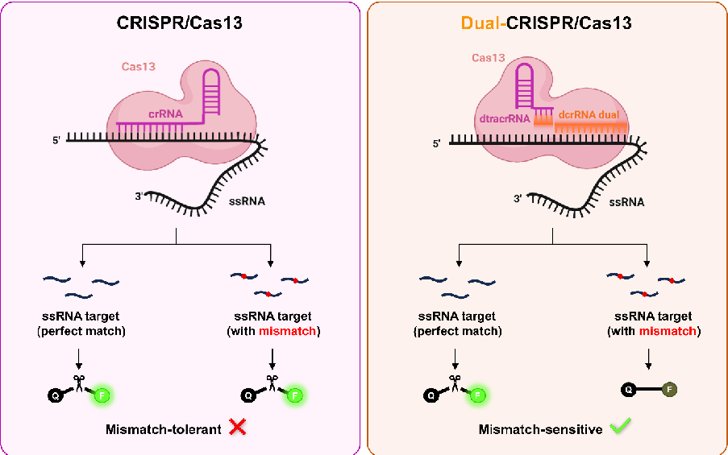
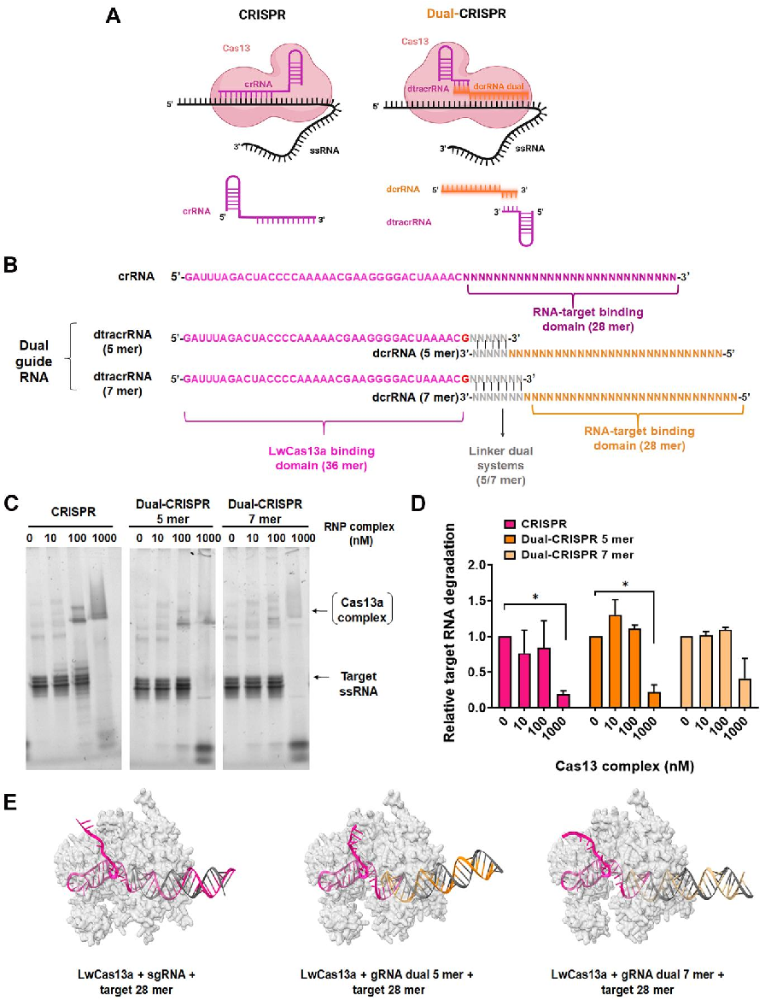
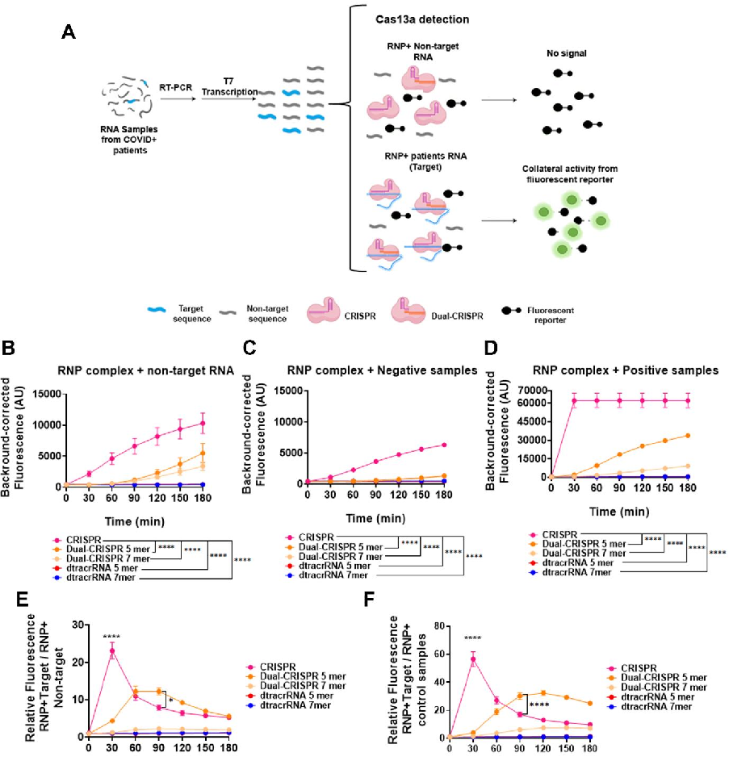
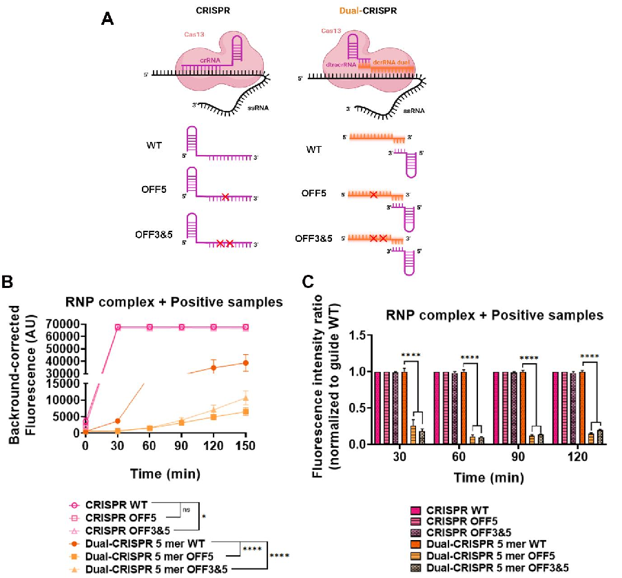
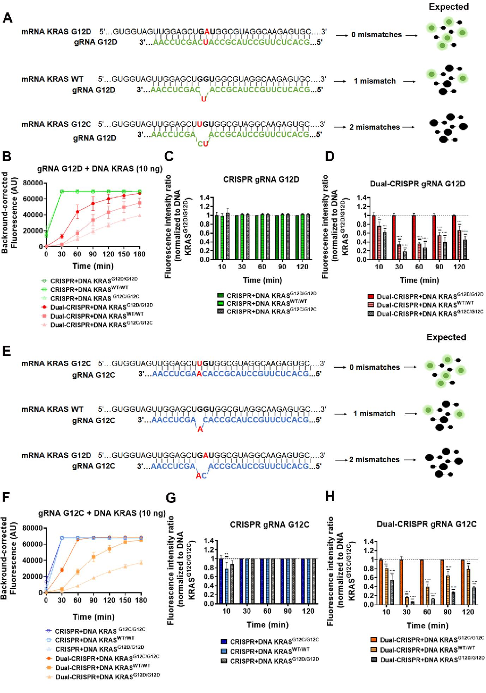

# 1  MANUSCRIPT TITLE

2  A  Novel  Dual-Guide  CRISPR-Cas13  Strategy  Improves  Specificity  for  Single-Nucleotide  Variant  3  Detection 

4  AUTHORS 

5  Araceli  Aguilar-González1,3*†,  Ismael  Martos-Jamai1,2,3†,  Iris  Ramos-Hernández1,3,  Francisco  6  Javier Molina-Estévez1,3, Pilar Puig-Serra4, Sandra Rodríguez-Perales4, Raúl Torres4,5, Rosario  7  María Sánchez-Martín1,2,3, Juan José Díaz-Mochón1,2,3*, Francisco Martín1,3,6* 

8 

9  1  GENYO,  Centre  for  Genomics  and  Oncological  Research,  Pfizer,  University  of  Granada,  10  Andalusian Regional Government, PTS Granada, Avenida de la Ilustración, 114, 18016, Granada,  11  Spain. 

12  2 Department of Medicinal & Organic Chemistry, Excellence Research Unit of Chemistry applied  13  to Biomedicine and the Environment, Faculty of Pharmacy, University of Granada, Campus de  14  Cartuja s/n, 18071, Granada, Spain. 

15  3 Instituto de Investigación Biosanitaria ibs. GRANADA, 18012, Granada, Spain. 

16  4 Human Cancer Genetics Program, Centro Nacional de Investigaciones Oncologicas (CNIO),  17  Molecular Cytogenetics & Genome Editing Unit, Melchor Fernandez Almagro, 3, 28029 Madrid,  18  Spain. 

19  5 Centro de Investigación Energéticas Medioambientales y Tecnológicas (CIEMAT), Advanced  20  Therapies  Unit,  Hematopoietic  Innovative  Therapies  Division,  Instituto  de  Investigación  21  Sanitaria Fundación Jiménez Díaz (IIS-FJD, UAM), 28040 Madrid, Spain. 

22  6 Departament of Biochemistry and Molecular Biology III and Immunology, Faculty of Medicine,  23  Excellence  Research  Unit  “Modeling  Nature”  (MNat),  University  of  Granada. Avda.  de  la  24  Investigación 11, 18071, Granada, Spain. 

25  † Araceli Aguilar González and Ismael Martos-Jamai have contributed equally. 

26  *  To  whom  correspondence  should  be  addressed.  Email:  araceli.aguilar@genyo.es.  27  Correspondence may also be addressed to: Francisco Martín, email: francisco.martin@genyo.es,  28  franciscomm@ugr.es; and Juan José Díaz-Mochón, email: juandiaz@go.ugr.es.

NOTE: This preprint reports new research that has not been certified by peer review and should not be used to guide clinical practice.

## 29  GRAPHICAL ABSTRACT 

30 

## 31  ABSTRACT 

32  The  emergence  of  CRISPR-Cas  systems  has  transformed  nucleic  acid  detection  and  33  manipulation. Cas13, a type VI CRISPR effector, targets RNA with high sensitivity through both  34  cis  (target  RNA)  and  trans  (collateral  RNA)  cleavage.  This  property  enables  the  use  of  35  fluorescent reporters for sensitive diagnostics. However, Cas13’s heightened sensitivity also  36  leads  to  reduced  specificity  due  to  its  susceptibility  to  single-nucleotide  mismatches,  37  potentially causing off-target effects. To overcome this limitation, we developed the first dual38  guide RNA system for Cas13 that enhances mismatch discrimination and improves target  39  specificity. This system employs two distinct RNAs—dcrRNA and dtracrRNA—which hybridise  40  to refine target recognition and activation. In vitro experiments demonstrated robust cis- and  41  trans-RNase activity, indicating efficient and specific cleavage. The system accurately detected  42  SARS-CoV-2  RNA,  demonstrating  its  potential  for  pathogen  diagnostics,  and  successfully  43  discriminated between KRAS G12D and G12C mutations—clinically relevant single-nucleotide  44  variants in cancer diagnosis. These results highlight the dual-guide Cas13 platform’s potential  45  for precise, rapid, and reliable RNA detection. Overall, this approach represents a significant  46  advance  over  conventional  Cas13  systems,  offering  improved  specificity  without  47  compromising  sensitivity.  Its  versatility  makes  it  a  promising  tool  for  next-generation  48  molecular diagnostics and precision gene editing applications. 

## 49  INTRODUCTION 

50  Molecular diagnostics based on nucleic acid detection have become a central component of  51  modern  medicine,  enabling  the  identification  of  pathogens,  genetic  alterations,  and  52  transcriptional signatures across a range of biomedical applications [1, 2]. In particular, the  53  ability  to  distinguish  single-nucleotide  variants  (SNVs)  is  critical  for  differentiating  closely  54  related viral strains, detecting drug resistance mutations, or identifying oncogenic drivers (RAS,  55  BRAF, EGFR, and other), as well as microRNAs [3-6]. Although PCR and hybridization-based  56  techniques such as TaqMan probes, melting curve analysis and microarrays are widely used  57  for SNV detection, they often suffer from limited mismatch discrimination, cross-reactivity, and  58  inflexible design [7-9]. Sequencing-based approaches including next-generation sequencing  59  (NGS) provide higher accuracy, especially for short RNA species, however its complexity and  60  cost limit widespread implementation [9, 10]. For these reasons, alternative technologies that  61  effectively balance sensitivity, specificity, and applicability are required. 

62  Clustered Regularly Interspaced Short Palindromic Repeats (CRISPR) and CRISPR-associated  63  (Cas)  proteins  have  gained  significant  attention  in  recent  years  as  promising  alternatives.  64  CRISPR/Cas systems have transformed the field of molecular biology, enabling precise and  65  programmable  nucleic  acid  targeting  across  a  wide  range  of  organisms  and  applications,  66  including  precision  medicine,  diagnostics,  and  biotechnology  [11-13].  While  early  studies  67  focused primarily on DNA-editing systems such as Cas9, increasing attention has been given  68  to RNA-targeting effectors, particularly the class 2 type VI CRISPR effector Cas13. This enzyme  69  is guided by a single RNA molecule to recognize and cleave the complementary target RNA  70  (cis activity), while also inducing collateral (trans) RNase activity that results in non-specific  71  degradation of surrounding RNAs [14, 15]. These properties have made Cas13 an attractive  72  tool for transcriptome engineering, transient mRNA knockdown, and molecular diagnostics,  73  where it has demonstrated high sensitivity in the nucleic acid-based detection of pathogenic  74  organisms [16-19]. However, this sensitivity likewise results in a notable tolerance for single75  nucleotide mismatches, raising concerns about off-target effects in both research and clinical  76  settings.  Consequently,  enhancing  mismatch  discrimination  in  CRISPR/Cas13  platforms  77  remains a critical challenge for their reliable use in high-specificity contexts [20-22]. 

78  To  overcome  these  limitations,  several  strategies  have  been  proposed  to  improve  Cas13  79  mismatch  discrimination  and  specificity.  One  common  approach  involves  deliberately  80  introducing synthetic base-pair alterations into the guide RNA in addition to the naturally  81  occurring  target  mismatch,  thus  creating  multiple  mismatches  (typically  three  or  more)  82  between guide and target sequences [23, 24]. This cumulative effect reduces off-target binding,  83  leading to improved specificity. However, this strategy is highly empirical and target-specific,  84  requiring careful optimization of the number, position, and nature of these mismatches, which  85  restricts its applicability for routine use. Another strategy to improve off-target discrimination  86  in Cas13 systems involves engineering the protein itself. This includes modifications to key  87  residues in the catalytic domains or regions involved in crRNA binding, aiming to improve  88  target recognition and reduce collateral activity. While these approaches can indeed improve  89  specificity, they typically require extensive structural analysis, are labour-intensive, and often  90  result in context-dependent performance [25, 26]. 

91  Recent studies have explored the viability of splitting the guide RNA in CRISPR systems beyond  92  Cas9 [27-29]. Among the included studies, split CRISPR RNA configurations for Cas12a were  93  able to reconstitute functional complexes in vitro under optimized conditions. However, these  94  approaches have been limited to the detection of short RNA targets (such as microRNAs) due  95  to  the  constrained  guide  length  (typically  less  than  20  nucleotides).  Achieving  detectable  96  activity often requires elevated concentrations of both protein and guide RNAs [29]. Because  97  Cas12a is inherently a DNA-targeting enzyme, its direct application to RNA detection remains  98  limited [30]. This restricts the use of Cas12a-based split systems in diagnostic settings involving  99  longer or more complex RNA analytes [31, 32] 

100  In  this  study,  we  introduce  a  novel  dual-guide  CRISPR/Cas13  platform,  in  which  the  101  conventional single guide RNA is divided into two separate RNA fragments connected through  102  engineered  5-  or  7-nucleotide  complementary  linker  sequences.  This  innovative  design  103  preserves the catalytic activity of LwaCas13a at levels comparable to the conventional single104  guide  system,  while  substantially  enhancing  its  specificity.  We  demonstrate  that  spatially  105  separating the guide RNA reduces off-target binding, which is a major limitation of current  106  Cas13-based diagnostics. We validate the improved specificity and functionality of this dual107  guide system through two clinically relevant applications: the sensitive and specific detection  108  of  SARS-CoV-2  RNA,  demonstrating  its  potential  for  pathogen  diagnostics,  and  the 

109  identification  of  single-nucleotide  variants  (SNVs)  in  the  oncogene  KRAS,  including  the  110  differentiation  between  wild-type  and  key  mutant  alleles  such  as  G12D  and  G12C,  111  demonstrating its potential for cancer diagnosis. Our results highlight the robustness and  112  versatility of the dual-guide approach, providing an innovative platform that addresses key  113  challenges in nucleic acid diagnostics, with particular relevance for precision medicine. 

## 114  MATERIAL AND METHODS 

### 115  Patient samples 

116  For the SARS-CoV-2 analysis, we used five saliva control samples from healthy adult volunteers  117  and ten saliva samples from individuals with confirmed SARS-CoV-2 infection by RT-qPCR. All  118  samples were provided by the Biobank of the Public Health System of Andalusia (reference  119  S2000262), and informed consent was obtained from all participants. Total RNA was extracted  120  from each sample using the Qiagen RNeasy Mini Kit (Qiagen, Hilden, Germany) according to  121  the manufacturer’s instructions. Purified RNA samples were stored at –80 °C until further use  122  to preserve integrity for downstream analyses. 

### 123  Cell lines and Culture media 

124  MiaPaca-2 (CRL-1420, ATCC) were maintained in DMEM medium (Dulbecco’s modified Eagle  125  medium high glucose) (Biowest, Nuaillé, France) supplemented with 10% foetal bovine serum  126  (FBS) (Biowest) and 1% penicillin/streptomycin (Biowest). BxPC3 (CRL-1687) and AsPC1 (CRL127  1682, ATCC) cells were maintained in RPMI-1640 medium (Biowest), supplemented with 10%  128  FBS and 1% penicillin/streptomycin. Cells were maintained in incubators at 37ºC with 5% CO2 129  atmosphere and 85%–90% relative humidity. Absence of Mycoplasma spp. in cultured cells was  130  routinely tested by a PCR-based assay (Minerva Biolabs, Skillman, NJ, USA). 

### 131  RT-qPCR 

132  To confirm SARS-CoV-2 positivity in patient samples, total RNA was reverse-transcribed into  133  cDNA using the High-Capacity cDNA Reverse Transcription Kit (Applied Biosystems, Waltham,  134  MA, USA) with RNase Inhibitor (Applied Biosystems), following the manufacturer’s instructions.  135  Quantitative PCR (qPCR) was then performed using Fast SYBR™ Green Master Mix (Applied  136  Biosystems)  on  a  QuantStudio™  6  Flex  Real-Time  PCR  System  (96-well  format;  Applied  137  Biosystems). The amplification protocol was as follows: 95 °C for 5 s; followed by 40 cycles of 

138  96.5 °C for 10 s and 62–64 °C for 30 s; and a melt curve step consisting of 95.6 °C for 10 s, 55 °C  139  with a ramp rate of 0.05 °C/s, and 95 °C for 30 s. All reactions were performed in duplicate using  140  the primers listed in Supplementary Table S1. 

### 141  RNA synthesis 

142  To generate synthetic RNA targets, SARS-CoV-2 cDNA was PCR-amplified using KAPA HiFi  143  HotStart  ReadyMix  (Kapa  Biosystems,  Wilmington,  MA,  USA)  and  primers  listed  in  144  Supplementary Table S1. The resulting double-stranded DNA (dsDNA) amplicons were gel145  purified using the MinElute Gel Extraction Kit (Qiagen). In vitro transcription was performed by  146  incubating the purified dsDNA overnight at 37 °C with T7 RNA polymerase (New England  147  Biolabs, Ipswich, MA, USA) in the presence of RNase inhibitor (Applied Biosystems) and rNTPs  148  (New England Biolabs). The transcribed RNA was purified using the MEGAclear Transcription  149  Clean-Up Kit (Applied Biosystems) according to the manufacturer's instructions. 

### 150  Electrophoretic Mobility Shift Assay (EMSA) 

151  RNA–protein interactions were assessed using an electrophoretic mobility shift assay (EMSA)  152  optimized for Cas13-based complexes. First, dual guide RNA complexes were prepared by  153  annealing 10 µL of dcrRNA (10 µM, Integrated DNA Technologies, Coralville, IA, USA) with 10 µL  154  of dtracrRNA (10 µM, Integrated DNA Technologies) in the presence of 5 µL of annealing buffer  155  (Synthego, Menlo Park, CA, USA). This mixture was incubated in a thermocycler using the  156  following program: 95 °C for 4 minutes, 65 °C for 5 minutes, 25 °C for 5 minutes, and then held  157  at 4 °C. Recombinant LwaCas13a (57 µM, GenScript, Piscataway, NJ, USA) was diluted in 2 buffer  158  (New England Biolabs, Ipswich, MA, USA) supplemented with BSA to a working concentration  159  of 4 µM. To assemble the Cas13-RNP complex (2 µM), the diluted Cas13 was mixed with the  160  annealed crRNA:tracrRNA duplex and incubated for 10 minutes at room temperature. Samples  161  were  then  kept  on  ice  until  further  use.  Binding  reactions  were  prepared  by  combining  162  appropriate volumes of the Cas13-RNP complex with binding buffer (20 mM HEPES, pH 7.5,  163  250 mM KCl, 2 mM MgCl₂, 0.01% Triton X-100, 10% glycerol; all reagents from Sigma-Aldrich,  164  St.  Louis,  MO,  USA)  to  reach  final  complex  concentrations  of  0,  10,  100,  or  1000 nM.  165  Subsequently,  1 µL  of  target  RNA  (100 ng/µL)  previously  synthesized  was  added  to  each  166  reaction, followed by incubation for 1 hour at 37 °C. Following incubation, each reaction was  167  loaded  onto  a  precast  native  4–20%  polyacrylamide  gel  (Bio-Rad,  Hercules,  CA,  USA). 

168  Electrophoresis was performed in 1× TBE buffer supplemented with 2 mM MgCl₂ at 100 V for  169  75 minutes at 4 °C. After electrophoresis, the gel was stained in 1× TBE containing GelRed®  170  nucleic acid stain (Biotium, Fremont, CA, USA) and 2 mM MgCl₂. Visualization of RNA–protein  171  complexes  was  performed  using  a  Gel Doc™  EZ  Imager  system  (Bio-Rad).  Images  were  172  analysed and band intensities quantified using ImageJ software version 1.53q (NIH, Bethesda,  173  MD, USA). 

### 174  Cas13 Collateral Cleavage Detection Assay (SHERLOCK) 

175  Detection  of  target  RNA  or  DNA  sequences  was  performed  using  a  two-step  SHERLOCK  176  (Specific  High-Sensitivity  Enzymatic  Reporter  Unlocking)  assay  optimized  for  LwaCas13a  177  collateral activity using both single- and dual-guide CRISPR systems. 

178  (1) Reverse Transcription and PCR Amplification. Total RNA extracted from patient samples  179  (including  both  SARS-CoV-2  positive  and  negative  cases)  was  reverse  transcribed  into  180  complementary DNA (cDNA) using the High-Capacity cDNA Reverse Transcription Kit with  181  RNase Inhibitor (Applied Biosystems), following the manufacturer’s instructions. For SARS182  CoV-2 samples, known amounts of cDNA (10 ng or 1 ng per reaction) were used. In the case  183  of KRAS detection, genomic DNA (gDNA) extracted with using a QIAamp DNA mini kit (Qiagen)  184  following the manufacturer’s instructions, instead at concentrations of 10, 1, or 0.1 ng per  185  reaction. Target sequences were amplified via endpoint PCR using gene-specific primers (Table  186  X) and GoTaq® G2 DNA Polymerase Master Mix, colorless 2× (Promega, Madison, WI, USA)  187  followed by incubation in a thermocycler with the following program: 95 °C for 4 min, 65 °C for  188  5 min, 25 °C for 5 min, and held at 4 °C. 

189  (2) In Vitro Transcription and Cas13 Detection. Cas13-based detection was carried out in 384190  well microplates. The plate reader (NanoQuant, Tecan, Männedorf, Switzerland) was preheated  191  to 37 °C, and all reagents were maintained on ice until transferred to the plate. LwaCas13a  192  (GenScript) was diluted to a final concentration of 450 nM in Buffer 2 (New England Biolabs)  193  supplemented with BSA. The detection mix (19 µL per well) was assembled in the following  194  order: RNase-free water, HEPES buffer (pH 6.8, final concentration 20 mM; Sigma), guide RNA  195  (45 nM; either a synthetic sgRNA from Integrated DNA Technologies, or a dual-guide complex).  196  The dual-guide complex was previously formed by annealing 10 µL of dcrRNA (10 µM, IDT)  197  with 10 µL of dtracrRNA (10 µM, IDT) in the presence of 5 µL of annealing buffer (Synthego), 

198  followed by incubation in a thermocycler with the following program: 95 °C for 4 min, 65 °C for  199  5 min, 25 °C for 5 min, and held at 4 °C. The mix was completed by adding LwaCas13a protein  200  (final 45 nM), murine RNase inhibitor (2 U/µL; New England Biolabs), rNTP solution (1 mM each;  201  New  England  Biolabs),  T7  RNA  polymerase  (0.125 U/µL;  New  England  Biolabs),  and  the  202  RNaseAlert  substrate (125 nM;  IDT).  The  reaction  was  initiated  by  adding  1 µL  of  the  PCR  203  product to each well. Fluorescence was monitored every 5 minutes for 3 hours at 37 °C using  204  excitation and emission wavelengths of 485 nm and 520 nm, respectively. All reactions were  205  performed  in  triplicate  and  protected  from  light  throughout  the  procedure  to  preserve  206  reporter integrity. 

### 207  AlphaFold 3 structure prediction and analysis 

208  Structural modelling of the Cas13a protein complex with either the conventional single-guide  209  RNA (sgRNA) or dual-guide RNA constructs was performed using AlphaFold 3 (DeepMind  210  Technologies Ltd., London, UK, and Isomorphic Labs Ltd., London, UK) via the AlphaFold Server  211  server https://alphafoldserver.com/ in (April, 2025) [33]. The LwaCas13a amino acid sequence  212  was obtained from UniProt (ID: U2PWF1), due to the absence of an experimentally resolved  213  structure. Input RNA sequences corresponded to either the canonical sgRNA or the dual-guide  214  RNA  constructs.  For  each  complex,  the  five  ranked  models  generated  by  AlphaFold  were  215  analysed, and the top-ranked model (Rank 1) was selected for further study. These models  216  were subsequently imported into UCSF ChimeraX (version 1.2.5) for visualization and detailed  217  structural  examination.  The  B-factor  attribute  was  employed  to  assess  regional  variability  218  among models. 

### 219  Statistical Analysis 

220  Statistical analyses on data obtained were performed and represented with the GraphPad  221  Prism software (version 8.0.1) (GraphPad Software, La Jolla, CA, USA). All data are presented as  222  mean ± SEM. Two-way ANOVA was used for multiple comparisons, followed by appropriate  223  post hoc tests. Statistical significance is indicated as follows: * p < 0.05, ** p < 0.01, *** p <  224  0.001, **** p < 0.0001). The specific tests used are detailed in each figure legend. 

### 225  Figures creation 

226  For formatting the figures Adobe Photoshop version 13.0.1 (Adobe, San José, CA, USA) was  227  used. Figure 1A was designed using BioRender (BioRender.com). This design served as the  228  base for the subsequent creation of Figures 2A, 3A and Graphical abstract, which were then  229  adapted and finalized using Adobe Photoshop (Adobe). 

## 230  RESULTS 

### 231  Design and structural characterization of the Dual-CRISPR system for LwaCas13a 

232  To address the limitations of conventional single-guide designs in CRISPR/Cas13 systems, we  233  engineered a modular dual-guide architecture, coined Dual-CRISPR. Unlike the conventional  234  CRISPR  system  where  a  single  crRNA  molecule  mediates  both  Cas13  binding  and  target  235  recognition, our Dual-CRISPR system dissociates these functions into two distinct components:  236  a variable dual crRNA (dcrRNA), which contains the spacer sequence complementary to the  237  RNA  target,  and  a  constant  dual  tracrRNA  (dtracrRNA),  which  mediates  interaction  with  238  LwaCas13a and the dcrRNA. These two components interact via short complementary linker  239  sequences (5 or 7 nucleotides), de novo designed in this study to enable stable hybridization  240  and efficient complex formation (Figure 1A). 

241  For the initial characterization of the system, we designed guide RNAs targeting a region within  242  the spike (S) gene-derived RNA of SARS-CoV-2. The structure of the single-guide and dual243  guide constructs are shown in Figure 1B, with the conserved Cas13-binding domain, 28-nt  244  spacer,  and  our  custom-designed  linker  regions  highlighted  in  different  colours.  The  full  245  sequences of all guide RNAs used in this study are listed in Supplementary Table S2.  

246  Complex formation and RNA binding capacity were evaluated by electrophoretic mobility shift  247  assays (EMSA), (Figure 1C). Both dual-guide constructs (5-mer and 7-mer) efficiently formed  248  RNP complexes with the SARS-CoV-2 target RNA, showing similar or higher RNA binding  249  capacity  compared  to  the  conventional  Cas13  system.  In  all  conditions,  increasing  250  concentrations of the RNP complex led to progressive degradation of the target ssRNA, as  251  evidenced by the decrease in free RNA signal. Quantification of band intensities (Figure 1D) 252  confirmed  a  concentration-dependent  enzymatic  activity,  consistent  with  efficient  target  253  cleavage by both dual-guide and conventional Cas13 constructs. 

254  To further investigate the integrity of our dual-CRISPR design, 3D structural models were  255  generated using, the latest generation of AI-driven molecular modeling system, AlphaFold 3  256  [33]. These models accurately predict the conformations of LwaCas13a bound to both single257  guide (sgRNA) and dual-guide RNA constructs, alongside the 28-nucleotide target RNA. The  258  dual-guide models, particularly the 5-mer linker variant, exhibited overall structural similarity  259  to the conventional CRISPR/Cas13 complex, suggesting that the introduction of a split guide  260  does not disrupt the formation of a functional ribonucleoprotein complex (Figure 1E). A more  261  detailed analysis of these models, including structural alignment and conformational features,  262  is provided in the Supplementary Figure S1. 

263 

264  Figure  1.  Designing  and  characterization  of  the  novel  Dual-CRISPR  system  for  Cas13.  A)  Schematic  265  representation  of  conventional  CRISPR  and  the  newly  developed  Dual-CRISPR  architecture  for  Cas13.  In  the  266  conventional  system,  Cas13  binds  to  a  single  crRNA  molecule  that  acts  as  both  the  Cas-binding  and  target267  recognition domain. In the Dual-CRISPR system, these functions are dissociated into two distinct RNAs: a variable  268  dcrRNA responsible for target binding, and a constant dtracrRNA that mediates interaction with Cas13 and dcrRNA. 

269  The final complex comprises three components: LwaCas13a protein, the variable dcrRNA targeting the sequence  270  of interest, and the constant dtracrRNA. Created in BioRender. Aguilar, A. (2026) https://BioRender.com/gxqr13o.  271  B) Sequences of the CRISPR and Dual-CRISPR (5-mer and 7-mer linkers) components used with LwaCas13a. The  272  Cas13-binding domain is highlighted in pink, the 28-nucleotide spacer targeting the viral RNA is highlighted in  273  purple (Conventional system) or orange (Dual-system), and the linker sequences for the Dual-CRISPR constructs  274  are shown in gray. C) Electrophoretic mobility shift assay (EMSA) of CRISPR and Dual-CRISPR (5-mer and 7-mer)  275  complexes incubated with their SARS-CoV-2 RNA target. Complexes were assembled in vitro and incubated with  276  increasing concentrations (0, 10, 100, and 1000 nM) of the CRISPR/Cas13 complexes. D) Quantification of residual  277  target RNA (ssRNA) from EMSA in panel C. Band intensities corresponding to the free RNA target were quantified  278  and normalized to the 0 nM RNP complex condition (no Cas13a). A decrease in intensity reflects increasing target  279  RNA degradation due to Cas13a activity. Bars represent mean ± SEM of n = 3 separate experiments. E) Predicted  280  3D structures of the CRISPR and Dual-CRISPR (5-mer and 7-mer) complexes bound to the target RNA (28 nt),  281  modelled using AlphaFold 3. 

### 282  Validation of the Dual-CRISPR/Cas13 system for RNA detection with a SHERLOCK-based  283  assay 

284  In order to evaluate the diagnostic potential of the Dual-CRISPR/Cas13 system, a SHERLOCK285  based assay for SARS-CoV-2 RNA was performed. All samples were previously validated by  286  RT-qPCR to confirm their SARS-CoV-2 status (positive or negative) (Supplementary Figure  287  S2). Traditional SHERLOCK protocols rely on isothermal amplification of the target sequence,  288  typically using recombinase polymerase amplification (RPA) followed by in vitro transcription  289  to generate RNA for Cas13 detection [34]. However, while RPA is a valuable amplification  290  method, under our experimental conditions, it exhibited a higher susceptibility to non-specific  291  amplification and cross-contamination. Several primer pairs targeting the S gene region of  292  SARS-CoV-2  were  tested,  but  false-positive  signals  were  detected  in  negative  controls  293  (Supplementary Figure S3). In light of the limited specificity and increased contamination  294  risk associated with RPA, under these experimental conditions, we opted to replace this step  295  with PCR amplification. 

296  For this approach, PCR primers were designed to flank the target region within the SARS-CoV297  2  spike  (S)  gene,  with  a  T7  promoter  sequence  incorporated  into  the  forward  primer  298  (Supplementary Table S1). This allowed the resulting amplicons to act as templates for in  299  vitro  transcription,  producing  RNA  for  subsequent  detection  by  Cas13.  A  schematic  300  representation  of  the  adapted  assay  workflow  is  shown  in  Figure  2A.  PCR  amplicons  301  containing a T7 promoter are incubated in a single reaction with T7 RNA polymerase, Cas13 

302  RNPs, and a fluorescent RNA reporter. During incubation, the DNA amplicons are transcribed  303  into RNA. Upon specific recognition of the RNA target, Cas13 is activated and cleaves the  304  fluorescent reporter via its collateral (trans) activity, generating a measurable fluorescence  305  signal [17]. 

306  The predicted secondary structures of the in vitro transcribed RNA targets used in these assays  307  is shown in Supplementary Figure S4A. These structural models, generated using FoRNA  308  software,  reveal  distinct  conformations  that  may  influence  target  accessibility  and  Cas13309  mediated cleavage. 

310  We  compared  the  collateral  activity  of  standard  CRISPR/Cas13  and  Dual-CRISPR/Cas13  311  systems (5-mer and 7-mer) using non-target RNA extracted from HEK293T cells, RNA from  312  healthy donors (SARS-CoV-2 negative samples confirmed by RT-qPCR), and target RNA from  313  SARS-CoV-2  positive  patients  confirmed  by  RT-qPCR.  Fluorescence  signal  resulting  from  314  reporter cleavage was monitored over a 3-hour period. Both Dual-CRISPR variants generated  315  substantially  lower  fluorescence  signals  in  the  presence  of  non-target  RNA  and  negative  316  samples (healthy  control) compared  to  the  conventional  system  (Figure 2B-C),  indicating  317  improved specificity. In contrast, RNA from positive samples (particularly when tested with the  318  5-mer  variant)  yielded  markedly  higher  fluorescence,  reaching  levels  comparable  to  the  319  standard CRISPR complex. Although standard CRISPR complex had faster kinetic, the dual  320  system achieved comparable levels after 180min (Figure 2D). These results demonstrate the  321  diagnostic potential and functionality of the Dual-CRISPR system. 

322  Although  absolute  fluorescence  was  lower  for  Dual-CRISPR,  target  discrimination  by  323  normalizing signals from patient samples (target) against both negative controls (Figures 2E– 324  F).  The  Dual-CRISPR  5-mer  variant  demonstrated  robust  target-specific  activation  with  325  improved specificity, particularly during longer incubation periods (>60 min), a timeframe in  326  which  the  conventional  CRISPR/Cas13  system  showed  a  tendency  toward  increased  327  background noise under our experimental conditions. 

328 

329  Figure 2. Evaluation of the functionality of the Dual-CRISPR/Cas13 system for SARS-CoV-2 virus detection. 330  A) Schematic of the PCR-adapted-SHERLOCK adapted method for SARS-CoV-2 virus detection for CRISPR and  331  Dual-CRISPR system. B-D) Corrected fluorescence of RNP-CRISPR, dual-CRISPR 5mer and 7mer complexes with  332  non-target  RNA  (RNA  from  HEK293T  cells)  (B),  with  negative  samples  (healthy  controls)  (C)  and  with  positive  333  samples  (SARS-CoV-2  RNA  target)  (D)  after  incubation  with  the  fluorescent  reporter  for  3  hours.  E)  Relative  334  fluorescence of RNP complexes with RNA from positive samples (target RNA) versus fluorescence of RNP complexes  335  with non-target RNA (HEK293T). F) Relative fluorescence of RNP complexes with RNA from positive samples (target  336  RNA) versus fluorescence of RNP complexes with negative samples. Statistical analysis: 2-way ANOVA (Dunnett's  337  multiple comparison test) of mean fluorescence at all times (B-D) and at specific times such as 30 min and 90 min  338  (E, F) (* p < 0.05, ** p < 0.01, *** p < 0.001, **** p < 0.001). Values represent the mean ± SEM of 3 separate  339  experiments. 

### 340  Evaluation of mismatch sensitivity in Dual-CRISPR vs. CRISPR for SARS-CoV-2 detection 

341  The  inherent  tolerance  of  conventional  Cas13  systems  to  single-nucleotide  mismatches  342  presents a significant challenge for their application in molecular diagnostics, often leading to  343  reduced  specificity  and  potential  false  positives,  particularly  when  differentiating  closely  344  related  targets  or  identifying  single-nucleotide  variants  (SNVs).  To  evaluate  mismatch  345  sensitivity, we further explored the specificity of the Dual-CRISPR/Cas13 system by assessing  346  its  ability  to  discriminate  single  and  double  mismatches  in  the  guide-target  pairing.  We  347  focused on the 5-mer dual-guide, which had previously demonstrated the most favourable  348  performance in terms of target recognition and signal specificity. To this end, we designed  349  several  guides  RNA  containing  either  one  (OFF5)  or  two  (OFF3&5)  synthetic  mismatches  350  relative to the SARS-CoV-2 target sequence. Positions 5 and 3&5 within the guide sequence  351  were selected based on previous studies which identified these sites as having the greatest  352  destabilizing effect on guide-target pairing [17, 35] (Figure 3A).  

353  Then, the collateral activity of Cas13 was compared with either wild-type or mismatched guides  354  using the RNA extracted from SARS-CoV-2 positive samples as target. Fluorescence generated  355  by  reporter  cleavage  was  monitored  in  both  the  conventional  CRISPR  and  Dual-CRISPR  356  systems.  The  standard  CRISPR  system  exhibited  minimal  variation  in  fluorescence  signals  357  between  wild-type  and  altered  guides  (OFF5  and  OFF3&5),  even  with  two  mismatches,  358  indicating a relatively high tolerance for sequence divergence (Figure 3B).  

359  These results are in line with the previous studies mentioned above, which reported that single  360  mismatches do not substantially affect Cas13 activity [23, 36]. In contrast, the Dual-CRISPR 5361  mer  exhibited a substantial  decrease  in  signal  intensity, reducing fluorescence by 80-85%  362  approximately, when using mismatched guides, with just one mismatch causing a significant  363  reduction in fluorescence (Figure 3B, orange dots vs. orange squares and triangles). To  364  better quantify the impact of mismatches on target recognition, fluorescence signals were  365  normalized to the corresponding wild-type guide signal at different time points. While the  366  conventional CRISPR system has been widely used and provides reliable results, the Dual367  CRISPR  system  demonstrated  notably  enhanced  discrimination  against  single  and  double  368  mismatches (Figure 3C). This improvement represents an important advancement toward  369  increasing diagnostic accuracy. 

370 

371  Figure 3. Evaluation of the specificity of Dual-CRISPR/Cas13 vs. CRISPR for SARS-CoV-2 virus detection. A)  372  Scheme of the different guides designed for CRISPR and dual-CRISPR 5mer. The WT guide binds perfectly to the  373  SARS-CoV-2 target sequence. The OFF5 and OFF3&5 guides have 1 and 2 mismatches with the SARS-CoV-2 target  374  sequence, respectively. B) Corrected fluorescence of RNP-CRISPR and dual-CRISPR 5mer complexes with RNA from  375  patient  samples  (target  RNA)  after  incubation  with  the  fluorescent  reporter  for  150  minutes.  C)  Fluorescence  376  intensity ratio normalized to the WT guide (CRISPR and Dual-CRISPR 5 mer, respectively) at different time points  377  (30, 60, 90 and 120 minutes). Statistical analysis: 2-way ANOVA with a Dunnett's multiple comparisons test was  378  used to compared mean fluorescence at all times (B) and at specific times (C) comparing between WT and different  379  mismatches) (* p < 0.05, ** p < 0.01, *** p < 0.001, **** p < 0.001). Values represent the mean ± SEM of 3 separate  380  experiments. 

### 381  Improved  Specificity  of  Dual-CRISPR-Cas13  System  in  Detecting  Oncogenic  KRAS  382  Variants 

383  Next, the efficiency of Dual-CRISPR-Cas13 system in distinguishing clinically relevant single384  nucleotide  variants  (SNVs)  was  evaluated.  Given  the  relevance  of  detecting  oncogenic  385  mutations  with  high  specificity  for  precise  patient  stratification  and  effective  treatment  386  decisions, the next phase of this research focuses on evaluating the implementation of this  387  technology in these settings. Detecting oncogenic mutations with high specificity is critical in  388  clinical  diagnostics  for  accurate  patient  stratification  and  treatment  guidance.  Single389  nucleotide variants (SNVs) in the KRAS gene, such as G12D and G12C, are prevalent in various  390  cancers, including pancreatic adenocarcinoma, and their precise identification is crucial for  391  targeted therapies such as monoclonal antibody-based therapies. Conventional Cas13 systems,  392  while sensitive, often struggle to reliably discriminate between such closely related SNVs within  393  a complex genomic background, potentially leading to misdiagnosis. We thus evaluated the  394  specificity  of  our  Dual-CRISPR-Cas13  system  for  detecting  these  clinically  relevant  KRAS  395  mutations  (G12D  and  G12C)  in  a  cell-based genomic  DNA model.  The  presence of  these  396  specific  KRAS  was  validated  in  different pancreatic  cell  lines  (Supplementary Figure  S5),  397  ensuring a reliable model for specificity testing. Genomic DNA was thus extracted from well398  characterized pancreatic cell lines: BxPC-3 (KRAS WT), AsPC-1 (KRAS G12D), and MIA-PaCa2  399  (KRAS G12C), each homozygous for their respective alleles. The predicted secondary structures  400  of the in vitro transcribed RNA targets used for KRAS are shown in Supplementary Figure  401  S4B-D. A  guide  RNA  specific  for  the  G12D  mutation  was  used  in  both  the  conventional  402  CRISPR/Cas13 assay and our Dual-CRISPR/Cas13 configuration [35]. This design allowed for  403  the  direct  comparison  of  their  abilities  to  selectively  detect  the  KRAS  G12D  allele,  while  404  effectively discriminating against the wild-type sequence (representing a single mismatch) and  405  the KRAS G12C sequence (representing two mismatches) (Figure 4A). To enable detection  406  from  genomic  DNA,  the  SHERLOCK  workflow  was  adapted  from  the  RNA-based  format  407  previously used for SARS-CoV-2 (Figure 2A) to use genomic DNA as input for KRAS mutation  408  analysis. 

409  We then compared the collateral activity of G12D-gRNA:Cas13 complexes across different  410  DNA  targets  (G12D,  WT,  and  G12C)  using  genomic  DNA  (10  ng).  The  conventional  411  CRISPR/Cas13  system  showed  minimal  signal  profile  differences  over  time  between  the 

412  specific G12D and non-specific WT and G12C targets (Figure 4B-C). In contrast, our Dual413  CRISPR/Cas13  configuration  consistently  demonstrated  superior  mismatch  discrimination  414  exhibiting higher specificity by clearly distinguishing the G12D target from WT (1 mismatch)  415  and  G12C  (2  mismatches)  sequences  (Figure  4B  and D).  This  enhanced  specificity  was  416  maintained at lower DNA inputs (1 ng and 0.1 ng; Supplementary Figures S6A–C and S7A– 417  C). At lower inputs (0.01 ng and 0.001 ng), no signal was detected for any target, even to  418  conventional CRISPR system, indicating a detection threshold of approximately 0.1 ng under  419  current assay conditions (Supplementary Figure S8). 

420  Using a G12C-specific guide RNA, both systems were evaluated for their ability to discriminate  421  the  G12C  mutation.  The  Dual-CRISPR  configuration  consistently  and  clearly  distinguished  422  G12C from WT and G12D sequences (Figure 4F and H), while the conventional system failed  423  to differentiate between specific and non-specific targets (Figure 4F-G). Notably, the high  424  specificity of the Dual-CRISPR approach remain robust across all tested DNA concentrations  425  (Supplementary Figures S6D–F and S7D–F). 

426  These  findings  highlight  the  superior  mismatch  discrimination  and  enhanced  diagnostic  427  accuracy achieved with the Dual-CRISPR/Cas13 system relative to the conventional CRISPR  428  assay. 

429 

430  Figure  4.  Evaluation  of  CRISPR  and  Dual-CRISPR  Specificity  in  the  Detection  of  KRAS  G12D  and  G12C  431  Variants. A) Schematic representation of the KRAS G12D guide, which is designed for use with CRISPR and Dual-

432  CRISPR systems, binding to different RNA targets (KRAS G12D, KRAS WT or KRAS G12C). The expected output from  433  the SHERLOCK system is shown based on the number of mismatches. The KRAS G12D guide binds perfectly to the  434  KRAS G12D target sequence. The KRAS WT and KRAS G12C targets have one and two mismatches with the G12D  435  guide, respectively. B) Corrected fluorescence of RNP-G12D guides (CRISPR and Dual-CRISPR) with DNA from  436  pancreatic cell lines harbouring G12D, WT or G12C alleles (10 ng), after 180 minutes' incubation with the fluorescent  437  reporter. C) Fluorescence intensity ratio normalised to KRAS G12D DNA (10 ng) using RNP-G12D guides (CRISPR)  438  at different time points (30, 60, 90 and 120 minutes). D) Fluorescence intensity ratio normalised to KRAS G12D DNA  439  (10 ng) using RNP-G12D guides (Dual-CRISPR) at different time points (30, 60, 90 and 120 minutes). E) A schematic  440  representation of the binding of the KRAS G12C guide, which is designed for the CRISPR and Dual-CRISPR systems,  441  to different RNA targets (KRAS G12C, KRAS WT or KRAS G12D) and the expected SHERLOCK output, based on the  442  number of mismatches. The KRAS G12C guide binds perfectly to the KRAS G12C target sequence. The KRAS WT  443  and KRAS G12D targets have one and two mismatches with the G12C guide, respectively. F) Corrected fluorescence  444  of RNP-G12C guides (CRISPR and Dual-CRISPR) with DNA from pancreatic cell lines harbouring G12C, WT or G12D  445  alleles (10 ng) after 180 minutes of incubation. G) Fluorescence intensity ratio normalised to KRAS G12C DNA (10  446  ng) using RNP-G12C guides (CRISPR) at different time points (30, 60, 90 and 120 minutes). H) Fluorescence intensity  447  ratio normalised to KRAS G12C DNA (10 ng) using RNP-G12C guides (Dual-CRISPR) at different time points (30, 60,  448  90 and 120 minutes). Statistical analysis: 2-way ANOVA with a Dunnett's multiple comparisons test was used to  449  compare specific targets with non-specific sequences (1 and 2 mismatches) at each time point (* p < 0.05, ** p <  450  0.01, *** p < 0.001, **** p < 0.0001). Data are presented as the mean ± SEM from at least three independent  451  experiments. 

452  As summarized in Table 1, our Dual-CRISPR/Cas13 system demonstrates a markedly improved  453  ability to discriminate between clinically relevant KRAS single-nucleotide variants (SNVs), while  454  avoiding false-positive signals from closely related sequences that the conventional assay fails  455  to distinguish.

|Guide RNA* |Target DNA Tested |Standard CRISPR-Cas13 |Dual-CRISPR-Cas13 |
|---|---|---|---|
|G12D-specific |KRAS G12D (On-Target) |Detected|Detected|
|G12D-specific |KRAS WT (1 Mismatch) |Detected (False Positive) |Not Detected (Accurate)|
|G12D-specific |KRAS G12C (2 Mismatches) |Detected (False Positive) |Not Detected (Accurate)|
|G12C-specific |KRAS G12C (On-Target) |Detected|Detected|
|G12C-specific |KRAS WT (1 Mismatch) |Detected (False Positive) |Not Detected (Accurate)|

|G12C-specific |KRAS G12D (2 Mismatches) |Detected (False Positive) |Not Detected (Accurate)|
|---|---|---|---|

456  Table 1. Comparative analysis of mismatch discrimination between the standard and Dual-CRISPR/Cas13  457  systems targeting KRAS single-nucleotide variants (SNVs). Each guide RNA was tested against matched (on458  target) and mismatched sequences (1 or 2 nucleotide differences). *In the Standard CRISPR-Cas13 system, guide  459  RNA refers to single-guide RNA (sgRNA) that are designed to be specific for the target (either G12D or G12C). In  460  the Dual-CRISPR system, the specific guide RNA refers to the variable dual crRNA (dcrRNA), which contains the  461  sequence complementary to the target. In bold and italic, the correct calls.

## 462  DISCUSSION 

463  In this study, we developed and validated a dual-guide RNA architecture for CRISPR-Cas13a  464  that enhances target specificity while maintaining robust RNA cleavage activity. By splitting  465  the conventional single guide RNA into two distinct components (dcrRNA and dtracrRNA)  466  linked via complementary sequences, the system introduces an additional layer of molecular  467  recognition and enhances mismatch discrimination. The platform was successfully applied to  468  detect both SARS-CoV-2 RNA and oncogenic KRAS mutations, demonstrating versatility across  469  clinically relevant applications. 

470  In the context of viral diagnostics, the dual-guide system effectively identified SARS-CoV-2  471  RNA with high specificity, particularly the 5-mer variant, even at long incubation times. While  472  its sensitivity was slightly lower than the conventional single-guide Cas13 system at early time  473  points,  the  dual  architecture  provided  greater  signal  stability  and  significantly  reduced  474  background noise. Moreover, the dual-guide system presented a pronounced and significant  475  decrease in signal intensity when challenged with guide RNAs containing single or double  476  synthetic mismatches relative to the target sequence (Figure 3B, C). This is in great contrast to  477  the conventional CRISPR system, which showed minimal differentiation in fluorescence signals  478  between wild-type and mismatched guides (Figure 3B, C). The strategic selection of mismatch  479  positions (5 and 3&5) based on prior literature further underscores the deliberate approach  480  taken to challenge the system's discriminatory power at sites known to have a significant  481  impact on guide-target pairing.  

482  Previous CRISPR-based diagnostics using Cas13a, such as SHERLOCK [17, 37], or Cas13-based  483  RPA amplification platforms [38], can achieve sensitive and multiplexed detection of viral RNA.  484  However,  despite  their  speed  and  simplicity,  these  approaches  are  often  susceptible  to  485  nonspecific amplification, carryover contamination, and amplification artefacts, particularly in 

486  resource-limited settings. In contrast, our Dual-CRISPR platform was integrated with a PCR487  based  pre-amplification  strategy,  providing  a  more  controlled  and  robust  workflow  that  488  reduces nonspecific background and improves assay reproducibility. 

489  Beyond pathogen detection, we demonstrated that the dual-guide CRISPR-Cas13 system is  490  also effective in distinguishing clinically relevant single-nucleotide variants (SNVs), using KRAS  491  mutations as a model. Specifically, we showed that our system could robustly discriminate  492  between the oncogenic G12D and G12C alleles and the wild-type KRAS sequence, achieving  493  improved mismatch sensitivity over the conventional single-guide approach (Figure 4B, D, F,  494  H). The standard CRISPR system, under the same conditions, failed to clearly differentiate  495  between  specific  and  non-specific  targets,  exhibiting  significant  overlap  in  signal  profiles  496  (Figure  4B,  C,  F,  G).  This  superior  mismatch  discrimination  was  maintained  even  at  lower  497  genomic DNA inputs with a detection threshold of approximately 0.1 ng under current assay  498  conditions,  highlighting  the  potential  of  the  Dual-CRISPR  system  for  applications  where  499  sample availability or target concentration is limited (Figures S6 and S7). 

500  This distinction is critical, as accurate identification of KRAS mutations has direct implications  501  for the diagnosis, prognosis, and targeted treatment of various cancers, including pancreatic,  502  colorectal, and non-small lung carcinomas [39-41]. Our system's ability to clearly distinguish  503  between  single-base  changes  represents  a  critical  step  forward  in  precision  oncology  504  diagnostics. 

505  Previous studies using Cas13 for SNV detection have relied on guide engineering or tuning  506  buffer conditions, often with limited success in complex backgrounds [21, 23]. However, such  507  methods  still  require  extensive  optimization  of  guide-target  interactions  or  reliance  on  508  engineered Cas13 variants, and remain challenging for broadly applicable diagnostic assays.  509  Using this aproach, by requiring dual guide-target recognition, false positives are substantially  510  reduced, making the approach suitable for liquid biopsy applications where mutant alleles may  511  be present at low frequencies. 

512  Several  studies  have  recently  reported  that  split-guide  strategies  in  CRISPR-Cas12  could  513  improve single-nucleotide mismatch discrimination when detecting microRNAs [27, 30]. These  514  systems  are  based  on  the  same  principle  of  spatial  separation  between  RNA  domains  to  515  increase target specificity, a strategy conceptually similar to our dual-guide design for Cas13. 

516  Notably, these split-Cas12 approaches have been validated primarily in short RNA targets,  517  such as microRNAs (<22 nt), and rely on high concentrations of protein and RNA to maintain  518  detectable activity. In contrast, our dual-guide Cas13 system extends the applicability of the  519  split-guide  concept  to  longer  and  more  complex  RNA  targets,  including  full-length  viral  520  genomes (SARS-CoV-2) and endogenous human mRNAs containing clinically relevant SNVs  521  (e.g., KRAS mutations). This broader target range, combined with the robust discrimination of  522  closely related sequences, highlights the versatility and diagnostic potential of the dual-guide  523  Cas13 platform. 

524  Despite the clear advantages of the dual-guide CRISPR-Cas13 platform in terms of improved  525  specificity and mismatch discrimination, several limitations remain. First, the detection limit  526  under the current experimental conditions was approximately 0.1 ng of genomic DNA, below  527  which no signal was observed. This sensitivity, while sufficient for many diagnostic applications,  528  may require further enhancement for samples with extremely low RNA abundance, such as  529  liquid  biopsies  or  early-stage  infections.  Second,  although  the  system  showed  robust  530  discrimination of single-nucleotide variants and successful SARS-CoV-2 detection, it has not  531  yet been optimized for multiplexing, like conventional CRISPR platform [42]. Third, we still  532  need to optimize the protocol to enable amplification-free detection, eliminating the reliance  533  on  PCR.  This  would  not  only  streamline  the  workflow  but  also  reduce potential  bias  and  534  increase applicability in point-of-care settings. 

535  In conclusion, this dual-guide CRISPR-Cas13 platform provides enhanced specificity and stable  536  signal amplification for RNA detection. Its ability to discriminate single-nucleotide differences  537  and reduce background activity holds promise for next-generation molecular diagnostics, with  538  potential applications in infectious disease monitoring and precision oncology. In addition,  539  these  features  could  be  further  exploited  for  multiplexed  diagnostic  platforms  or  future  540  applications in RNA editing and regulation.  

## 541  DATA AVAILABILITY 

542  The data underlying this article will be shared on reasonable request to the corresponding  543  author. 

## 544  SUPPLEMENTARY DATA 

545  Supplementary Data are available at NAR online. 

## 546  AUTHOR CONTRIBUTIONS 

547  A.A-G,  J.J.D-M.,  F.M.,  I.M-J.:  conceptualization  and  methodology.  A.A-G,  I.M-J,  P.P-S:  548  investigation and validation. A.A-G, I.M-J, J.J.D-M., F.M: formal analysis. A.A-G, I.M-J, I.R-H,  549  F.J.M-E, P.P-S, S.R-P, R.T, R.S-M: writing-review & editing. R.M.S-M, J.J. D-M and F.M: Funding  550  acquisition, project administration, resources and supervision. A.A-G, I.M-J., R.M.S-M, J.J.D-M.,  551  F.M:  visualization,  writing-original  draft  and  review  &  editing.  I.  M-J.  is  a  PhD  student  in  552  Biomedicine at the University of Granada, and this work is part of  his Doctoral Thesis. All  553  authors have read and agreed to the published version of the manuscript. 

## 554  ACKNOWLEDGEMENTS 

555  We thank Lorgen S.L. for their collaboration and support for the validation of our SARS-CoV556  2 detection assays. We also express our gratitude to the Biobank of the Public Health System  557  of Andalusia for the sample provision. 

## 558   FUNDING 

559  This  work  was  supported  by  the  Spanish  Ministry  of  Science  and  Innovation  560  (MCIN)/AEI/10.13039/501100011033  and  the  European  Union  Next  Generation  EU/PRTR  561  (Grant  PID2022-141065OB-I00)  as  well  as,  by  FEDER/Junta  de  Andalucía-Consejería  de  562  Economía  y  Conocimiento/Project  CV20-77741.  Additional  support  was  provided  by  the  563  Instituto de Salud Carlos III (ISCIII) through research projects PI21/00298 and PI24/00888, a 564  TerAv (RD21/0017/0004) and TerAv+ (RD24/0014/0005]. By the Consejería de Salud y Familias  565  (Junta de Andalucía) (PI-0236-2024). By the European Cooperation in Science and Technology  566  (COST)  [GeneHumdi-CA21113]. IMJ  was  supported  by  a  predoctoral  fellowship  from  the  567  Spanish Ministry of Science, Innovation and Universities (FPU22/03455). 

## 568  CONFLICT OF INTEREST 

569  Conflict of interest: F.M., A.A.G., J.J.D.M., and R.M.S.M are inventors of the patent Number:  570  EP4414452A1,  “DUAL-GUIDE  RNA  COMPOSITION  FOR  EXECUTING  A  SINGLE-GUIDE  RNA  571  CRISPR-ASSOCIATED SYSTEM”. 

## 572  REFERENCES 

573  1.  Li, M., et al., Nucleic Acid Tests for Clinical Translation. Chem Rev, 2021. 121(17): p.  574  10469-10558. 

575  2.  Rolando, J.C., A.V. Melkonian, and D.R. Walt, The Present and Future Landscapes of  576  Molecular Diagnostics. Annu Rev Anal Chem (Palo Alto Calif), 2024. 17(1): p. 459-474. 

577  3.  Arancibia, T., et al., Association between single-nucleotide polymorphisms in miRNA and  578  breast cancer risk: an updated review. Biol Res, 2021. 54(1): p. 26. 

579  4.  Bhattacharyya, K., et al., Correlation of drug resistance with single nucleotide variations  580  through genome analysis and experimental validation in a multi-drug resistant clinical  581  isolate of M. tuberculosis. BMC Microbiol, 2020. 20(1): p. 223. 

582  5.  Gao, R., et al., Quasispecies of SARS-CoV-2 revealed by single nucleotide polymorphisms  583  (SNPs) analysis. Virulence, 2021. 12(1): p. 1209-1226. 

584  6.  Zaidi, S.H., et al., Landscape of somatic single nucleotide variants and indels in colorectal  585  cancer and impact on survival. Nat Commun, 2020. 11(1): p. 3644. 

586  7.  Muneeswaran, K., et al., Genotyping SNPs and Indels: A method to improve the scope  587  and sensitivity of High-Resolution melt (HRM) analysis based applications. Clin Chim  588  Acta, 2024. 562: p. 119897. 

589  8.  Yu, S., et al., Characteristic and influencing factors of Taqman genotyping calling error. J  590  Clin Lab Anal, 2018. 32(9): p. e22613. 

591  9.  Yuan,  H.,  et  al.,  Recent  advances  in  single-nucleotide  variant  assay:  From  in  vitro  592  detection to in vivo imaging. TrAC Trends in Analytical Chemistry, 2024. 180: p. 117963. 

593  10.  Bacher, U., et al., Challenges in the introduction of next-generation sequencing (NGS) for  594  diagnostics of myeloid malignancies into clinical routine use. Blood Cancer J, 2018. 8(11):  595  p. 113. 

596  11.  Anzalone, A.V., L.W. Koblan, and D.R. Liu, Genome editing with CRISPR-Cas nucleases,  597  base editors, transposases and prime editors. Nat Biotechnol, 2020. 38(7): p. 824-844. 

598  12.  Doudna,  J.A.  and  E.  Charpentier,  Genome  editing.  The  new  frontier  of  genome  599  engineering with CRISPR-Cas9. Science, 2014. 346(6213): p. 1258096. 

600  13.  Jinek,  M.,  et  al.,  A  programmable  dual-RNA-guided  DNA  endonuclease  in  adaptive  601  bacterial immunity. Science, 2012. 337(6096): p. 816-21. 

602  14.  Abudayyeh, O.O., et al., C2c2 is a single-component programmable RNA-guided RNA603  targeting CRISPR effector. Science, 2016. 353(6299): p. aaf5573. 

604  15.  Cox, D.B.T., et al., RNA editing with CRISPR-Cas13. Science, 2017. 358(6366): p. 1019605  1027. 

606  16.  East-Seletsky, A., et al., Two distinct RNase activities of CRISPR-C2c2 enable guide-RNA  607  processing and RNA detection. Nature, 2016. 538(7624): p. 270-273. 

608  17.  Gootenberg, J.S., et al., Nucleic acid detection with CRISPR-Cas13a/C2c2. Science, 2017.  609  356(6336): p. 438-442. 

610  18.  Kellner, M.J., et al., SHERLOCK: nucleic acid detection with CRISPR nucleases. Nat Protoc,  611  2019. 14(10): p. 2986-3012. 

612  19.  Konermann, S., et al., Transcriptome Engineering with RNA-Targeting Type VI-D CRISPR  613  Effectors. Cell, 2018. 173(3): p. 665-676 e14. 

614  20.  Li, Z., et al., Intrinsic targeting of host RNA by Cas13 constrains its utility. Nat Biomed  615  Eng, 2024. 8(2): p. 177-192. 

616  21.  Molina  Vargas,  A.M.,  et  al.,  New design  strategies  for  ultra-specific CRISPR-Cas13a617  based  RNA detection  with single-nucleotide  mismatch  sensitivity.  Nucleic  Acids  Res,  618  2024. 52(2): p. 921-939. 

619  22.  Shi, P. and X. Wu, Programmable RNA targeting with CRISPR-Cas13. RNA Biol, 2024.  620  21(1): p. 1-9. 

621  23.  Shembrey, C., et al., Principles of CRISPR-Cas13 mismatch intolerance enable selective  622  silencing of point-mutated oncogenic RNA with single-base precision. Sci Adv, 2024.  623  10(51): p. eadl0731. 

624  24.  Wessels, H.H., et al., Massively parallel Cas13 screens reveal principles for guide RNA  625  design. Nat Biotechnol, 2020. 38(6): p. 722-727. 

626  25.  Deng, X., et al., Structural basis for the activation of a compact CRISPR-Cas13 nuclease. 627  Nat Commun, 2023. 14(1): p. 5845. 

628  26.  Tong, H., et al., High-fidelity Cas13 variants for targeted RNA degradation with minimal  629  collateral effects. Nat Biotechnol, 2023. 41(1): p. 108-119. 

630  27.  Chen,  Y.,  et  al.,  Split  crRNA  with  CRISPR-Cas12a  enabling  highly  sensitive  and  631  multiplexed detection of RNA and DNA. Nat Commun, 2024. 15(1): p. 8342. 

632  28.  Fei, X., et al., 'Splice-at-will' Cas12a crRNA engineering enabled direct quantification of  633  ultrashort RNAs. Nucleic Acids Res, 2025. 53(2). 

634  29.  Shebanova, R., et al., Efficient target cleavage by Type V Cas12a effectors programmed  635  with split CRISPR RNA. Nucleic Acids Res, 2022. 50(2): p. 1162-1173. 

636  30.  Yang, S., et al., CRISPR-Cas12a with split crRNA for the direct and sensitive detection of  637  microRNA. Analyst, 2025. 150(9): p. 1884-1890. 

638  31.  Wen,  M.,  et  al.,  Harnessing  crRNA  Transformer  for  Facile  and  Specific  Nucleic  Acid  639  Detection. Anal Chem, 2025. 97(7): p. 3964-3971. 

640  32.  Xia, X., et al., Split crRNA Precisely Assisted Cas12a Expansion Strategy for Simultaneous,  641  Discriminative,  and  Low-Threshold  Determination  of  Two  miRNAs  Associated  with  642  Multiple Sclerosis. Anal Chem, 2025. 97(5): p. 2873-2882. 

643  33.  Abramson,  J.,  et  al.,  Accurate  structure  prediction  of  biomolecular  interactions  with  644  AlphaFold 3. Nature, 2024. 630(8016): p. 493-500. 

645  34.  Kellner, M.J., et al., Author Correction: SHERLOCK: nucleic acid detection with CRISPR  646  nucleases. Nat Protoc, 2020. 15(3): p. 1311. 

647  35.  Shinoda, H., et al., Amplification-free RNA detection with CRISPR-Cas13. Commun Biol,  648  2021. 4(1): p. 476. 

649  36.  Amintas, S., et al., Integrating allele-specific PCR with CRISPR-Cas13a for sensitive KRAS  650  mutation detection in pancreatic cancer. J Biol Eng, 2024. 18(1): p. 53. 

651  37.  Patchsung, M., et al., Clinical validation of a Cas13-based assay for the detection of  652  SARS-CoV-2 RNA. Nat Biomed Eng, 2020. 4(12): p. 1140-1149. 

653  38.  Arizti-Sanz, J., et al., Streamlined inactivation, amplification, and Cas13-based detection  654  of SARS-CoV-2. Nat Commun, 2020. 11(1): p. 5921. 

655  39.  Cancer Genome Atlas, N., Comprehensive molecular characterization of human colon  656  and rectal cancer. Nature, 2012. 487(7407): p. 330-7. 

657  40.  Cancer  Genome  Atlas  Research,  N.,  Comprehensive  molecular  profiling  of  lung  658  adenocarcinoma. Nature, 2014. 511(7511): p. 543-50. 

659  41.  Cancer Genome Atlas Research Network. Electronic address, a.a.d.h.e. and N. Cancer  660  Genome  Atlas  Research,  Integrated  Genomic  Characterization  of  Pancreatic  Ductal  661  Adenocarcinoma. Cancer Cell, 2017. 32(2): p. 185-203 e13. 

662  42.  Gootenberg, J.S., et al., Multiplexed and portable nucleic acid detection platform with  663  Cas13, Cas12a, and Csm6. Science, 2018. 360(6387): p. 439-444. 

664 

