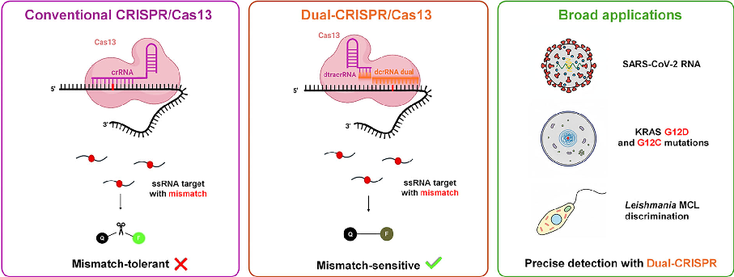
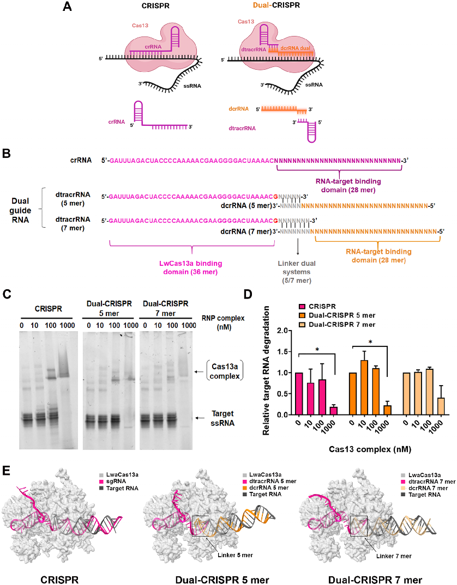
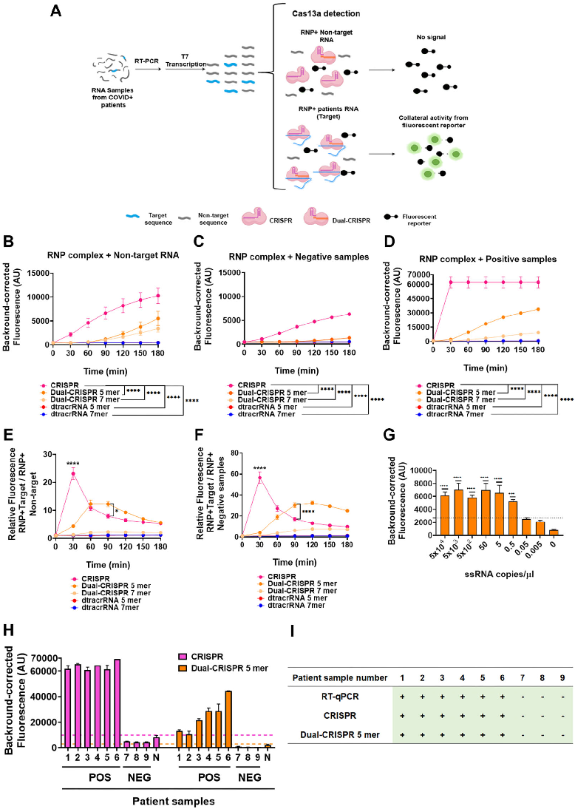
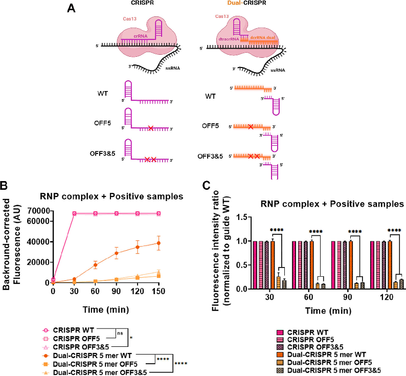
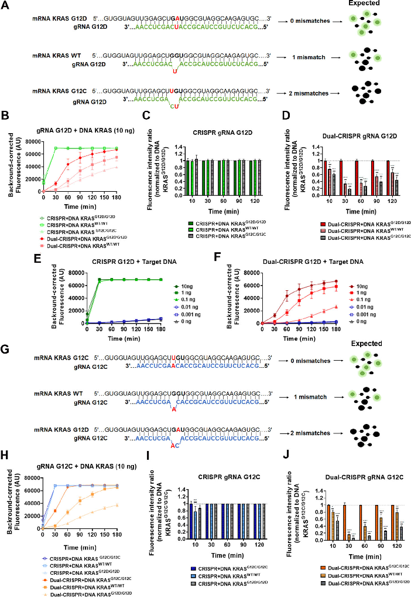
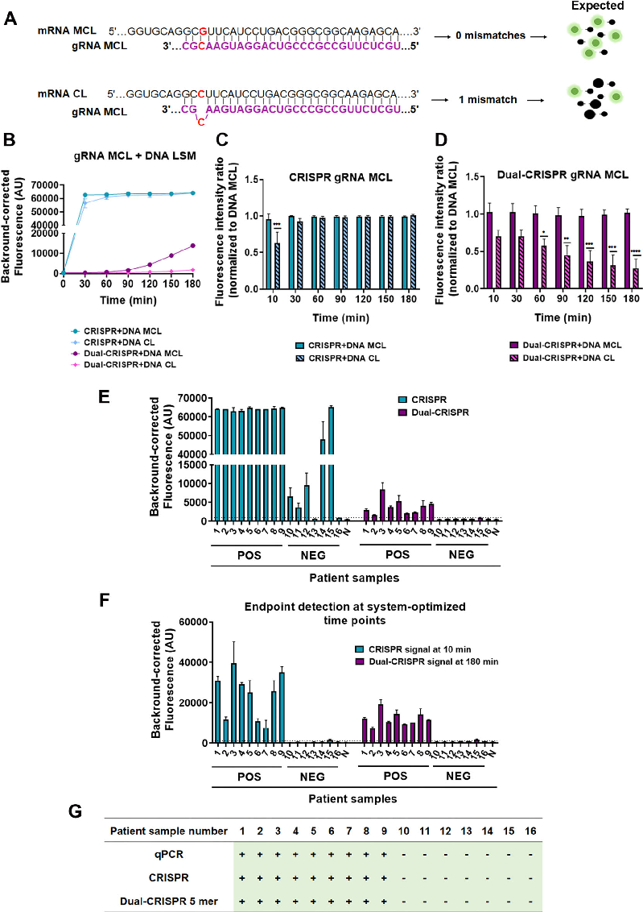

Nucleic Acids Research , 2026, 54 , gkag161 https://doi.org/10.1093/nar/gkag161 Chemical Biology and Nucleic Acid Chemistry

# A no v el Dual-guide CRISPR –Cas13 str at eg y impro v es specificity for single-nucleotide v ar iant detection

Ar aceli A guilar-González 1 , 2 , 3 ,* ,†,

Ismael Mar t os-J amai 1 , 2 , 3 ,†,

Ir is Ramos-Her nández 1 ,3 ,

F r ancisco J a vier Molina-Estév ez 1 ,3 ,

Nancy Villeg as Villao 4 ,

Pilar Puig-Serr a 5 ,

Sandr a Rodríguez-Per ales 5 ,

Raúl Torres 5 ,6 ,

Kornel Labun 7 ,

Rosario María Sánc hez-Mar tín 1 , 2 , 3 ,

Juan José Díaz-Mochón 1 , 2 , 3 ,* ,

F r ancisco Mar tín 1 , 3 , 8 ,*

1 GENYO, Centre for Genomics and Oncological Research, Pfizer, University of Granada, Andalusian Regional Government, PTS Granada, Avenida de la Ilustración, 114, Granada 18016, Spain 2 Department of Medicinal & Organic Chemistry, Excellence Research Unit of Chemistry applied to Biomedicine and the Environment, Faculty of Pharmacy, University of Granada, Campus de Cartuja s/n, Granada 18071, Spain 3 Instituto de Investigación Biosanitaria ibs, GRANADA, Granada 18012, Spain 4 Department of Parasitology and Tropical Medicine, Medical Degree Programme, Faculty of Health Sciences, Catholic University of Santiago de Guayaquil, Guayaquil 090615, Ecuador 5 Human Cancer Genetics Program, Molecular Cytogenetics & Genome Editing Unit, Centro Nacional de Investigaciones Oncologicas (CNIO), Melchor Fernandez Almagro, 3, Madrid 28029, Spain 6 Advanced Therapies Unit, Hematopoietic Innovative Therapies Division, Centro de Investigación Energéticas Medioambientales y Tecnológicas (CIEMAT) & Instituto de Investigación Sanitaria Fundación Jiménez Díaz (IIS-FJD, UAM), Madrid 28040, Spain 7 Computational Biology Unit, Department of Informatics, University of Bergen, Bergen Postboks 7803 NO-5020, Norway 8 Department of Biochemistry and Molecular Biology III and Immunology, Faculty of Medicine, Excellence Research Unit “Modeling Nature” (MNat), University of Granada. Avda. de la Investigación 11, Granada 18071, Spain

∗To whom correspondence should be addressed. Email: araceli.aguilar@genyo.es, araceliaguilar@ugr.es Correspondence may also be addressed to Francisco Martín. Email: francisco.martin@genyo.es, franciscomm@ugr.es Correspondence may also be addressed to José Díaz-Mochón. Email: juandiaz@go.ugr.es †Araceli Aguilar González and Ismael Martos-Jamai have contributed equally.

Abstract

The emergence of CRISPR –Cas systems has transformed nucleic acid detection and manipulation. Cas13, a type VI CRISPR effector, targets RNA with high sensitivity through both cis (target RNA) and trans (collateral RNA) clea v age. T his property enables the use of fluorescent reporters f or sensitiv e diagnostics. Ho w e v er, Cas13’s heightened sensitivity also leads to reduced specificity due to its susceptibility to single-nucleotide mismatches, potentially causing off-target effects. To o v ercome this limitation, w e de v eloped the first Dual-guide RNA sy stem f or Cas13 that impro v es mismatch discrimination and enhances target specificity. This system employs two distinct RNAs—dcrRNA and dtracrRNA—which cooperativ ely recogniz e the target and reduce off-t arget activit y. In vitro experiments demonstrated robust cis- and trans -RNase activity, indicating efficient and specific clea v age. T he sy stem accurately detected SAR S-CoV-2 RNA, distinguished KRAS G12D and G12C mutations, and differentiated mucocutaneous from cutaneous Leishmania sequences in analytical assays, with clinical validation confirming accurate detection of positive and negative samples. These results highlight the Dual-guide Cas13 platform’s potential for precise, rapid, and reliable RNA detection. Overall, this approach represents a substantial advance over conventional Cas13 systems, offering improved specificity while maintaining clinically rele v ant sensitivity, and provides a generalizable tool for next-generation molecular diagnostics and precision RNA targeting and regulation.

Downloaded from https://academic.oup.com/nar/article/54/5/gkag161/8500551 by guest on 25 June 2026

Received: August 13, 2025. Revised: February 5, 2026. Accepted: February 6, 2026 © The Author(s) 2026. Published by Oxford University Press. This is an Open Access article distributed under the terms of the Creative Commons Attribution-NonCommercial License ( https:// creativecommons.org/ licenses/by-nc/4.0/ ), which permits non-commercial re-use, distribution, and reproduction in any medium, provided the original work is properly cited. For commercial re-use, please contact reprints@oup.com for reprints and translation rights for reprints. All other permissions can be obtained through our RightsLink service via the Permissions link on the article page on our site—for further information please contact journals.permissions@oup.com .

2 Aguilar -González et al .

Gr aphical abstr act

# Introduction

Molecular diagnostics based on nucleic acid detection have become a central component of modern medicine, enabling the identification of pathogens, genetic alterations, and transcriptional signatures across a range of biomedical applications [ 1 , 2 ]. In particular, the ability to distinguish singlenucleotide variants (SNVs) is critical for differentiating closely related viral strains, detecting drug resistance mutations, or identifying oncogenic drivers such as Rat Sarcoma (RAS), B-Raf proto-oncogene, serine/threonine kinase (BRAF), Epidermal Growth Factor Receptor (EGFR) and others, as well as microRNAs [ 3 –6 ]. Although Polymerase Chain Reaction (PCR) and hybridization-based techniques such as TaqMan probes, melting curve analysis and microarrays are widely used for SNV detection, they often suffer from limited mismatch discrimination, cross-reactivity, and inflexible design [ 7 –9 ]. Sequencing-based approaches including nextgeneration sequencing (NGS) provide higher accuracy, especially for short RNA species; however its complexity and cost limit widespread implementation [ 9 , 10 ]. For these reasons, alternative technologies that effectively balance sensitivity , specificity , and applicability are required. Clustered Regularly Interspaced Short Palindromic Repeats (CRISPR) and CRISPR-associated (Cas) proteins have gained significant attention in recent years as promising alternatives. CRISPR –Cas systems have transformed the field of molecular biology, enabling precise and programmable nucleic acid targeting across a wide range of organisms and applications, including precision medicine, diagnostics, and biotechnology [ 11 –13 ]. While early studies focused primarily on DNAediting systems such as Cas9, increasing attention has been given to RNA-targeting effectors, particularly the class 2 type VI CRISPR effector Cas13. This enzyme is guided by a single RNA molecule to recognize and cleave the complementary target RNA ( cis activity), while also inducing collateral ( trans ) RNase activity that results in non-specific degradation of surrounding RNAs [ 14 , 15 ]. These properties have made Cas13 an attractive tool for transcriptome engineering, transient messenger RNA (mRNA) knockdown, and molecular diagnostics, where it has demonstrated high sensitivity in the nucleic acid-based detection of pathogenic organisms [ 16 –19 ]. However, this sensitivity likewise results in a notable tolerance for single-nucleotide mismatches, raising con-

cerns about off-target effects in both research and clinical settings. Consequently, enhancing mismatch discrimination in CRISPR –Cas13 platforms remains a critical challenge for their reliable use in high-specificity contexts [ 20 –22 ]. To overcome these limitations, several strategies have been proposed to improve Cas13 mismatch discrimination and specificity. One common approach involves deliberately introducing synthetic base-pair alterations into the guide RNA in addition to the naturally occurring target mismatch, thus creating multiple mismatches (typically three or more) between guide and target sequences [ 17 , 23 –26 ]. This cumulative effect reduces off-target binding, leading to improved specificity. However, this strategy is highly empirical and target-specific, requiring careful optimization of the number, position, and nature of these mismatches, which restricts its applicability for routine use. Another strategy to improve off-target discrimination in Cas13 systems involves engineering the protein itself. This includes modifications to key residues in the catalytic domains or regions involved in CRISPR RNA (crRNA) binding, aiming to improve target recognition and reduce collateral activity. While these approaches can indeed improve specificity, they typically require extensive structural analysis, are laborintensive, and often result in context-dependent performance [ 27 , 28 ]. Recent studies have explored the viability of splitting the guide RNA in CRISPR systems beyond Cas9 [ 29 –31 ]. Among the included studies, split CRISPR RNA configurations for Cas12a were able to reconstitute functional complexes in vitro under optimized conditions. However, these approaches have been limited to the detection of short RNA targets (such as microRNAs) due to the constrained guide length (typically < 20 nucleotides). Achieving detectable activity often requires elevated concentrations of both protein and guide RNAs [ 31 ]. Because Cas12a is inherently a DNA-targeting enzyme, its direct application to RNA detection remains limited [ 32 ]. This restricts the use of Cas12a-based split systems in diagnostic settings involving longer or more complex RNA analytes [ 33 , 34 ]. In this study, we introduce a novel Dual-guide CRISPR –Cas13 platform, in which the conventional sgRNA is divided into two separate RNA fragments connected through engineered complementary linker sequences of 3, 5, 7, 9, or 11 nucleotides. Linkers of 5 and 7 nucleotides preserve

Downloaded from https://academic.oup.com/nar/article/54/5/gkag161/8500551 by guest on 25 June 2026

the catalytic activity of LwaCas13a at levels comparable to the conventional single-guide system, while improving its specificity. We demonstrate that spatially separating the guide RNA reduces off-target binding, which is a major limitation of current Cas13-based diagnostics. We validate the improved specificity and functionality of our Dual-guide system through several clinically relevant applications: the sensitive detection of S AR S-CoV-2 RNA, the identification of SNVs in the KRAS oncogene with discrimination between wild-type, G12D and G12C alleles, and the differentiation between mucocutaneous and cutaneous Leishmania strains. This demonstrates the broad potential of our system for pathogen detection, cancer diagnostics, and parasitic characterization. Our results highlight the robustness and versatility of the Dual-guide approach, providing an innovative platform that addresses key challenges in nucleic acid diagnostics, with particular relevance for precision medicine.

# Materials and methods

## Patient samples

For the S AR S-CoV-2 analysis, we used five saliva control samples from healthy adult volunteers and ten saliva samples from individuals with confirmed S AR S-CoV-2 infection by reverse transcription quantitative polymerase chain reaction (RT-qPCR). All samples were provided by the Biobank of the Public Health System of Andalusia (reference S2000262), and informed consent was obtained from all participants. Total RNA was extracted from each sample using the Qiagen RNeasy Mini Kit (Qiagen, Hilden, Germany) according to the manufacturer’s instructions. Purified RNA samples were stored at –80 ◦C until further use to preserve integrity for downstream analyses. For the Leishmania analysis, we used genomic DNA (gDNA) obtained from patient samples (LSM positive) and healthy donors (LSM negative). The collection and use of these samples were approved by the Human Research Ethics Committee of Hospital Clínica Kennedy (HCK-CEISH) in Guayaquil, Ecuador (approval code: HCK-CEISH-2022-013). All procedures involving human participants were performed in accordance with relevant ethical guidelines and regulations. gDNA was purified using QIAamp DNA mini kit (Qiagen) and stored at –20 ◦C until further analysis.

## Cell lines and culture media

MIA PaCa-2 (CRL-1420, ATCC) cells were maintained in DMEM medium (Dulbecco’s modified Eagle medium high glucose) (Biowest, Nuaillé, France) supplemented with 10% fetal bovine serum (FBS) (Biowest) and 1% penicillin/streptomycin (Biowest). BxPC3 (CRL-1687) and AsPC1 (CRL-1682, ATCC) cells were maintained in RPMI-1640 medium (Biowest), supplemented with 10% FBS, and 1% penicillin/streptomycin. Cells were maintained in incubators at 37 ◦C with 5% CO 2 atmosphere and 85% –90% relative humidity. Absence of Mycoplasma spp . in cultured cells was routinely tested by a PCR-based assay (Minerva Biolabs, Skillman, NJ, USA).

## qPCR

To confirm pathogen positivity in patient samples, quantitative PCR (qPCR) analyses were performed using Fast SYBR ™ Green Master Mix (Applied Biosystems, Waltham,

MA, USA) on a QuantStudio ™ 6 Flex Real-Time PCR System (96-well format; Applied Biosystems). For S AR S-CoV-2, total RNA was first reverse-transcribed into complementary DNA (cDNA) using the High-Capacity cDNA Reverse Transcription Kit (Applied Biosystems) with RNase Inhibitor (Applied Biosystems), following the manufacturer’s instructions. For Leishmania , gDNA was used directly as the amplification template. The qPCR protocol was identical for both targets and consisted of an initial denaturation at 95 ◦C for 5 s, followed by 40 cycles of 96.5 ◦C for 10 s and 62 –64 ◦C for 30 s, and a final melt curve step at 95.6 ◦C for 10 s, 55 ◦C with a ramp rate of 0.05 ◦C/s, and 95 ◦C for 30 s. All reactions were run in duplicate using the primers listed in Supplementary Table S1 .

## Guide RNA synthesis

All guide RNAs used in this study, including dual crRNAs (dcrRNAs), dual tracrRNAs (dtracrRNAs), and single-guide RNAs (sgRNAs), were synthesized and purchased from Integrated DNA Technologies (IDT, Coralville, IA, USA). The sequences of all guide RNAs corresponding to each target are provided in Supplementary Table S2 .

## Target RNA synthesis

To generate synthetic RNA targets, S AR S-CoV-2 cDNA was PCR-amplified using KAPA HiFi HotStart ReadyMix (Kapa Biosystems, Wilmington, MA, USA) and primers listed in Supplementary Table S1 . The resulting double-stranded DNA (dsDNA) amplicons were gel-purified using the MinElute Gel Extraction Kit (Qiagen). In vitro transcription was performed by incubating the purified dsDNA overnight at 37 ◦C with T7 RNA polymerase (New England Biolabs, Ipswich, MA, USA) in the presence of RNase inhibitor (Applied Biosystems) and rNTPs (New England Biolabs). The transcribed RNA was purified using the MEGAclear Transcription Clean-Up Kit (Applied Biosystems) according to the manufacturer’s instructions.

## Electrophoretic mobility shift assay

RNA –protein interactions were assessed using an electrophoretic mobility shift assay (EMSA) optimized for Cas13based complexes. First, Dual-guide RNA complexes were prepared by annealing 10 μl of dcrRNA (10 μM, IDT) with 10 μl of dtracrRNA (10 μM, IDT) in the presence of 5 μl of annealing buffer (Synthego, Menlo Park, C A, US A). This mixture was incubated in a thermocycler using the following program: 95 ◦C for 4 min, 65 ◦C for 5 min, 25 ◦C for 5 min, and then held at 4 ◦C. Recombinant LwaCas13a (57 μM, GenScript, Piscataway, NJ, USA) was diluted in buffer 2 (New England Biolabs, Ipswich, MA, USA) supplemented with bovine serum albumin (BSA) to a working concentration of 4 μM. To assemble the Cas13 –RNP complex (2 μM), the diluted Cas13 was mixed with the annealed crRNA:tracrRNA duplex and incubated for 10 min at room temperature. Samples were then kept on ice until further use. Binding reactions were prepared by combining appropriate volumes of the Cas13 –RNP complex with binding buffer (20 mM HEPES, pH 7.5, 250 mM KCl, 2 mM MgCl 2 , 0.01% Triton X-100, and 10% glycerol; all reagents from Sigma –Aldrich, St. Louis, MO, USA) to reach final complex concentrations of 0, 10, 100, or 1000 nM. Subsequently, 1 μl of target RNA (100 ng/ μl) previously synthesized was added to each reaction, followed by incubation for 1 h at 37 ◦C. Following incubation, each reaction was loaded onto

Downloaded from https://academic.oup.com/nar/article/54/5/gkag161/8500551 by guest on 25 June 2026

a precast native 4% –20% polyacrylamide gel (Bio-Rad, Hercules, C A, US A). Electrophoresis was performed in 1 × TBE buffer supplemented with 2 mM MgCl 2 at 100 V for 75 min at 4 ◦C. After electrophoresis, the gel was stained in 1 × TBE containing GelRed ® nucleic acid stain (Biotium, Fremont, CA, USA) and 2 mM MgCl 2 . Visualization of RNA –protein complexes was performed using a Gel Doc ™ EZ Imager system (Bio-Rad). Images were analyzed and band intensities quantified using ImageJ software version 1.53q (NIH, Bethesda, MD, USA).

## Cas13 collateral cleavage detection assay (SHERLOCK)

Detection of target RNA or DNA sequences was performed using a two-step SHERLOCK (Specific High-Sensitivity Enzymatic Reporter Unlocking) assay optimized for LwaCas13a collateral activity using both single- and dual-guide CRISPR systems. (i) Reverse transcription and PCR amplification: Total RNA extracted from patient samples (including both S AR S-CoV2 positive and negative cases) was reverse transcribed into cDNA using the High-Capacity cDNA Reverse Transcription Kit with RNase Inhibitor (Applied Biosystems), following the manufacturer’s instructions. For S AR S-CoV-2 samples, known amounts of cDNA (10 ng or 1 ng per reaction) were used. For KRAS detection, gDNA was extracted using a QIAamp DNA mini kit (Qiagen) following the manufacturer’s instructions, and used input amounts of 10, 1, or 0.1 ng per reaction. For Leishmania , target sequences were amplified from approximately 25 ng of patient-derived gDNA, while in analytical assays using gDNA from L. major (cutaneous form) lower amounts (0.01 ng) were tested. PCR amplification was performed using gene-specific primers ( Supplementary Table S1 ) and GoTaq ® G2 DNA Polymerase Master Mix, colorless 2 × (Promega, Madison, WI, USA). (ii) In vitro transcription and Cas13 detection: Cas13based detection was carried out in 384-well microplates. The plate reader (NanoQuant, Tecan, Männedorf, Switzerland) was preheated to 37 ◦C, and all reagents were maintained on ice until transferred to the plate. LwaCas13a (GenScript) was diluted to a final concentration of 450 nM in Buffer 2 (New England Biolabs) supplemented with BSA. The detection mix (19 μl per well) was assembled in the following order: RNasefree water, HEPES buffer (pH 6.8, final concentration 20 mM; Sigma), and guide RNA (45 nM of a synthetic sgRNA or 90 nM of a Dual-guide complex, both from IDT). The dual-guide complex was previously formed by annealing 10 μl of dcrRNA (10 μM, IDT) with 10 μl of dtracrRNA (10 μM, IDT) in the presence of 5 μl of annealing buffer (Synthego), followed by incubation in a thermocycler with the following program: 95 ◦C for 4 min, 65 ◦C for 5 min, 25 ◦C for 5 min, and held at 4 ◦C. The mix was completed by adding LwaCas13a protein (final 45 nM), murine RNase inhibitor (2 U/ μl; New England Biolabs), rNTP solution (1 mM each; New England Biolabs), T7 RNA polymerase (0.125 U/ μl; New England Biolabs), and the RNaseAlert substrate (125 nM; IDT). The reaction was initiated by adding 1 μl of the PCR product to each well. Fluorescence was monitored every 5 min for 3 h at 37 ◦C using excitation and emission wavelengths of 485 and 520 nm, respectively. All reactions were performed in triplicate and protected from light throughout the procedure to preserve reporter integrity.

## Limit of detection

The limit of detection (LoD) was determined using a synthetic RNA oligonucleotide corresponding to the target sequence (IDT). Serial ten-fold dilutions of the RNA, ranging from 5 × 10 4 to 0.005 copies/ μl, were prepared in nuclease-free water. Each dilution was reverse-transcribed into cDNA using the High-Capacity cDNA Reverse Transcription Kit (Applied Biosystems) with RNase Inhibitor (Applied Biosystems), following the manufacturer’s instructions. The resulting cDNA was subsequently amplified by PCR and analyzed using the Cas13 Collateral Cleavage Detection Assay (SHERLOCK) as described in the previous section, to determine the lowest concentration detectable by the Dual-CRISPR system.

## AlphaFold 3 structure prediction and analysis

Structural modeling of the Cas13a protein complex with either the conventional sgRNA or Dual-guide RNA constructs was performed using AlphaFold 3 (DeepMind Technologies Ltd., London, UK, and Isomorphic Labs Ltd., London, UK) via the AlphaFold Server https:// alphafoldserver.com/ (April, 2025) [ 35 ]. The LwaCas13a amino acid sequence was obtained from UniProt (ID: U2PWF1), due to the absence of an experimentally resolved structure. Input RNA sequences corresponded to either the canonical sgRNA or the Dual-guide RNA constructs. For each complex, the five ranked models generated by AlphaFold were analyzed, and the top-ranked model (Rank 1) was selected for further study. These models were subsequently imported into UCSF ChimeraX (version 1.2.5) for visualization and detailed structural examination. The B-factor attribute was employed to assess regional variability among models.

## Website for Dual-cas13a guide design

We developed a web tool ( https:// crisprtools.org/ dual-cas13a ) that automates the design of Dual-crRNAs and compatible primers. The algorithm integrates Primer3 [ 36 ] to generate T7-promoted amplicons (75 –150 bp) and the ViennaRNA Package [ 37 ] to model guide folding and target affinity. Candidates are ranked hierarchically based on accessibility and thermodynamic stability. For more details see Supplementary Materials and Methods.

## Statistical analysis

Statistical analyses on data obtained were performed and represented with the GraphPad Prism software (version 8.0.1) (GraphPad Software, La Jolla, C A, US A). All data are presented as mean ± SEM. Two-way ANOVA was used for multiple comparisons, followed by appropriate post-hoc tests. Statistical significance is indicated as follows: ∗P < 0.05, ∗∗P < 0.01, ∗∗∗P < 0.001, ∗∗∗∗P < 0.0001. The specific tests used are detailed in each figure legend.

## Figure creation

For formatting the figures Adobe Photoshop version 13.0.1 (Adobe, San José, C A, US A) was used. Figure 1 A was designed using BioRender (BioRender.com). This design served as the base for the subsequent creation of Figs 2 A, 3 A and Graphical abstract. These figures were subsequently adapted and finalized in Adobe Photoshop, including the incorporation of AI-generated schematic elements in the graphical abstract.

Downloaded from https://academic.oup.com/nar/article/54/5/gkag161/8500551 by guest on 25 June 2026

# Results

## Design and structural characterization of the Dual-CRISPR system for LwaCas13a

To address the limitations of conventional single-guide designs in CRISPR –Cas13 systems, we engineered a modular dualguide architecture, coined Dual-CRISPR. Unlike the conventional CRISPR system where a single crRNA molecule mediates both Cas13 binding and target recognition, our DualCRISPR system dissociates these functions into two distinct components: a variable dcrRNA, which contains the spacer sequence complementary to the RNA target, and a constant dtracrRNA, which mediates interaction with LwaCas13a and the dcrRNA (Fig. 1 A). These two components interact via short complementary linker sequences de novo designed to enable stable hybridization and efficient complex formation. Different linker lengths (ranging from 3 to 11 nucleotides) were empirically tested during the development of the DualCRISPR system ( Supplementary Fig. S1 ). Based on these assays, we selected 5- and 7-nt linkers because they exhibited higher corrected fluorescence signals in the presence of target RNA as well as lower background activation with non-target RNA compared with the others ( Supplementary Fig. S1 ). The complete sequences of all guide RNAs used are provided in Supplementary Table S2 . For the initial characterization of the system, we designed guide RNAs targeting a region within the spike (S) genederived RNA of S AR S-CoV-2. The structure of the singleguide and dual-guide constructs are shown in Fig. 1 B, with the conserved Cas13-binding domain, 28-nt spacer, and our custom-designed linker regions highlighted in different colors. Complex formation and RNA-binding capacity were evaluated by EMSA (Fig. 1 C). Both dual-guide constructs (5mer and 7-mer) efficiently assembled into RNP complexes with the S AR S-CoV-2 target RNA, showing similar RNAbinding capacity compared to the conventional Cas13 system. In all conditions, increasing concentrations of the RNPs resulted in a progressive loss of free target ssRNA, consistent with concentration-dependent activity. Band intensities corresponding to the free target RNA were quantified and normalized to the 0 nM RNP condition (RNP-free control), with lower normalized values indicating increased target degradation (Fig. 1 D). No significant differences were observed at 0, 10, and 100 nM RNPs, indicating that concentrations up to 1000 nM RNPs are required to trigger RNA target degradation. To further investigate the integrity of our Dual-CRISPR design, 3D structural models were generated using the latest generation of AI-driven molecular modeling system, AlphaFold 3 [ 35 ]. These models accurately predict the conformations of LwaCas13a bound to both sgRNA and Dual-guide RNA constructs, alongside the 28-nucleotide target RNA. The dual-guide models, particularly the 5-mer linker variant, exhibited overall structural similarity to the conventional CRISPR –Cas13 complex, suggesting that the introduction of a split guide does not disrupt the formation of a functional ribonucleoprotein complex (Fig. 1 E). Beyond this global comparison, the models offer a detailed understanding of the differences between dual-guide variants. Introducing a split creates a junction whose flexibility depends on the length of the linker: shorter linkers, such as the 5-mer, appear to preserve the native orientation of the guide within the Cas13a RNA-binding groove more effectively, whereas longer link-

ers introduce additional conformational freedom that may weaken cooperative binding. Consistent with this interpretation, AlphaFold 3 predictions indicate that the Cas13a core fold remains largely unchanged across all constructs. This suggests that functional differences arise from subtle variations in guide positioning rather than protein rearrangement. Local steric effects at the guide –target interface may also be a contributing factor, as small differences in the modelled crRNA –target duplex could influence binding energy and, consequently, catalytic activation. A more detailed analysis of these models, including structural alignment and conformational features, can be found in the Supplementary Fig. S2 .

## Validation of the Dual-CRISPR –Cas13 system for RNA detection with a SHERLOCK-based assay

In order to evaluate the diagnostic potential of the DualCRISPR –Cas13 system, a SHERLOCK-based assay for S AR SCoV-2 RNA was performed. All samples were previously validated by RT-qPCR to confirm their SARS-CoV-2 status (positive or negative) ( Supplementary Fig. S3 ). Traditional SHERLOCK protocols rely on isothermal amplification of the target sequence, typically using recombinase polymerase amplification (RPA) followed by in vitro transcription to generate RNA for Cas13 detection [ 38 ]. However, while RPA is a valuable amplification method, under our experimental conditions, it exhibited a higher susceptibility to nonspecific amplification and cross-contamination. Several primer pairs targeting the S gene region of S AR S-CoV-2 were tested, but false-positive signals were detected in negative controls ( Supplementary Fig. S4 ). In light of the limited specificity and increased contamination risk associated with RPA, under these experimental conditions, we opted to replace this step with PCR amplification. For this approach, PCR primers were designed to flank the target region within the S AR S-CoV-2 spike (S) gene, with a T7 promoter sequence incorporated into the forward primer ( Supplementary Table S1 ). This allowed the resulting amplicons to act as templates for in vitro transcription, producing RNA for subsequent detection by Cas13. A schematic representation of the adapted assay workflow is shown in Fig. 2 A. PCR amplicons containing a T7 promoter are incubated in a single reaction with T7 RNA polymerase, Cas13 RNPs, and a fluorescent RNA reporter. During incubation, the DNA amplicons are transcribed into RNA. Upon specific recognition of the RNA target, Cas13 is activated and cleaves the fluorescent reporter via its collateral ( trans ) activity, generating a measurable fluorescence signal [ 17 ]. The predicted secondary structures of the in vitro transcribed RNA targets used in these assays are shown in Supplementary Fig. S5 A. These structural models, generated using FoRNA software, reveal distinct conformations that may influence target accessibility and Cas13-mediated cleavage. We compared the collateral activity of standard CRISPR –Cas13 and Dual-CRISPR –Cas13 systems (5mer and 7-mer) using non-target RNA extracted from HEK293T cells, RNA from healthy donors (S AR S-CoV-2 negative samples confirmed by RT-qPCR), and target RNA from S AR S-CoV-2 positive patients confirmed by RT-qPCR. Fluorescence signal resulting from reporter cleavage was monitored over a 3-h period. Both Dual-CRISPR variants generated substantially lower fluorescence signals in the

Downloaded from https://academic.oup.com/nar/article/54/5/gkag161/8500551 by guest on 25 June 2026

Figure 1. Design and characterization of the no v el Dual-CRISPR system for Cas13. ( A ) Schematic representation of con v entional CRISPR and the newly de v eloped Dual-CRISPR architecture for Cas13. In the con v entional sy stem, Cas13 binds to a single crRNA molecule that acts as both the Cas-binding and target-recognition domain. In the Dual-CRISPR system, these functions are dissociated into two distinct RNAs: a variable dcrRNA responsible for t arget binding , and a const ant dtracrRNA that mediates interaction with Cas13 and dcrRNA. The final complex comprises three components: LwaCas13a protein, the variable dcrRNA targeting the sequence of interest, and the constant dtracrRNA. ( B ) Sequences of the CRISPR and Dual-CRISPR (5-mer and 7-mer linkers) components used with LwaCas13a. The Cas13-binding domain, the 28-nucleotide spacer targeting the viral RNA (Conventional vs Dual system), and the linker sequences for the Dual-CRISPR constructs are indicated. ( C ) EMSA of CRISPR and Dual-CRISPR (5-mer and 7-mer) comple x es incubated with their SARS-CoV-2 RNA target. Complexes were assembled in vitro and incubated with increasing concentrations (0, 10, 100, and 10 0 0 nM) of the CRISPR –Cas13 ribonucleoprotein comple x es. T he lo w er bands correspond to the target single-stranded RNA (ssRNA) generated in our laboratory, which displa y s some heterogeneity, while the upper bands represent the Cas13 –RNA comple x es whose intensity increases with higher RNP concentrations. ( D ) Quantification of residual target ssRNA from the EMSA in panel (C). Band intensities corresponding to the target ssRNA were quantified for each lane and normalized to the 0 nM RNP condition in each case. Lower normalized values indicate increased Cas13a-mediated target degradation. Statistical analysis: tw o-w a y ANO V A with Tuk e y’s multiple comparisons test w as used to compare residual ssRNA le v els ( ∗P < 0.05). B ars represent mean ± SEM of n = 3 independent experiments.( E ) Predicted 3D str uct ures of the CRISPR and Dual-CRISPR (5-mer and 7-mer) complexes bound to the target RNA (28 nt), modeled using AlphaFold 3. Created in BioRender. Aguilar, A. (2026) https:// BioRender.com/ gxqr13o .

Downloaded from https://academic.oup.com/nar/article/54/5/gkag161/8500551 by guest on 25 June 2026

Figure 2. Evaluation of the functionality of the Dual-CRISPR –Cas13 system for SARS-CoV-2 virus detection. ( A ) Schematic of the PCR-adapted-SHERLOCK method for SARS-CoV-2 virus detection for CRISPR and Dual-CRISPR system. ( B –D ) Corrected fluorescence of RNP-CRISPR, Dual-CRISPR 5mer and 7mer comple x es with non-target RNA (RNA from HEK293T cells) (B), with negative samples (healthy controls) (C), and with positive samples (SARS-CoV-2 RNA target) (D) after incubation with the fluorescent reporter for 3 h. ( E ) Relative fluorescence of RNP complexes with RNA from positive samples (target RNA) versus fluorescence of RNP complexes with non-target RNA (HEK293T). ( F ) Relative fluorescence of RNP comple x es with RNA from positive samples (target RNA) versus fluorescence of RNP complexes with negative samples. ( G ) LoD analysis of the Dual-CRISPR 5mer system using synthetic ssRNA containing the target sequence. Fluorescence was measured after 60 min of incubation and compared against the no-input control (0 copies/ μl). ( H ) Endpoint fluorescence signal of 9 patient saliva samples (6 positives for SARS-CoV-2 and 3 negativ es) f or clinical e v aluation of Dual-CRISPR 5mer and CRISPR af ter 1 20 min. For eac h sy stem, the detection threshold w as defined based on its respectiv e negativ e control (N), with CRISPR and Dual-CRISPR 5mer conditions indicated separately. ( I ) Perf ormance assessment of CRISPR and Dual-CRISPR 5-mer compared against standard RT-qPCR testing. Statistical analysis: tw o-w a y ANO V A (Dunnett’s multiple comparison test) of mean fluorescence at all times (B –D) and at specific times such as 30 and 90 min (E and F); one-w a y ANO V A (Dunnett’s multiple comparison test) of mean fluorescence at 60 min (G) ( ∗P < 0.05, ∗∗P < 0.01, ∗∗∗P < 0.001, ∗∗∗∗P < 0.0 0 01). Values represent the mean ± SEM of at least three separate experiments. Created in BioRender. Aguilar, A. (2026) https:// BioRender.com/ gxqr13o .

Downloaded from https://academic.oup.com/nar/article/54/5/gkag161/8500551 by guest on 25 June 2026

presence of non-target RNA and negative samples (healthy control) compared to the conventional system (Fig. 2 B and C), indicating improved specificity. In contrast, RNA from positive samples (particularly when tested with the 5-mer variant) yielded markedly higher fluorescence, reaching levels comparable to the standard CRISPR complex. Although standard CRISPR complex had faster kinetics, the dual system achieved comparable levels after 180 min (Fig. 2 D). These results demonstrate the diagnostic potential and functionality of the Dual-CRISPR system. Although absolute fluorescence was lower for DualCRISPR, target discrimination became evident after normalizing patient samples signals (target) against both negative controls (Fig. 2 E and F). The Dual-CRISPR 5-mer variant demonstrated robust target-specific activation with improved specificity, particularly during longer incubation periods ( > 60 min), a timeframe in which the conventional CRISPR –Cas13 system showed a tendency toward increased background noise under our experimental conditions. To further evaluate the analytical performance of the DualCRISPR 5mer system, we first determined its LoD using serial dilutions of preamplified synthetic ssRNA (Fig. 2 G). Fluorescence was measured after incubation and compared to the no-input control (0 copies/ μl), demonstrating robust detection down to 0.5 copies/ μl in a final volume of 20 μl. We next assessed clinical performance using nine characterized patient saliva samples (six S AR S-CoV-2 positive and three negative), directly comparing the Dual-CRISPR 5mer system with conventional CRISPR –Cas13. Although positive samples showed lower absolute fluorescence with the Dual-CRISPR system, negative samples produced even lower signals than with conventional CRISPR, resulting in reliable target discrimination and overall detection performance comparable to the standard system (Fig. 2 H). Finally, the results from both platforms were benchmarked against RT-qPCR, showing complete concordance (100%) and therefore confirming the sensitivity and specificity of the Dual-CRISPR assay (Fig. 2 I).

## Evaluation of mismatch sensitivity in Dual-CRISPR versus CRISPR for SARS-CoV-2 detection

The inherent tolerance of conventional Cas13 systems to single-nucleotide mismatches presents a significant challenge for their application in molecular diagnostics, often leading to reduced specificity and potential false positives, particularly when differentiating closely related targets or identifying SNVs. We hypothesize that the strict co-assembly requirements and reduced dtracrRNA stabilization in the Dual Cas13a system elevate the activation threshold, such that even single-nucleotide mismatches within the spacer can prevent target cleavage and collateral activity, thereby significantly lowering off-target rates compared to conventional Cas13a. To test this, we examine the system’s mismatch sensitivity by evaluating its ability to discriminate between single and double mismatches in the guide-target pairing. We focused on the 5-mer dual-guide, which had previously demonstrated the most favorable performance in terms of target recognition and signal specificity. To this end, we designed several guide RNAs containing either one (OFF5) or two (OFF3&5) synthetic mismatches relative to the S AR S-CoV-2 target sequence. Positions 5 and 3&5 within the guide sequence were selected based on previous studies which identified these sites as having the

greatest destabilizing effect on guide-target pairing [ 17 , 39 ] (Fig. 3 A). Then, the collateral activity of Cas13 was compared with either wild-type or mismatched guides using the RNA extracted from S AR S-CoV-2 positive samples as target. Fluorescence generated by reporter cleavage was monitored in both the conventional CRISPR and Dual-CRISPR systems. The standard CRISPR system exhibited minimal variation in fluorescence signals between wild-type and altered guides (OFF5 and OFF3&5), even with two mismatches, indicating a relatively high tolerance for sequence divergence (Fig. 3 B, pink dots versus pink squares and triangles). These results are in line with the previous studies mentioned above, which reported that single mismatches do not substantially affect Cas13 activity [ 23 , 40 ]. In contrast, the Dual-CRISPR 5-mer exhibited a substantial decrease in signal intensity, reducing fluorescence by 80% –85% approximately, when using mismatched guides, with just one mismatch causing a significant reduction in fluorescence (Fig. 3 B, orange dots versus orange squares and triangles). To better quantify the impact of mismatches on target recognition, fluorescence signals were normalized to the corresponding wild-type guide signal at different time points. While the conventional CRISPR system has been widely used and provides reliable results, the Dual-CRISPR system demonstrated notably enhanced discrimination against single and double mismatches (Fig. 3 C). This improvement represents an important advancement toward increasing diagnostic accuracy.

## Improved specificity of Dual-CRISPR –Cas13 system in detecting oncogenic KRAS variants

Next, the efficiency of Dual-CRISPR –Cas13 system in distinguishing clinically relevant SNVs was evaluated. Given the relevance of detecting oncogenic mutations with high specificity for precise patient stratification and effective treatment decisions, the next phase of this research focuses on evaluating the implementation of this technology in these settings. Detecting oncogenic mutations with high specificity is critical in clinical diagnostics for accurate patient stratification and treatment guidance. SNVs in the KRAS gene, such as G12D and G12C, are prevalent in various cancers, including pancreatic adenocarcinoma, and their precise identification is crucial for targeted therapies such as monoclonal antibody-based therapies. Conventional Cas13 systems, while sensitive, often struggle to reliably discriminate between such closely related SNVs within a complex genomic background, potentially leading to misdiagnosis. We thus evaluated the specificity of our DualCRISPR –Cas13 system for detecting these clinically relevant KRAS mutations (G12D and G12C) in a cell-based gDNA model. The presence of these specific KRAS mutations was validated in different pancreatic cell lines ( Supplementary Fig. S6 ), ensuring a reliable model for specificity testing. gDNA was thus extracted from wellcharacterized pancreatic cell lines: BxPC-3 (KRAS WT), AsPC-1 (KRAS G12D), and MIA-PaCa2 (KRAS G12C), each homozygous for their respective alleles. The predicted secondary structures of the in vitro transcribed RNA targets used for KRAS are shown in Supplementary Fig. S5 B –D. A guide RNA specific for the G12D mutation was used in both the conventional CRISPR –Cas13 assay and our DualCRISPR –Cas13 configuration [ 39 ]. This design allowed for

Downloaded from https://academic.oup.com/nar/article/54/5/gkag161/8500551 by guest on 25 June 2026

Figure 3. Evaluation of the specificity of Dual-CRISPR –Cas13 versus CRISPR for SARS-CoV-2 virus detection. ( A ) Scheme of the different guides designed for CRISPR and Dual-CRISPR 5mer. The WT guide binds perfectly to the SARS-CoV-2 target sequence. The OFF5 and OFF3&5 guides have 1 and 2 mismatches with the SARS-CoV-2 target sequence, respectively. ( B ) Corrected fluorescence of RNP –CRISPR and Dual-CRISPR 5mer complexes with RNA from patient samples (target RNA) after incubation with the fluorescent reporter for 150 min. ( C ) Fluorescence intensity ratio normalized to the WT guide (CRISPR and Dual-CRISPR 5 mer, respectively) at different time points (30, 60, 90, and 120 min). Statistical analysis: two-way ANO V A with a Dunnett’s multiple comparisons test was used to compare mean fluorescence at all times (B) and at specific times (C) comparing between WT and different mismatches) ( ∗P < 0.05, ∗∗P < 0.01, ∗∗∗P < 0.001, ∗∗∗∗P < 0.0 0 01). Values represent the mean ± SEM of three separate experiments. Created in BioRender. Aguilar, A. (2026) https:// BioRender.com/ gxqr13o .

the direct comparison of their abilities to selectively detect the KRAS G12D allele, while discriminating against the wildtype sequence (representing a single mismatch) and the KRAS G12C sequence (representing two mismatches) (Fig. 4 A). To enable detection from gDNA, the SHERLOCK workflow was adapted from the RNA-based format previously used for S AR S-CoV-2 (Fig. 2 A) to use gDNA as input for KRAS mutation analysis. We then compared the collateral activity of G12D –gRNA:Cas13 complexes across different DNA targets (G12D, WT, and G12C) using gDNA (10 ng). The conventional CRISPR –Cas13 system showed minimal signal profile differences over time between the specific G12D and non-specific WT and G12C targets (Fig. 4 B and C). In contrast, our Dual-CRISPR/Cas13 configuration showed improved mismatch discrimination, with a clearer separation between the G12D target from WT (1 mismatch) and G12C (2 mismatches) sequences (Fig. 4 B and D). This enhanced specificity was maintained at lower DNA inputs (1 and 0.1 ng; Supplementary Figs S7 A –C and S8 A –C). In

addition, we determined the kinetic fluorescence signal of the G12D-specific gRNA across decreasing gDNA inputs (10, 1, 0.1, 0.01, 0.001 ng, and no DNA) for both the conventional CRISPR/Cas13 system (Fig. 4 E) and the Dual-CRISPR configuration (Fig. 4 F). The conventional CRISPR system produced robust fluorescence at 10, 1, and 0.1 ng, while the Dual-CRISPR system showed slightly lower signals at 1 and 0.1 ng, reflecting its lower sensitivity. At the lowest inputs (0.01 and 0.001 ng) and in the no-DNA control, both systems produced no detectable signal, establishing an approximate detection threshold of 0.1 ng under these assay conditions (Fig. 4 E and F, and Supplementary Fig. S9 ). Using a G12C-specific guide RNA, both systems were evaluated for their ability to discriminate the G12C mutation (Fig. 4 G). The Dual-CRISPR configuration consistently distinguished G12C from WT and G12D sequences (Fig. 4 H and J), while the conventional system failed to differentiate between specific and non-specific targets (Fig. 4 H –I and Table 1 ). Notably, the discriminatory performance of the Dual-CRISPR ap-

Downloaded from https://academic.oup.com/nar/article/54/5/gkag161/8500551 by guest on 25 June 2026

Figure 4. Evaluation of CRISPR and Dual-CRISPR Specificity in the Detection of KRAS G12D and G12C variants. ( A ) Schematic representation of the KRAS G12D guide, which is designed for use with CRISPR and Dual-CRISPR systems, binding to different RNA targets (KRAS G1 2D , KRAS WT, or KRAS G12C). The expected output from the SHERLOCK system is shown based on the number of mismatches. The KRAS G12D guide binds perfectly to the KRAS G12D target sequence. The KRAS WT and KRAS G12C targets ha v e one and two mismatches with the G12D guide, respectively. ( B ) Corrected fluorescence of RNP-G12D guides (CRISPR and Dual-CRISPR) with DNA from pancreatic cell lines harboring G12D, WT, or G12C alleles (10 ng), after 180-min incubation with the fluorescent reporter. ( C ) Fluorescence intensity ratio normalised to KRAS G12D DNA (10 ng) using RNP-G12D guides (CRISPR) at different time points (10, 30, 60, 90, and 120 min). ( D ) Fluorescence intensity ratio normalized to KRAS G12D DNA (10 ng) using RNP-G12D guides (Dual-CRISPR) at different time points (10, 30, 60, 90, and 120 min). ( E and F ) Kinetic fluorescence of the con v entional CRISPR –Cas13 (E) and Dual-CRISPR –Cas13 (F) systems using a G12D-specific gRNA and decreasing amounts of KRAS G12D gDNA (10, 1, 0.1, 0.01, 0.001 ng, and no-DNA control) measured o v er 180 min. ( G ) A schematic representation of the binding of the KRAS G12C guide, which is designed for the CRISPR and Dual-CRISPR systems, to different RNA targets (KRAS G12C, KRAS WT or KRAS G12D) and the expected SHERLOCK output, based on the number of mismatches. The KRAS G12C guide binds perfectly to the KRAS G12C target sequence. The KRAS WT and KRAS G12D targets ha v e one and two mismatches with the G12C guide, respectively. ( H ) Corrected fluorescence of RNP-G12C guides (CRISPR and Dual-CRISPR) with DNA from pancreatic cell lines harboring G12C, WT, or G12D alleles (10 ng) after 180 min of incubation. ( I ) Fluorescence intensity ratio normalized to KRAS G12C DNA (10 ng) using RNP-G12C guides (CRISPR) at different time points (10, 30, 60, 90, and 120 min). ( J ) Fluorescence intensity ratio normalized to KRAS G12C DNA (10 ng) using RNP-G12C guides (Dual-CRISPR) at different time points (10, 30, 60, 90, and 120 min). Statistical analysis: tw o-w a y ANO V A with a Dunnett’s multiple comparisons test was used to compare specific targets with non-specific sequences (1 and 2 mismatches) at each time point ( ∗P < 0.05, ∗∗P < 0.01, ∗∗∗P < 0.001, ∗∗∗∗P < 0.0 0 01). Dat a are presented as the mean ± SEM from at least three independent experiments.

Downloaded from https://academic.oup.com/nar/article/54/5/gkag161/8500551 by guest on 25 June 2026

Table 1 . Mismatc h-discrimination performance of the Standard CRISPR –Cas1 3 and Dual-CRISPR –Cas1 3 sy stems f or KRAS SNVs

|Guide RNA ∗|Target DNA tested|Standard CRISPR –Cas13|Dual-CRISPR –Cas13|
|---|---|---|---|
|G12D-specific|KRAS G12D (On-Target)|Detected|Detected|
|G12D-specific|KRAS WT (1 Mismatch)|Detected (False Positive)|Not Detected (Accurate)|
|G12D-specific|KRAS G12C (2 Mismatches)|Detected (False Positive)|Not Detected (Accurate)|
|G12C-specific|KRAS G12C (On-Target)|Detected|Detected|
|G12C-specific|KRAS WT (1 Mismatch)|Detected (False Positive)|Not Detected (Accurate)|
|G12C-specific|KRAS G12D (2 Mismatches)|Detected (False Positive)|Not Detected (Accurate)|

Each guide RNA was tested against matched (on-target) and mismatched (1 –2 nt difference) sequences. Genotype calls correspond to the diagnostic reaction window (30 –60 min), during which only the specific target reaches detectable activation. Extended incubations shown in Fig. 4 were used only to evaluate collateral kinetics and are not used for allele calling. Correct assignments are indicated in bold italics. ∗In the Standard CRISPR –Cas13 system, guide RNA refers to sgRNA that is designed to be specific for the target (either G12D or G12C). In the Dual-CRISPR system, the specific guide RNA refers to the variable dcrRNA, which contains the sequence complementary to the target.

proach was preserved across all tested DNA concentrations ( Supplementary Figs S7 D –F and S8 D –F). These findings highlight the superior mismatch discrimination and enhanced diagnostic accuracy achieved with the Dual-CRISPR –Cas13 system relative to the conventional CRISPR assay.

## Enhanced accuracy of CRISPR-based detection of leishmania mucocutaneous variants in patient samples

The efficiency of the Dual-CRISPR –Cas13 system in distinguishing clinically relevant SNVs was next evaluated in the context of parasitic pathogens, further demonstrating the versatility of the system across diverse biological targets. Accurate molecular classification of Leishmania (LSM) infections is essential for patient management, as mucocutaneous leishmaniasis (MCL) is associated with more severe clinical outcomes compared with cutaneous leishmaniasis (CL) [ 41 ]. The genomic differences between these two variants consist mainly of single-nucleotide changes, which makes them difficult to differentiate. We designed guide RNAs targeting the hsp70 gene, specifically a genomic region containing a SNV, also referred to as a single-nucleotide fingerprint (SNF) in this infectious context [ 42 ], that distinguishes MCL from CL Leishmania variant (Fig. 5 A). As an initial assessment of variant discrimination, we used purified gDNA from qPCR-confirmed MCL patient samples ( Supplementary Fig. S10 ) together with gDNA from L. major (a representative CL species). Using in vitro –transcribed RNA targets, we evaluated variant resolution with the same SHERLOCK-based assay used for S AR SCoV-2 and KRAS. The conventional CRISPR system showed minimal discrimination, with only a slight difference between MCL and CL targets at early time points (10 min) before signal saturation (Fig. 5 B and C). By contrast, the DualCRISPR –Cas13 system demonstrated an increasing ability to discriminate over time. Although the overall positive signal was lower, likely due to the high GC content of the targeted region reducing accessibility, the discrimination between variants became significant after 60 min and continued to increase, enabling clear differentiation between MCL and CL targets (Fig. 5 D). To evaluate the clinical performance of both CRISPR-based assays, gDNA from 16 patient samples (9 positive and 7 negative) was analyzed. As an initial assessment, endpoint fluorescence was measured at the standard reaction time of 120 min for both systems (Fig. 5 E), consistent with the clinical evaluation strategy used for S AR S-CoV-2 detection (Fig. 2 H). Under these conditions, the conventional CRISPR –Cas13 system

generated elevated fluorescence signals not only in positive samples but also in several negatives, resulting in five falsepositive classifications. This behavior underscores the timedependent loss of specificity associated with the conventional CRISPR system at prolonged incubation times. In contrast, the Dual-CRISPR –Cas13 assay exhibited very low background fluorescence at 120 min in negative samples, but also produced relatively weak signals for Leishmania positive samples, making it difficult to distinguish positives from negatives at this time point. Based on these observations, systemspecific optimized detection times were established for each assay in order to compare them. Endpoint fluorescence was therefore evaluated at 10 min for CRISPR –Cas13 and 180 min for Dual-CRISPR –Cas13 (Fig. 5 F). At these optimized time points, both systems showed clear separation between positive and negative samples, with results fully concordant with qPCR classification (Fig. 5 G). Sanger sequencing confirmed that all patient-derived positive samples corresponded to the MCL variant ( Supplementary Fig. S11 ). Consequently, the clinical evaluation presented here reflects a binary presence/absence detection scenario rather than direct discrimination between MCL and CL variants. Variant-level specificity was independently established in prior analytical assays using purified L. major gDNA as the CL reference (Fig. 5 B). These results demonstrate that both systems accurately distinguish positive from negative samples when evaluated at their respective optimized detection times, while the DualCRISPR system additionally provides an enhanced discrimination of MCL variants at the SNV level. To facilitate the broader use of this platform, we also developed an automated web tool for dual-guide and primer design, available at https:// crisprtools.org/ dual-cas13a (see Materials and Methods and Supplementary Materials and Methods for more details).

# Discussion

In this study, we developed and validated a Dual-guide RNA architecture for CRISPR –Cas13a that increases target specificity while maintaining robust RNA cleavage activity. By splitting the conventional sgRNA into two distinct components (dcrRNA and dtracrRNA) linked via complementary sequences, the system introduces an additional layer of molecular recognition and improved mismatch discrimination. Indeed, our data suggest that the dual Cas13a architecture requires precise co-assembly of Cas13a, dtracrRNA, and dcrRNA together with the target RNA, thereby imposing a stricter conformational checkpoint for activation. In contrast to the wild-type crRNA, where scaffold and spacer are cova-

Downloaded from https://academic.oup.com/nar/article/54/5/gkag161/8500551 by guest on 25 June 2026

Figure 5. Evaluation of CRISPR and Dual-CRISPR specificity for detection of Leishmania mucocutaneous variants in patient samples. ( A ) Schematic of the LSM MCL guide designed for CRISPR and Dual-CRISPR systems, showing binding to target RNA sequences from LSM MCL and LSM CL. The expected SHERLOCK output is based on mismatch number: the MCL guide perfectly binds the MCL target, while CL sequences have one mismatch. ( B ) Corrected fluorescence of RNP-MCL (CRISPR and Dual-CRISPR) incubated with DNA from patient samples (25 ng) for 180 min with fluorescent reporter. ( C and D ) Fluorescence intensity ratios normalized to MCL DNA using RNP-MCL from conventional CRISPR system (C) and Dual-CRISPR system (D), measured at multiple time points (10 –180 min). ( E ) Endpoint fluorescence signals of 16 patient samples (9 LSM-positive and 7 LSM-negative) measured at the standard reaction time (120 min) for both CRISPR and Dual-CRISPR 5mer systems. Negative controls (N) for each system are shown; a common detection threshold, defined using negative samples, is indicated by black dotted lines. ( F ) Endpoint fluorescence signals of the same patient cohort measured at system-specific optimized detection times (CRISPR, 10 min; Dual-CRISPR 5mer, 180 min). ( G ) Performance assessment of CRISPR and Dual-CRISPR 5-mer compared against standard qPCR testing using optimized detection times. Statistical analysis was performed using two-way ANO V A with Dunnett’s multiple comparisons test to compare specific targets with non-specific sequences at each time point (C and D) ( ∗P < 0.05, ∗∗P < 0.01, ∗∗∗P < 0.001, ∗∗∗∗P < 0.0 0 01). Dat a are sho wn as mean ± SEM of at least three independent e xperiments.

Downloaded from https://academic.oup.com/nar/article/54/5/gkag161/8500551 by guest on 25 June 2026

lently linked and can tolerate partial mismatches, the dual system demands cooperative alignment of both RNA fragments (dcrRNA and dtracrRNA) and the target sequence. As a result, mismatches within the spacer region more effectively destabilize the ternary complex, reducing off-target cleavage and collateral activity. We hypothesized that the absence of a covalent scaffold –spacer linkage may itself contribute to the observed specificity. As reported by Shebanova et al . [ 31 ], the scaffold (dtracrRNA) enhances the affinity of the spacer for the effector protein, potentially stabilizing imperfect guide –target interactions. Similarly to the split CRISPR systems, this stabilizing effect is partially lost in our Dual-Cas13a system, meaning that spacer binding and activation become more dependent on perfect complementarity with the target RNA, increasing specificity of the system. These findings position dual Cas13a architecture as a promising platform for precise RNA targeting and SNP-sensitive diagnostics. The platform was successfully applied to detect S AR S-CoV2 RNA, discriminate oncogenic KRAS mutations, and accurately identify Leishmania mucocutaneous variants, demonstrating versatility across diverse and clinically relevant diagnostic contexts. In the context of viral diagnostics, the dual-guide system effectively identified S AR S-CoV -2 RNA with high specificity , particularly the 5-mer variant, even at long incubation times. While its sensitivity was slightly lower than the conventional single-guide Cas13 system at early time points, the dual architecture provided greater signal stability and significantly reduced background noise. Clinical testing with saliva samples further confirmed its robustness: despite lower absolute fluorescence, negative samples remained clearly separated from positives, yielding 100% concordance with RT-qPCR and demonstrating high sensitivity and specificity. Moreover, the dual-guide system presented a pronounced and significant decrease in signal intensity when challenged with guide RNAs containing single or double synthetic mismatches relative to the target sequence, unlike the conventional system (Fig. 3 B and C). Previous CRISPR-based diagnostics using Cas13a, such as SHERLOCK [ 17 , 43 ], or Cas13-based RPA amplification platforms [ 44 , 45 ], enable sensitive viral RNA detection but are often prone to nonspecific amplification and artefacts, especially in resource-limited settings. Our Dual-CRISPR system integrates a PCR-based pre-amplification step, providing a more controlled and reproducible workflow. While isothermal methods such as RT-RPA or RT-LAMP could be used, we observed increased false positives with RT-RPA in our platform ( Supplementary Fig. S4 ). PCR with Taq polymerase offers robust, cost-effective amplification with comparable reaction times to isothermal methods [ 46 ], minimizing nonspecific background and ensuring assay reliability. This choice prioritizes specificity , reproducibility , and accessibility , while leaving room for future adaptation to alternative amplification strategies. The practical utility of the Dual-gRNA system is further supported by its clinically relevant limits of detection. Using synthetic RNA standards, the system achieved a LoD of 0.5 copies/ μl for S AR S-CoV-2 (approximately 1 copy/reaction), while genomic KRAS detection reached ∼0.1 ng gDNA ( ∼15 diploid cells, ∼30 KRAS copies). These values are comparable to previously reported Cas13-based diagnostic platforms that rely on PCR preamplification, which typically achieve LoDs of 1 –10 copies per reaction [ 46 , 47 ]. As in those studies, the LoD

depends strongly on preamplification strategy, primer design, and reaction conditions. Beyond pathogen detection, we demonstrated that the Dual-guide CRISPR –Cas13 system is also effective in distinguishing clinically relevant SNVs across diverse biological contexts. We showed that contrary to wild-type Cas13a, our system could discriminate the oncogenic KRAS and mucocutaneous leishmaniasis (MCL). This improved mismatch discrimination was maintained even at lower gDNA inputs, highlighting the potential of the Dual-CRISPR system for applications where sample availability or target concentration is limited. This distinction is critical, as accurate identification of KRAS mutations and of the type of Leishmania has direct implications for the diagnosis, prognosis, and targeted treatment of various cancers (KRAS) [ 48 –50 ] and leishmaniasis. Together, these results demonstrate that the dual-guide architecture provides a generalizable strategy for enhanced variant detection, enabling accurate molecular classification both in human genomic targets and in clinically relevant pathogens. While the dual-guide architecture significantly enhances discrimination, the underlying mechanism—whether driven by intrinsic high-fidelity recognition or kinetic partitioningremains to be fully elucidated. As shown in Fig. 4 E and F, the dual-guide architecture exhibits lower overall catalytic activity and a slower signal accumulation rate than the conventional single-guide Cas13a. This reduction in activity likely narrows the kinetic window for off-target activation, thereby increasing the relative specificity during longer incubation periods. While our results demonstrate a clear diagnostic advantage, further biophysical studies are required to definitively decouple whether this stems from an inherent high-fidelity mechanism or is a secondary effect of reduced enzymatic turnover. Previous studies using Cas13 for SNV detection have relied on guide engineering or tuning buffer conditions, often with limited success in complex backgrounds [ 21 , 23 ]. However, such methods still require extensive optimization of guide-target interactions or reliance on engineered Cas13 variants, and remain challenging for broadly applicable diagnostic assays. Using this approach, by requiring dual guide-target recognition, false positives are substantially reduced, making the approach suitable for liquid biopsy applications where mutant alleles may be present at low frequencies. Other recent strategies to enhance Cas13a single-nucleotide specificity include hairpin-structured crRNAs (hs-crRNAs) [ 51 ], artificial sgRNAs with optimized mismatch patterns to enhance specificity [ 52 ] and DNAzyme-mediated off-target cleavage [ 53 ]. While these strategies increase mismatch discrimination, they also introduce practical limitations: hairpin crRNAs are substantially longer and structurally complex, complicating synthesis and large-scale implementation, improved artificial sgRNAs are limited to the spacer sequence and DNAzyme-based methods require additional recognition motifs and enzymatic steps, reducing assay versatility. In contrast, the Dual-CRISPR –Cas13 architecture achieves high SNV resolution using simple, modular guides without auxiliary components, and performs robustly across diverse targets (including patient samples) within standard SHERLOCK workflows. Several studies have recently reported that split-guide strategies in CRISPR –Cas12 could improve single-nucleotide mismatch discrimination when detecting microRNAs [ 29 , 32 ]. These systems are based on the same principle of spatial sep-

Downloaded from https://academic.oup.com/nar/article/54/5/gkag161/8500551 by guest on 25 June 2026

aration between RNA domains to increase target specificity, a strategy conceptually similar to our Dual-guide design for Cas13. Notably, these split-Cas12 approaches have been validated primarily in short RNA targets, such as microRNAs ( < 22 nt), and rely on high concentrations of protein and RNA to maintain detectable activity. In contrast, our Dual-guide Cas13 system extends the applicability of the split-guide concept to longer and more complex RNA targets, including fulllength viral genomes (S AR S-CoV-2) and endogenous human mRNAs containing clinically relevant SNVs (e.g. KRAS mutations). This broader target range, combined with the robust discrimination of closely related sequences, highlights the versatility and diagnostic potential of the Dual-guide Cas13 platform. Despite the clear advantages of the Dual-guide CRISPR –Cas13 platform in terms of improved specificity and mismatch discrimination, several limitations remain. First, although the system achieves clinically relevant limits of detection that are comparable to other Cas13-based diagnostics, its sensitivity currently relies on a preamplification step. As observed in related platforms, the LoD is strongly influenced by the amplification strategy, primer design, and reaction conditions, which may introduce variability across sample types and limit direct RNA detection in settings with extremely low target abundance. Second, although the system showed robust discrimination of SNVs and successful S AR S-CoV-2 detection, it has not yet been optimized for multiplexing, like conventional CRISPR platform [ 54 ]. Third, we still need to optimize the protocol to enable amplification-free detection, eliminating the reliance on PCR. This would not only streamline the workflow but also reduce potential bias and increase applicability in point-of-care settings. In conclusion, this Dual-guide CRISPR –Cas13 platform provides enhanced specificity and stable signal amplification for RNA detection. Its ability to discriminate single-nucleotide differences and reduce background activity holds promise for next-generation molecular diagnostics, with potential applications in infectious disease monitoring and precision oncology. In addition, these features could be further exploited for multiplexed diagnostic platforms or future applications in RNA editing and regulation.

# A c kno wledg ements

We thank Lorgen S.L. for their collaboration and support for the validation of our S AR S-CoV-2 detection assays. We also express our gratitude to the Biobank of the Public Health System of Andalusia for the sample provision. The graphical abstract was created in BioRender . Aguilar , A. (2026) https:// BioRender.com/ gxqr13o . Author contributions : Araceli Aguilar-González (Conceptualization: equal, Data curation: equal, Formal Analysis: equal, Investigation: equal, Methodology: equal, Project administration: equal, Validation: equal, Writing – original draft: equal, Writing – review & editing: equal), Ismael MartosJamai (Conceptualization: equal, Data curation: equal, Formal Analysis: equal, Investigation: equal, Methodology: equal, Validation: equal, W riting – original draft: equal, W riting – review & editing: equal), Iris Ramos-Hernández (Writing – review & editing: equal]), Francisco Javier Molina-Estévez (Writing – review & editing: equal), Nancy V illegas-V illao (Investigation: supporting), Raul Torres-Ruiz (Writing – review & editing:equal), Pilar Puig-Serra (Investigation: sup-

porting, Validation: supporting, Writing – review & editing: equal), Sandra Rodriguez-Perales (Writing – review & editing: equal), Kornel Labun (Formal Analysis: supporting, Investigation: supporting), Rosario María Sánchez-Martín (Project administration: equal, Resources: equal, Supervision: equal, Visualization: equal, Writing – review & editing: equal), Juan Jose Díaz Mochón (Conceptualization: equal, Funding acquisition: equal, Methodology: equal, Project administration: equal, Resources: equal, Supervision: equal, Writing – original draft: equal, Writing – review & editing: equal), and Francisco Martín (Conceptualization: equal, Funding acquisition: equal, Methodology: equal, Project administration: equal, Resources: equal, Supervision: equal, Writing – original draft: equal, Writing – review & editing: equal). I. M-J. is a PhD student in Biomedicine at the University of Granada, and this work is part of his Doctoral Thesis.

# Supplementary data

Supplementary data is available at NAR online.

# Conflict of interest

Conflict of interest: F.M., A.A.G., J .J .D.M., and R.M.S.M are inventors of the patent Number: EP4414452A1, “DUALGUIDE RNA COMPOSITION FOR EXECUTING A SINGLE-GUIDE RNA CRISPR-ASSOCIATED SYSTEM”.

# Funding

This work was supported by the Spanish Ministry of Science and Innovation (MCIN)/AEI/10.13039/501100011033 and the European Union Next Generation EU/PRTR (Grant PID2022-141065OB-I00) as well as, byFEDER/Junta de Andalucía-Consejería de Economía y Conocimiento/Project CV20-77741. Additional support was provided by the Instituto de Salud Carlos III (ISCIII) through research projects PI21/00298 and PI24/00888, a TerAv (RD21/0017/0004) and TerAv + (RD24/0014/0005). By the Consejería de Salud y Familias (Junta de Andalucía) (PI-0236-2024 and PIP –0004 –2025). By the European Cooperation in Science and Technology (COST) [GeneHumdi-CA21113]. IMJ was supported by a predoctoral fellowship from the Spanish Ministry of Science, Innovation and Universities (FPU22/03455). AAG is supported by a postdoctoral fellowship awarded by the Consejería de Salud y Familias, Junta de Andalucía (RHJ –0053 –2025), co-financed by the European Social Fund (FSE + Andalucía 2021 –2027). Funding to pay the Open Access publication charges for this article was provided by Universidad de Granada / CBUA.

# Data availability

The data underlying this article will be shared on reasonable request to the corresponding author.

# References

- 1. Li M, Yin F, Song L et al. . Nucleic acid tests for clinical translation. Chem Rev 2021;121:10469 –558. https:// doi.org/ 10.1021/ acs.chemrev.1c00241

- 2. Rolando JC, Melkonian AV, Walt DR. The present and future landscapes of molecular diagnostics. Annu Rev Anal Chem (Palo

Alto Calif) 2024;17:459 –74. https:// doi.org/ 10.1146/ annurev- anchem- 061622- 015112

Downloaded from https://academic.oup.com/nar/article/54/5/gkag161/8500551 by guest on 25 June 2026

- 3. Arancibia T, Morales-Pison S, Maldonado E et al. Association between single-nucleotide polymorphisms in miRNA and breast cancer risk: an updated review. Biol Res 2021;54:26. https:// doi.org/ 10.1186/ s40659- 021- 00349- z

- 4. Bhattacharyya K, Nemaysh V, Joon M et al. Correlation of drug resistance with single nucleotide variations through genome analysis and experimental validation in a multi-drug resistant clinical isolate of M. tuberculosis. BMC Microbiol 2020;20:223. https:// doi.org/ 10.1186/ s12866- 020- 01912- 6

- 5. Gao R, Zu W, Liu Y et al. Quasispecies of S AR S-CoV-2 revealed by single nucleotide polymorphisms (SNPs) analysis. Virulence 2021;12:1209 –26. https:// doi.org/ 10.1080/ 21505594.2021.1911477

- 6. Zaidi SH, Harrison TA, Phipps AI et al. Landscape of somatic single nucleotide variants and indels in colorectal cancer and impact on survival. Nat Commun 2020;11:3644. https:// doi.org/ 10.1038/ s41467- 020- 17386- z

- 7. Muneeswaran K, Branavan U, de Silva VA et al. Genotyping SNPs and Indels: a method to improve the scope and sensitivity of High-Resolution melt (HRM) analysis based applications. Clin Chim Acta 2024;562:119897. https:// doi.org/ 10.1016/ j.cca.2024.119897

- 8. Yu S, Li X, Liu X et al. Characteristic and influencing factors of Taqman genotyping calling error. Clin Lab Analysis 2018;32:e22613. https:// doi.org/ 10.1002/ jcla.22613

- 9. Yuan H, Liu W-j, Hu J et al. -y. Recent advances in single-nucleotide variant assay: from in vitro detection to in vivo imaging. TrAC, Trends Anal Chem 2024;180:117963. https:// doi.org/ 10.1016/ j.trac.2024.117963

- 10. Bacher U, Shumilov E, Flach J et al. Challenges in the introduction of next-generation sequencing (NGS) for diagnostics of myeloid malignancies into clinical routine use. Blood Cancer J 2018;8:113. https:// doi.org/ 10.1038/ s41408- 018- 0148- 6

- 11. Anzalone AV, Koblan LW, Liu DR. Genome editing with CRISPR –Cas nucleases, base editors, transposases and prime editors. Nat Biotechnol 2020;38:824 –44. https:// doi.org/ 10.1038/ s41587- 020- 0561- 9

- 12. Doudna JA, Charpentier E. Genome editing. The new frontier of genome engineering with CRISPR –Cas9. Science 2014;346:1258096. https:// doi.org/ 10.1126/ science.1258096

- 13. Jinek M, Chylinski K, Fonfara I et al. A programmable dual-RNA-guided DNA endonuclease in adaptive bacterial immunity. Science 2012;337:816 –21. https:// doi.org/ 10.1126/ science.1225829

- 14. Abudayyeh OO, Gootenberg JS, Konermann S et al. C2c2 is a single-component programmable RNA-guided RNA-targeting CRISPR effector. Science 2016;353:aaf5573. https:// doi.org/ 10.1126/ science.aaf5573

- 15. Cox DBT, Gootenberg JS, Abudayyeh OO et al. RNA editing with CRISPR –Cas13. Science 2017;358:1019 –27. https:// doi.org/ 10.1126/ science.aaq0180

- 16. East-Seletsky A, O’Connell MR, Knight SC et al. Two distinct RNase activities of CRISPR –C2c2 enable guide-RNA processing and RNA detection. Nature 2016;538:270 –3. https:// doi.org/ 10.1038/ nature19802

- 17. Gootenberg JS, Abudayyeh OO, Lee JW et al. Nucleic acid detection with CRISPR –Cas13a/C2c2. Science 2017;356:438 –42. https:// doi.org/ 10.1126/ science.aam9321

- 18. Kellner MJ, Koob JG, Gootenberg JS et al. SHERLOCK: nucleic acid detection with CRISPR nucleases. Nat Protoc 2019;14:2986 –3012. https:// doi.org/ 10.1038/ s41596- 019- 0210- 2

- 19. Konermann S, Lotfy P, Brideau NJ et al. Transcriptome engineering with RNA-targeting type VI-D CRISPR effectors. Cell 2018;173:665 –676. https:// doi.org/ 10.1016/ j.cell.2018.02.033 e614.

- 20. Li Z, Li Z, Cheng X et al. Intrinsic targeting of host RNA by Cas13 constrains its utility. Nat Biomed Eng 2024;8:177 –92. https:// doi.org/ 10.1038/ s41551- 023- 01109- y

- 21. Molina Vargas AM, Sinha S, Osborn R et al. New design strategies for ultra-specific CRISPR –Cas13a-based RNA detection with single-nucleotide mismatch sensitivity. Nucleic Acids Res 2024;52:921 –39. https:// doi.org/ 10.1093/ nar/ gkad � ?PMU ? � 1132

- 22. Shi P, Wu X. Programmable RNA targeting with CRISPR –Cas13. RNA Biol 2024;21:575 –83. https:// doi.org/ 10.1080/ 15476286.2024.2351657

- 23. Shembrey C, Yang R, Casan J et al. Principles of CRISPR –Cas13 mismatch intolerance enable selective silencing of point-mutated oncogenic RNA with single-base precision. Sci Adv 2024;10:eadl0731. https:// doi.org/ 10.1126/ sciadv.adl0731

- 24. Wessels HH, Mendez-Mancilla A, Guo X et al. Massively parallel Cas13 screens reveal principles for guide RNA design. Nat Biotechnol 2020;38:722 –7. https:// doi.org/ 10.1038/ s41587- 020- 0456- 9

- 25. Zhou T, Huang R, Huang M et al. CRISPR –Cas13a powered portable electrochemiluminescence chip for ultrasensitive and specific MiRNA detection. Adv Sci 2020;7:1903661. https:// doi.org/ 10.1002/ advs.201903661

- 26. Myhrvold C, Freije CA, Gootenberg JS et al. Field-deployable viral diagnostics using CRISPR –Cas13. Science 2018;360:444 –8. https:// doi.org/ 10.1126/ science.aas8836

- 27. Deng X, Osikpa E, Yang J et al. Structural basis for the activation of a compact CRISPR –Cas13 nuclease. Nat Commun 2023;14:5845. https:// doi.org/ 10.1038/ s41467- 023- 41501- 5

- 28. Tong H, Huang J, Xiao Q et al. High-fidelity Cas13 variants for targeted RNA degradation with minimal collateral effects. Nat Biotechnol 2023;41:108 –19. https:// doi.org/ 10.1038/ s41587- 022- 01419- 7

- 29. Chen Y, Wang X, Zhang J et al. Split crRNA with CRISPR –Cas12a enabling highly sensitive and multiplexed detection of RNA and DNA. Nat Commun 2024;15:8342. https:// doi.org/ 10.1038/ s41467- 024- 52691- x

- 30. Fei X, Lei C, Ren W et al. ‘ Splice-at-will’ Cas12a crRNA engineering enabled direct quantification of ultrashort RNAs. Nucleic Acids Res 2025;53:gkaf002. https:// doi.org/ 10.1093/ nar/ gkaf002

- 31. Shebanova R, Nikitchina N, Shebanov N et al. Efficient target cleavage by Type V Cas12a effectors programmed with split CRISPR RNA. Nucleic Acids Res 2022;50:1162 –73. https:// doi.org/ 10.1093/ nar/ gkab1227

- 32. Yang S, Ren L, Fan N et al. CRISPR –Cas12a with split crRNA for the direct and sensitive detection of microRNA. Analyst 2025;150:1884 –90. https:// doi.org/ 10.1039/ D5AN00142K

- 33. Wen M, Zhou M, Huang Z et al. Harnessing crRNA transformer for facile and specific nucleic acid detection. Anal Chem 2025;97:3964 –71. https:// doi.org/ 10.1021/ acs.analchem.4c05399

- 34. Xia X, Liang Z, Xu G et al. Split crRNA precisely assisted Cas12a expansion strategy for simultaneous, discriminative, and low-threshold determination of two miRNAs associated with multiple sclerosis. Anal Chem 2025;97:2873 –82. https:// doi.org/ 10.1021/ acs.analchem.4c05388

- 35. Abramson J, Adler J, Dunger J et al. Accurate structure prediction of biomolecular interactions with AlphaFold 3. Nature 2024;630:493 –500. https:// doi.org/ 10.1038/ s41586- 024- 07487- w

- 36. Untergasser A, Cutcutache I, Koressaar T et al. Primer3 –new capabilities and interfaces. Nucleic Acids Res 2012;40:e115. https:// doi.org/ 10.1093/ nar/ gks596

- 37. Lorenz R, Bernhart SH, Honer Zu Siederdissen C et al. ViennaRNA Package 2.0. Algorithms Mol Biol 2011;6:26. https:// doi.org/ 10.1186/ 1748- 7188- 6- 26

- 38. Kellner MJ, Koob JG, Gootenberg JS et al. Author Correction: SHERLOCK: nucleic acid detection with CRISPR nucleases. Nat

Protoc 2020;15:1311. https:// doi.org/ 10.1038/ s41596- 020- 0302- z

Downloaded from https://academic.oup.com/nar/article/54/5/gkag161/8500551 by guest on 25 June 2026

- 39. Shinoda H, Taguchi Y, Nakagawa R et al. Amplification-free RNA detection with CRISPR –Cas13. Commun Biol 2021;4:476. https:// doi.org/ 10.1038/ s42003- 021- 02001- 8

- 40. Amintas S, Cullot G, Boubaddi M et al. Integrating allele-specific PCR with CRISPR –Cas13a for sensitive KRAS mutation detection in pancreatic cancer. J Biol Eng 2024;18:53. https:// doi.org/ 10.1186/ s13036- 024- 00450- 3

- 41. David CV, Craft N. Cutaneous and mucocutaneous leishmaniasis. Dermatol Ther 2009;22:491 –502. https:// doi.org/ 10.1111/ j.1529-8019.2009.01272.x

- 42. Villao NV, Tabraue-Chavez M, Megino-Luque C et al. A novel colorimetric assay for early differentiation of mucocutaneous and cutaneous leishmaniasis via species-specific identification. Talanta 2025;293:128016. https:// doi.org/ 10.1016/ j.talanta.2025.128016

- 43. Patchsung M, Jantarug K, Pattama A et al. Clinical validation of a Cas13-based assay for the detection of S AR S-CoV-2 RNA. Nat Biomed Eng 2020;4:1140 –9. https:// doi.org/ 10.1038/ s41551- 020- 00603- x

- 44. Arizti-Sanz J, Freije CA, Stanton AC et al. Streamlined inactivation, amplification, and Cas13-based detection of S AR S-CoV-2. Nat Commun 2020;11:5921. https:// doi.org/ 10.1038/ s41467- 020- 19097- x

- 45. Mahas A, Marsic T, Lopez-Portillo Masson M et al. Characterization of a thermostable Cas13 enzyme for one-pot detection of S AR S-CoV-2. Proc Natl Acad Sci USA 2022;119:e2118260119. https:// doi.org/ 10.1073/ pnas.2118260119

- 46. Rauch JN, Valois E, Solley SC et al. A scalable, easy-to-deploy protocol for Cas13-based detection of S AR S-CoV-2 genetic material. J Clin Microbiol 2021;59:e02402–20. https:// doi.org/ 10.1128/ JCM.02402-20

- 47. Cao Y, Tian Y, Huang J et al. CRISPR/Cas13-assisted carbapenem-resistant Klebsiella pneumoniae detection. J Microbiol Immunol Infect 2024;57:118 –27. https:// doi.org/ 10.1016/ j.jmii.2023.10.010

- 48. Cancer Genome Atlas N. Comprehensive molecular characterization of human colon and rectal cancer. Nature , 2012;487:330 –7.

- 49. Cancer Genome Atlas Research, N. Comprehensive molecular profiling of lung adenocarcinoma. Nature 2014;511:543 –50. https:// doi.org/ 10.1038/ nature13385

- 50. Cancer Genome Atlas Research Network. Electronic address, a.a.d.h.e. and Cancer Genome Atlas Research, N. Integrated Genomic Characterization of Pancreatic Ductal Adenocarcinoma. Cancer Cell 2017;32:185 –203.

- 51. Ke Y, Huang S, Ghalandari B et al. Hairpin-Spacer crRNA-Enhanced CRISPR –Cas13a System Promotes the Specificity of Single Nucleotide Polymorphism (SNP) Identification. Adv Sci 2021;8:2003611. https:// doi.org/ 10.1002/ advs.202003611

- 52. Mantena S, Pillai PP, Petros BA et al. Model-directed generation of artificial CRISPR –Cas13a guide RNA sequences improves nucleic acid detection. Nat Biotechnol 2025;43:1266 –73. https:// doi.org/ 10.1038/ s41587- 024- 02422- w

- 53. Wu Y, Jin R, Chang Y et al. A high-fidelity DNAzyme-assisted CRISPR –Cas13a system with single-nucleotide resolved specificity. Chem Sci 2024;15:6934 –42. https:// doi.org/ 10.1039/ D4SC01501K

- 54. Gootenberg JS, Abudayyeh OO, Kellner MJ et al. Multiplexed and portable nucleic acid detection platform with Cas13, Cas12a, and Csm6. Science 2018;360:439 –44. https:// doi.org/ 10.1126/ science.aaq0179

Downloaded from https://academic.oup.com/nar/article/54/5/gkag161/8500551 by guest on 25 June 2026

Received: August 13, 2025. Revised: February 5, 2026. Accepted: February 6, 2026 © The Author(s) 2026. Published by Oxford University Press. This is an Open Access article distributed under the terms of the Creative Commons Attribution-NonCommercial License ( https:// creativecommons.org/ licenses/ by-nc/ 4.0/ ), which permits non-commercial re-use, distribution, and reproduction in any medium, provided the original work is properly cited. For commercial re-use, please contact reprints@oup.com for reprints and translation rights for reprints. All other permissions can be obtained through our RightsLink service via the Permissions link on the article page on our site—for further information please contact journals.permissions@oup.com .

