- 12
- 13

Research Article 2017/06/30

Nanomedicine (Lond.)

2017

### Research Article

For reprint orders, please contact: reprints@futuremedicine.com

# Tracking cell proliferation using a nanotechnology-based approach

Aim: To develop an efficient nanotechnology fluorescence-based method to track cell proliferation to avoid the limitations of current cell-labeling dyes. Material & methods: Synthesis, PEGylation, bifunctionalization and labeling with a fluorophore (Cy5) of 200 nm polystyrene nanoparticles (NPs) were performed. These NPs were characterized and assessed for in vitro long-term monitoring of cell proliferation. Results: The optimization and validation of this method to track long-term cell proliferation assays have been achieved with high reproducibility, without cell cycle disruption. This method has been successfully applied in several adherent and suspension cells including hard-to-transfect cells and isolated human primary lymphocytes. Conclusion: A novel approach to track efficiently cellular proliferation by flow cytometry using fluorescence labeled NPs has been successfully developed.

Patricia Altea-Manzano1,3, Juan Diego Unciti-Broceta*,3, Victoria Cano-Cortes1,2, María Paz Ruiz-Blas1,2, Teresa Valero-Griñan1,2, Juan Jose Diaz-Mochon1,2 & Rosario Sanchez-Martin**,1,2

1GENYO:Pfizer – Universidad de Granada-Junta de Andalucía Centre for Genomics & Oncological Research, Health Science Technological Park (PTS), Avenida de la Ilustración 114, 18016 Granada, Spain 2Department of Medicinal & Organic Chemistry, University of Granada, Campus de Cartuja s/n, 18071 Granada, Spain 3R&D Deparment, NanoGetic S. L. Granada HealthScienceTechnological Park (PTS), Avenida de la Innovación 1, Edificio BIC, 18016 Granada, Spain

Plasma and platelets PBMC Ficoll gradient Erythrocytes and granulocytes Parent progeny nanoparticles transfer –  uorescence reduction

Blood extraction

0 division 1 division 2 divisions 3 divisions

- *Author for correspondence: technical@nanogetic.es
- **Author for correspondence: rmsanchez@ugr.es

Nanoparticles

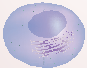

Nanoinfected cell

Cancer cell lines (including hard to transfect suspension cell lines)

Nanoparticles

Cell proliferation

First draft submitted: 3 April 2017; Accepted for publication: 4 May 2017; Published online: 17 May 2017

Keywords: cell proliferation • cell tracking • flow cytometry • fluorescent nanoparticles

• nanofection

Cell division, as the default status, is a sine qua noncondition for life [1]. In normal cells, the cell growth and division processes are tightly

controlled by complex mechanisms [2]. Many biological responses are related to changes in cell proliferation. For instance the abnormal

part of

10.2217/nnm-2017-0118 © 2017 Future Medicine Ltd

Nanomedicine (Lond.) (Epub ahead of print) ISSN 1743-5889

and uncontrolled cell proliferation is a hallmark of cancer cells [3], being crucial cell proliferation assays to control the division rate in cancer research. By contrast, the lack of proliferative ability of immune cells may indicate an immunodeficiency disorder. A key feature of the adaptive immunity is the T-cell proliferative responses to antigen stimuli [4]. Therefore, the measure of cell proliferation is essential in the assessment of the immune status. Among the wide variety of methods for measuring dividing cells, cell-labeling fluorescent dyes for monitoring proliferation are commercially available [5]. These exogenous reporters are chemical entities that interact with cellular components such as cell membrane (e.g., PKH lipophilic dyes), cytoplasm (e.g., CSFE) and nucleus (e.g., Hoechst 33342), and are distributed to daughter cells after each cell division, in a theoretically equal distribution, resulting in a progressive halving of the progeny fluorescence. This fluorescence intensity reduction can be quantified by conventional fluorescent techniques, the most used one being flow cytometry [5,6]. Although these fluorescent reporters are one of the most commonly used by the scientific community for the measurement of cell proliferation, they present some limitations such as alteration of the normal function of tracked cells, uneven distribution within the progeny population, rapid dilution during cell proliferation and high cytotoxic effects [5,6]. Consequently, there is a need for a safe and efficient alternative method to track successfully cell proliferation to overcome these limitations.

Over the last decade, our group has developed several nanotechnologies for preparing functionalized polystyrene nanoparticles (NPs) that are then conjugated to cargoes of different nature from small molecules (fluorophores, sensors and small drugs) to biomolecules (proteins and nucleic acids and their mimics). The main benefits of using polystyrene NPs are cellular environment is not degraded and there is no apparent toxicity to cells even in long-term studies [7]. Specifically surface-modified polystyrene NPs are homogeneous, exhibit a low polydispersity index and form stable colloids in biological fluids. These nanodevices have been extensively used as systems for in vitro applications [7–9]. Furthermore, these NPs enable solidphase multistep chemistries to become compatible with different bio-orthogonal strategies [10,11]. Easy entry in a broad range of cell types including adherent, suspensions and primary cell lines has been reported [8–12]. On the other hand, gene-expression profiling studies showed that these NPs did not induce any significant alteration in nanofected cell transcriptomes [13]. Recent proteomic studies showed no key regulators of cell cycle were affected by the internalization of these NPs, resulting in a parent-progeny transfer of the

nanofection load. Furthermore, NPs are not exported from the cells because externalization-exocytosis rate is negligible, allowing long-term monitoring [14], and their intracellular localization has been proved [15]. These properties make NPs ideal to be used as cell proliferation devices.

Herein, we present a novel approach to monitor cell proliferation based on the use of fluorescent bifunctionalized cross-linked polystyrene NPs (referred as fluorescent NPs). The alternative method is inspired by the use of cell-labeling dyes to quantify cell proliferation by fluorescence techniques but avoiding the limitations of the mentioned dyes by applying nanotechnology.

#### Materials & methods

Cell culture

Cell lines were provided by the cell bank of the CIC of the University of Granada. For this study we used: as model of adherent cells, the human breast cancer cell lines: MCF-7, MDA-MB-468 and MDA-MB-231; as model of suspension cells, the lymphoma cell line Raji (B-lymphoblastic) and two types of leukemia cell lines: K562 (erythroleukemic) and Jurkat (T-lymphoblastic). Adherent cell lines were cultured in DMEM base medium (Gibco) and suspension cell lines in RPMI base medium (Gibco) supplemented with 10% (v/v) fetal bovine serum (Gibco, Ashford, UK), 1% L-glutamine (Gibco) and 1% penicillin/streptomycin (Gibco) in a humidified incubator at 5% CO2 and 37°C. All cell lines tested negative for mycoplasma infection.

Preparation of fluorescent NPs

A total of 200 nm (PDI 0.089) amino functionalized polystyrene cross-linked NPs were prepared by dispersion polymerization following the protocol previously described [16]. PEGylation, bifunctionalization and dye conjugation were performed following a fluorenylmethyloxycarbonyl-1-(4,4-dimethyl-2,6-dioxacyclohexylidene)ethyl (Fmoc-Dde) ortoghonal strategy using Oxyma/DIC as coupling reagents (see Supplementary Figure 1 & Supplementary Information). The loading (mmol/g free amino groups) was calculated by conjugation of Fmoc-Glycine and quantification of Fmoc release analyzed by ultraviolet spectrophotometry. The effectiveness of the Cy5 conjugation was checked by flow cytometry with a FACSCanto II flow cytometer (Becton Dickinson & Co., NJ, USA) and by fluorescence microscopy with Confocal Scanning Microscope Zeiss LSM 710 (Supplementary Figure 1). As control Fmoc deprotected PEGylated 200 nm NPs, referred as naked NPs, were used. Dynamic light scattering and ζ potential were measured on a Zetasizer Nano ZS ZEN 3500 in molecular biology grade water in a disposable sizing cuvette for hydrodynamic size

10.2217/nnm-2017-0118 Nanomedicine (Lond.) (Epub ahead of print) future science group

measurements or clear disposable ζ cuvette for ζ potential measurements. The stability of NPs at 37°C in culture medium was tested at different time points by measuring the hydrodynamic size and ζ potential (see Supplementary Table 1).

Fluorescent NPs uptake study by flow cytometry

Adherents and suspension cell lines were incubated with the fluorescent NPs at the established incubation times in a humidified incubator at 5% CO2 and 37°C. Naked NPs were used as control (at the specific ratio cell/NPs), and cells without NPs treatment. After that, for adherent cells, they were detached and washed with PBS 1×; for suspension cells, the media was removed by centrifugation and washed once with PBS 1×. In the case of suspension hard-to-transfect cells, additional wash step adding a reducing agent (tris(2-carboxyethyl)phosphine, fluorochem) was done in order to quench possible binding NPs in the membrane extracellular side, avoiding fluorescence interference from unincorporated adsorbed NPs. Then, samples were fixed in 2% paraformaldehyde and analyzed via flow cytometry using FACSCanto II flow cytometer (Becton Dickinson & Co., NJ, USA). See Supplementary Information for detailed protocol.

Fluorescent NP-based proliferation assay

Cells were properly disposed to NP incubation as described above, using 1:25,000 cell:NPs ratio and 30 min of nanofection. Immediately after the incubation had finished, a sample of nanofected cells was fixed and named time 0. After that, the rest of the nanofected cells were plated and maintained using appropriate culture conditions for each cell line. Every day, a sample of the nanofected cells was fixed and named as the corresponding harvesting day (day 1, 2, 3, 4, 5, 6 and 7). Untreated and arresting cells treated with 0. 5 μg/ml of Mitomycin C (MCC) (Sigma) were used as a control. Once the assay was finished, all the samples were analyzed by flow cytometry. Data acquisition and analysis was performed using the BP 660/20 nm (APC filter) on a BD FACS Canto II Flow Cytometer with BD FACS Diva™ 61 software. Harvest cells from culture wells can also be analyzed directly without fixation step by flow cytometry for cell proliferation.

In vitro lymphocyte proliferation assay

Peripheral blood mononuclear cells (PMBCs) were thawed according to manufacture instructions in order to collect lymphocyte population. Nanofection protocol was adapted from suspension hard-to-transfect cells proliferation assay. See Supplementary Information for detailed protocol. Appropriate stimuli to induce pro-

liferation of lymphocyte subsets, phytohemagglutinin (PHA-P; Sigma), was used as a polyclonal T-cell mitogen at 2% and proliferation was analyzed by flow cytometry. CFSE assay was performed according to the manufacturer’s instructions as a control to monitor proliferation lymphocyte model assay.

#### Results

Optimization of the method

A monodispersed population of 200 nm amino functionalized cross-linked PS-NPs (PDI 0. 089) (Supplementary Figure 1A) was obtained by dispersion polymerization as previously described [16]. NPs were first functionalized with a polyethylene glycol (PEG) spacer PEGylation of PS-NPs ((2) Supplementary Figure 1A) was performed following a Fmoc solid phase protocol and using Oxyma/DIC as coupling reagents. This PEGylation increases the biocompatibility of the NPs, thereby facilitating their transport across cell membranes. The NPs were bifunctionalized following an orthogonal strategy based on the use of Dde and Fmoc protecting groups [17]. This bifunctionalization allows the labeling of the NP by conjugation of a near infrared fluorophore (Cy5) (activated as NHS ester) while keeping a defined amount of free amino groups to keep the positive surface charge of the NP. The stability of these NPs was tested. These NPs are stable at storage conditions (4°C, 2% solid content in water). In another hand, the stability at incubation conditions, (37 °C in culture media supplemented with serum) has been tested (see Supplementary Figure 1, Supplementary Table 1 & Supplementary Information for details of synthesis and characterization and stability studies).

Considering the requirements of fluorescent dye labeling procedures, the number of fluorescent NPs per cell and the incubation time required for obtaining a 100% of nanofected cells were calculated. The number of fluorescent NPs was calculated using a spectrometric-based method recently reported by us [18].

To optimize cellular uptake, three different ratios of fluorescent NPs per cell (1:12,500, 1:25,000 and 1:50,000; cell: fluorescent NPs) were interrogated at a fixed incubation time of 60 min using human breast cancer cell lines: MCF-7, MDA-MB-468 and MDAMB-231. Following incubation, cells were analyzed by flow cytometry and the percentage of cells which are nanofected – nanofection percentage – was calculated (Figure 1A). The data show that although there are high percentage of cells nanofected in all tested conditions, the required 100% value was reached when using the 1:25,000 ratio (cell:fluorescent NPs). Although 100% of cells are nanofected at one point, NPs uptake continues and the nanofection load increases proportionally to the number of NPs. For this reason, an analy-

future science group www.futuremedicine.com 10.2217/nnm-2017-0118

|MDA-MB-231  MDA MB 468  MCF7| | | | | |
|---|---|---|---|---|---|
| | | | | | |
| | | | | | |
| | | | | | |
| | | | | | |
| | | | | | |
| | | | | | |
| | | | | | |
| | | | | | |
| | | | | | |
| | | | | | |
| | | | | | |
| | | | | | |
| | | | | | |
| | | | | | |
| | | | | | |
| | | | | | |
| | | | | | |
| | | | | | |
| | | | | | |

12,50025,00050,00012,50025,00050,00012,50025,00050,000

60 min

| | | | |
|---|---|---|---|
| | | | |
| | | | |
| | | | |
| | | | |
| | | | |
| | | | |
| | | | |
| | | | |
| | | | |
| | | | |
| | | | |
| | | | |
| | | | |
| | | | |
| | | | |
| | | | |
| | | | |
| | | | |
| | | | |
| | | | |
| | | | |
| | | | |
| | | | |
| | | | |
| | | | |

UT

Time (min) 010203040506075010203040506075010203040506075

60 min

UT

60 min

UT

60 min

Suspension cell lines

UT

60 min

UT

60 min

UT

60 min

MDA-MB-231

MDA MB 468

UT

60 min

JURKAT

MCF7

UT

K562

RAJI

60 min

UT

| | | |
|---|---|---|
| | | |

100

10

150

200

20

100

80

60

40

20

0

0

∆MFI

∆MFI

| | | |
|---|---|---|
| | | |
| | | |
| | | |
| | | |
| | | |
| | | |
| | | |

|MDA MB 231  MDA MB 468  MCF7| | | | | | |
|---|---|---|---|---|---|---|
| | | | | | | |
| | | | | | | |
| | | | | | | |
| | | | | | | |
| | | | | | | |
| | | | | | | |
| | | | | | | |
| | | | | | | |
| | | | | | | |
| | | | | | | |
| | | | | | | |
| | | | | | | |
| | | | | | | |
| | | | | | | |
| | | | | | | |
| | | | | | | |
| | | | | | | |
| | | | | | | |
| | | | | | | |
| | | | | | | |
| | | | | | | |
| | | | | | | |
| | | | | | | |
| | | | | | | |
| | | | | | | |

01020304050607501020304050607501020 30 40 50 60 75

1:12,5001:25,0001:50,000 UT60 minUT60 minUT60 min

Adherent cell lines

Time (min)

MDA-MB-231

MDA-MB-468

MDA MB 231

MDA MB 468

MCF7

MCF7

100

10

10

90

80

60

50

40

30

20

0

0

% nanofected cells

∆MFI

10.2217/nnm-2017-0118 Nanomedicine (Lond.) (Epub ahead of print)

future science group

###### MDA MB 468

###### MDA MB 231

| | | | | | |
|---|---|---|---|---|---|
| | | | | | |
| | | | | | |
| | | | | | |
| | | | | | |
| | | | | | |
| | | | | | |

| | | | | | |
|---|---|---|---|---|---|
| | | | | | |
| | | | | | |
| | | | | | |
| | | | | | |
| | | | | | |
| | | | | | |

100

###### Cell cycle distribution (%)

100

Cell cycle distribution (%)

80

80

60

60

40

40

20

20

0

0

Cy5-NP Day 0

UT Cy5-NP Day 7

Cy5-NP

UT Cy5-NP

UT

UT

Day 0 Day 7

MCF7

| | | | | | |
|---|---|---|---|---|---|
| | | | | | |
| | | | | | |
| | | | | | |
| | | | | | |
| | | | | | |
| | | | | | |

100

Cell cycle distribution (%)

80

60

Sub-G1

G1

40

S G2/M

20

0

UT

UT Cy5-NP Day 7

Cy5-NP Day 0

JURKAT

RAJI

| | | | | | |
|---|---|---|---|---|---|
| | | | | | |
| | | | | | |
| | | | | | |
| | | | | | |
| | | | | | |
| | | | | | |

| | | | | | |
|---|---|---|---|---|---|
| | | | | | |
| | | | | | |
| | | | | | |
| | | | | | |
| | | | | | |
| | | | | | |

100

100

Cell cycle distribution (%)

Cell cycle distribution (%)

80

80

60

60

40

40

20

20

0

0

UT

UT Cy5-NP Day 7

UT Cy5-NP Day 0

UT Cy5-NP Day 7

Cy5-NP Day 0

Figure 1. Optimization of the nanofection method in the different tested cell lines. (A) Analysis of Cy5-NPs cellular uptakes by MDA-MB-231 (red), MDA-MB-468 (green) and MCF7 (blue). Cy5-NPs, at different ratios per cell, were incubated and analyzed by flow cytometry and percentage of cells containing Cy5-NPs is displayed. Saturation percentage is represented above dotted line. (B) Study of median of fluorescence intensity increments (ΔMFI) at different Cy5-NPs ratios per cell (12,500, 25,000 and 50,000) compared with cells without NP treatment. Values for cells incubated with Cy5-NPs for 60 min and untreated cells (UTs) are shown. (C & D) Study of median of fluorescence intensity increments (ΔMFI) at different incubation time points. (C) Strong colors panel shows results for adherent cell line models and (D) light colors panel represents suspension cell line models. (E) Cell cycle distribution in cell lines before and after long-term nanoparticle incubation. The percentages of cells in different phases of the cell cycle were determined from the histograms by flow cytometry. Adherent cell lines (upper and middle panels) and suspension hard to transfect cell lines (lower panels) were tested. Graphs summarize data from initial (Day 0) and final (Day 7) experimental time points. Bars represent mean ± SEM of results from three independent experiments with duplicated points. Cy5-NP: Fluorescence nanoparticle; UT: Untreated cell.

future science group

www.futuremedicine.com 10.2217/nnm-2017-0118

sis of the median of fluorescence intensity increments (ΔMFI = MFI nanofected/MFI non-nanofected) was performed to obtain information about nanofection load (Figure 1B). This analysis reveals that the larger the number of NPs, the greater the cellular uptake. It observes that the increase of the nanofection load – ΔMFI units – is doubled when the fluorescent NPs per cell are doubled (Figure 1B). This feature allows controlling nanofection loads which is crucial to determine the labeling incubation times. As expected, the uptake capability – nanofection load – of the different cell lines differ between them so these times need to be adjusted for each cell type. To corroborate that fluorescence detected by flow cytometry was generated by NPs located inside cells rather than NPs absorbed on the cell membrane, a confocal microscopy analysis was carry out. Confocal images for three orthogonal axes of the NP uptake are shown in Supplementary Figure 2. It was observed the intracellular location of these NPs.

To further optimize the nanofection protocol, we performed a deeper study of the nanofection behavior in a time course assay to determine the influence of the incubation time. We analyzed the nanofection percentage and nanofection load at different established time points (10, 20, 30, 40, 50, 60 and 75 min) using the ratio 1:25,000 (cell:fluorescent NPs) (Figure 1C & D). The ΔMFI analysis shows that the phenomenon of doubling nanofection load also occurs when the time is doubled (Figure 1C). On the other hand, after 30 min of incubation, the 100% of all adherent cell lines were nanofected (Supplementary Figure 3). Moreover, a proportional increase of the nanofection load relative to the incubation time is observed. Then the specific value of ΔMFI units can be control by tuning the incubation time.

Once this method was optimized with adherent cells, human erythroleukemic cell line K562 was used as suspension cell model in order to evaluate the options of the method. Results obtained with K562 presented the same features as when using adherent cells in terms of nanofection load and percentage

- (Figure 1D). Furthermore, to verify the feasibility of this method, suspension hard-to-transfect cells, such as lymphoma cell lines Jurkat and Raji, were evaluated. Proportional increase of the nanofection load related to incubation time was also shown (Figure 1D). In both cases, the best ratio cell:fluorescent NPs was 1:25,000 and optimum incubation time was 30 min.

An important aspect to keep in mind when developing methods for proliferation monitoring is their potential cytotoxicity. The cell cycle was evaluated by flow cytometry following propidium iodine staining. Evidence of cell death was not observed in any cell line

- (Figure 1E). None of them presented a significant incre-

ment in the subG1 population after NPs treatment, showing any toxic effect. Instead, perfect matches between cell cycle profile of untreated and nanofected cells were observed after 7 days of incubation. There is not a significant difference between the percentage of cells in each phase of the cell cycle in any condition (p < 0. 05) (Figure 1D & Supplementary Figure 4A). Additionally, a long-term tetrazolium-based toxicity assay to assess mitochondrial function was performed in NPtreated cells compared with untreated cells using two different NP:cell ratios. Same proliferation level was maintained in all conditions tested and no substantial metabolic changes due to NP treatment were observed (Supplementary Figure 4B). These results suggest that nanofection load can be controlled in a robust manner through concentration and incubation time and cell– NP interaction does not adversely affect cell viability.

Predictive calculation of optimum range of nanofection

In this study, ΔMFI analysis revealed that median of fluorescence intensity decreases over time, and importantly this empirical observation was evident in all cell lines tested. Surprisingly, this fluorescence decay was differed dependent on cell line. These data supported possibility of use doubling time as a key parameter for cellular-based assays using NPs in order to optimize cellular uptake. Previous simulations predict an exponential decay of the average number of NPs per cell with a decay constant given by where is the cell population doubling time [19]. Therefore, we propose a mathematics approximation to predict the correct NPs amount to be able to monitor cell proliferation. Accordingly, previous optimization assay will not be required for using this method with new cell lines. As mentioned above, time-point assay can be determined by calculating the nanofection load values together with population doubling time. Cells can theoretically be monitored until complete dilution of fluorescents NPs, in other words, when ΔMFI decrease to 1 unit. This end point is reached when median fluorescence intensity of nanofected cells is equal to median fluorescence intensity of non-nanofected cells (background). However, this fluorescent NPs dilution is also influenced by population doubling times of cell lines. In the division process of a nanofected cell, a parent-progeny transfer of NPs is produced. After each division, the nanofection load halves into daughter cells reducing fluorescence intensities – nanofection load – to half. This results in an exponential decay of the fluorescence division after division. This force us to consider the ratio ‘nanofection load: population doubling times’ for long-term assay.

With this purpose, we calculate population doubling times of adherent and suspension cell lines. We

10.2217/nnm-2017-0118 Nanomedicine (Lond.) (Epub ahead of print) future science group

observed that considering the number of cell divisions of each cell line in specific period of time, we can estimate the optimal range of nanofection load – ΔMFI units – that we need in order to monitor cells during that period of time. Applying the general formula that is used for exponential growth and decay formula we know the optimal ΔMFI value require at the start of the experiment:

## Y = Y0κx

Y = ΔMFI units at the end of the experiment (equal to 1) Y0 = ΔMFI units at the start of the experiment κ = Reduction rate constant (equal to 0.5; after each division the ΔMFI units are reduced to the half) X = Number of divisions of each cell line in an specific period (days)

By applying this formula, an estimation of the initial range of nanofection load can be calculated. We applied that formula to our experimental data with MDAMB-231, MDA-MB-468 and MCF-7 cell lines. The doubling time is respectively 38, 40 and 43 h. Typical monitoring proliferation assays take 7 days. During this time, MDA-MB-231 cells divide 4.4-times, MDAMB-468 cells 4.2-times and MCF7 3.9-times. In contrast, suspension hard-to-transfect cells, Jurkat and Raji, proliferate faster. In consequence their doubling time is lower (23 and 25 h, respectively) and their division ratio in 7 days higher (7.30- and 6.72-times). In particular, using this predictive approach we found that to monitor MDA-MB-231, MBA-MB-468 and MCF7 cells, an initial nanofection load of around 21.4, 18.4 and 15 ΔMFI units, respectively, would be required. In the case of suspension hard-to-transfect cells, which have greater division ratio, higher ΔMFI units would be required (158.1 for Jurkat cells and 105.4 for Raji cells) (Supplementary Table 2). Remarkably, using the ratio 1:25,000 (cell:fluorescent NPs), these ΔMFI values were obtained for all cell lines with a 30 min incubation time (Figure 1C & Supplementary Figure 5). These results confirm the predictive value of this mathematics approach. Using this exponential decay formula, an estimation of a range of fluorescence intensity initial can be successfully calculated.

Validation of this method

Once all parameters were efficiently established (concentration and time of incubation together with doubling time), we tested this novel method for tracking cell proliferation. For this purpose, a long-term assay of cellular monitoring was performed. Adherent and hard-to-transfect suspension cells were nanofected (25,000 NPs per cell, 30 min). Following nanofec-

tion, fluorescent NPs were distributed to daughter cells resulting in a progressive halving of the progeny fluorescence (Figure 2A, top panel). This reduction of fluorescence intensity was quantified by flow cytometry. In order to monitor cell populations, harvesting was done at different time points (every 24 h). First, percentage and load of nanofection were analyzed at initial time (Day 0) (Supplementary Figure 6). Flow cytometry plots are shown in Figure 2B–D. During the progression of the assay, the reduction of nanofection load was clearly observed (Figure 2B). ΔMFI was near 1 at day 7, validating the use of exponential decay formula to optimize the nanofection parameters (Figure 2C & D).

To reinforce the feasibility of this method, an assay to monitor the reduction of cell proliferation was set up. For this purpose, cell proliferation was reduced by treatment with MCC, a cytotoxic drug that induces cell cycle arrest in G2/M phase as consequence of DNA damage. In a first stage, the cytotoxic effect of this drug was determined by flow cytometry analysis using propidium iodide staining (Supplementary Figure 7). The arrest in G2/M impedes that cells initiate mitosis, producing a stop of cell division. According to this, cells do not proliferate after MMC treatment; therefore, if the cells are nanofected, they should maintain the nanofection load after MMC treatment (Figure 2A, bottom panel). With this purpose we monitored nanofected cells after MMC treatment. Following nanofection step, nanofected cells were treated with MCC and cell proliferation was monitored for 7 days. Cells’ samples were fixed at different time points and analyzed by flow cytometry. Figure 2E shows the results of analysis of cell arrest based on this method. As expected, untreated cells suffered a complete loss of the fluorescence at day 7, a reduction which was progressive day by day according to an exponential decay. However, the fluorescence intensity of MMC-treated cells remained at day 7; there was not a reduction of fluorescence intensity compared with day 0 meaning that proliferation had stopped. These data confirm the feasibility of the presented method. In the particular case of suspension cells (Raji and Jurkat), an unexpected reduction of the fluorescence is observed in treated cells with MCC. This can be the result of high doubling times of these cells and delayed effect of MCC. This was confirmed by the time course monitoring of the MCC effect in these cells. At Day 4 (96 h), a significant difference was observed and, consequently, the effect of this drug can be studied after 96 h, time at which MMC treatment was totally effective (Supplementary Figures 7 & 8).

Monitoring primary lymphocytes proliferation

Success of adaptive immune system depends on lymphocyte proliferation. The ability to accurately predict

###### Figure 2. Validation of the nanofection method in order to monitor cell proliferation (also see facing page and overleaf). (A)Schematic representation of cell labeling by

dashed histograms represent 7 days incubation time point, whereas the filled histograms depict initial experimental time point. Each panel shows a comparison between

arrested, nanoparticles have not been split and fluorescence intensity is maintained over time (dashed blue histogram). Each histogram is representative of at least three

nanofection and the nanoparticle distribution into daughter cells, in a theoretically equal distribution, resulting in a progressive halving of the progeny fluorescence.(B)

adherent cell lines and(D)suspension hard to transfect cell lines,(E)Flow cytometry analysis of untreated and nanofected cell lines after Mitomycin C treatment. Open

Representative histogram plots of untreated cells (dark peak) compared with Cy5-NPs treated cells (light peaks) at day 0, 2, 4 and 7. Reduction of the nanofection load

Δwas observed over the days.(C & D)Flow cytometry was performed every 24 h and increment of median fluorescence intensity measured (MFI) is represented for(C)

untreated cells (gray filled histogram) and cells treated with Cy5-NP (25,000 added per cell) for 30 min (blue filled histogram). The graphs show that fluorescence

intensity decrease after 7 days of incubation due to cell division (dashed red histogram) compared with initial fluorescence. In contrast, in cells which cell cycle is

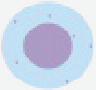

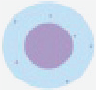

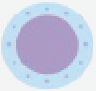

0 division1 division2 divisions3 divisions

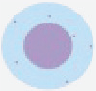

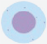

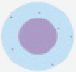

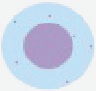

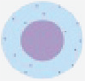

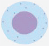

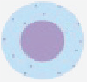

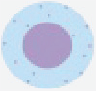

experiments and shows percentage of maximum (y axis) versus log fluorescence intensity (x axis) for 10,000 viable cells.

Stop cell

division

###### Parent progeny nanoparticles transfer – Fluorescence reduction

NH2

NH H

CHO2

H

O

Cytostatic drug

O

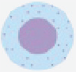

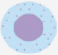

treatment

NCH2

O

O

NH2

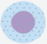

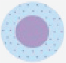

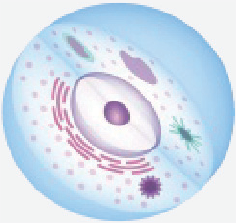

Cy5-NP: Fluorescence nanoparticle.

Nanofected cell

Nanoparticles

1010100345

8 10Day 0

Day 2

###### Day 4

###### Day 7

RAJI

Adherent cellsSuspension cells

-103

0 20

80 100

40 60

80 100

40 60

20

0

80 100

4 6

2

0

40 60

20

0

1010100345

Day 2 0

Day 4 0

###### Day 7

###### 100Day 0

JURKAT

-103

0

80 100

40 60

0 20

60 80

20 40

100

60 80

20 40

100

60 80

20 40

1010100345

80 100Day 0

Day 2

###### Day 4

###### Day 7

Cy5 fluorescence

MCF7

-103

80 100

40 60

0 20

40 60

20

80 100

40 60

20

80 100

40 60

20

0

0

0

1010100345

80 100Day 2

80 100Day 4

###### Day 7

80 100Day 0

###### MDA-MB-468

-103

80 100

40 60

0 20

40 60

20

0

40 60

20

0

40 60

20

0

1010010345

100Day 2 0

Day 4 0

###### Day 7

100Day 0 MDA-MB-231

-103

0

80 100

40 60

0 20

60 80

20 40

100

60 80

20 40

60 80

20 40

Events (% of maximum)

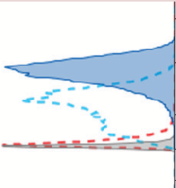

-1010101003345

JURKAT

Time (days) 0123456701234567

RAJI

RAJI

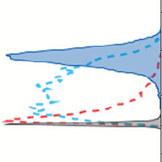

-1010101003345

JURKAT

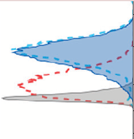

-1010101003345

150

60 125

50

40

30

20

10

0

∆ median fluorescence intensity (units)

MCF7

012345670123456701234567

MDA MB 231

MDA MB 468

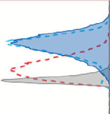

MCF7

-1010101003345

MDA-MB-468

Fluorescence intensity (APC)

Time (days)

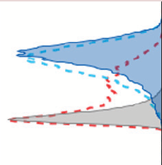

1010010345

MDA-MB-231

5

0

25

20

15

10

∆ median fluorescence intensity (units)

-103

100

0

80

60

40

20

Events (% of max)

proliferative behavior of lymphocytes has important implications for human health research. Standard methods to measure cell proliferation based on fluorescent dyes are particularly toxic in this kind of cell [20]. Therefore, alternative methods that were not cytotoxic are required. This fact led us to assess our method for measuring lymphocyte proliferation. For this purpose, in the first stage, the NP uptake capacity of isolated human primary PBMC (monocyte depleted-PBMCs) was tested. PBMCs were incubated with Cy5-NP and the efficiency of NPs internalization was analyzed by confocal fluorescence microscopy and flow cytometry. A confocal fluorescence microscopy confirmed the NPs intracellular localization just after nanofection (Figure 3A). In parallel, a flow cytometry analysis was performed. It was found that our nanofection parameters managed to reach 90% nanofected population (Figure 3B & C). Nanofected population percentages can increase by varying incubation time and number of added NPs per cell.

Once the efficiency of cellular labeling using NPs was proven, and in order to assess our method for measuring lymphocyte proliferation, the PBMCs were nanofected and stimulated to induce their proliferation. The analysis was performed following 7 days after PHA-induced proliferation. The nanofection load practically disappeared due to the induced lymphocyte proliferation. In fact, fluorescence intensity decrease was gradually observed over days due to Cy5-NPs dilution between the progeny as consequence of induced cell division (Figure 3D). At day 7, the histogram plot shows a slight peak of positive population which corresponds to nonproliferative cells, something expected due to the fact that, following stimulation step, not all cell population participate in the division (Supplementary Figure 9A). Overall, the data confirms the absence of deleterious effect of Cy5-NPs in the PBMC viability.

In order to confirm our data, comparison of our nanotechnology-based method with the wide accessible and most popular method to measure lymphocyte proliferation (intracellular fluorescent dye, CFSE) was performed [20–22]. We confirmed that substantial cell proliferation was evident only after 3 days of culture as common feature of T and B cells responding to mitogens and specific antigens. CFSE dye dilution was observed in the tested successive time points (Supplementary Figure 9B). The data validate the applicability of the method to measure lymphocyte proliferation.

#### Discussion

A good candidate for tracking cell proliferation using fluorescence techniques must have certain specific characteristics such as having bright fluorescent features, being readily taken up by cells, being evenly dis-

tributed within progeny cells, displaying slow dilution rates and being non cytotoxic[5,6]. The main advantages of using NPs rather than classical approaches are that: they are more stable than fluorophore in solution [15], the fluorescence signal does not decrease rapidly during the first 24 h after labeling, then zeroth generation can be set up using cell sample from day 0 [23] and they can be used to track a broad range of cellular types without any cytotoxic effect allowing its application in many biological/biomedical research fields [18]. To the best of our knowledge, cell clone formation assay based on nanotechnology imaging technique by using Quantum dot, has been the only reported to date to study the proliferative features [19]. In this work, we have evaluated a nanotechnology-based method to monitor cell proliferation by analyzing these properties that a good candidate for tracking cell proliferation must offer. To do so, we have used 200 nm PS NPs labeled with a near infrared fluorophore (Cy5) to be able to evaluate these nanodevices by fluorescent techniques. However, other fluorophores of different nature could be used instead of Cy5. On the other hand, the role of surface charge of polystyrene NPs on cellular uptake is still controversial. Carboxylated PS-NPs were ingested to a higher degree by alveolar type I cells [24], whereas preferential uptake of cationic PS-NPs has been observed in Madin Darby canine kidney cells [25]. However, as previously reported, we have found that the presence of free amino groups on the NP surfaces is essential to allow an efficient cell labeling [26]. Based on these findings, we have designed a nanodevice that contain a defined amount of free amino groups to ensure an efficient cellular uptake with high rate, allowing an effective internalization and consequently an efficient cell labeling to be able to monitor cell proliferation in long term assays. NPs do not present cytotoxic effects in the cell lines tested, being this in fact is an essential characteristic therefore making them an ideal method to monitor cell proliferation. Interestingly, this method could be implemented using NPs of different nature as far as they do not affect cell viability.

We demonstrated that these nanodevices are readily taken up by the cells, and they present slow dilution and non effect on the cell function. On the other hand, it is already accepted that NPs are split between daughter cells when the parent cell divides [26]. Whether their distribution is equal during cell division still remains controversial. Future work could be focused on the determination of NP dose in a statistical framework by imaging microscopy using our fluorescent NPs as nanotracker. Nevertheless our results support the efficiency of this method. We have proven that the measurement of ΔMFI is a reliable parameter to monitoring the linearity over time, regardless of eventual asymme-

50k100k0150k200k250k

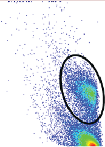

-1010101003345

Cy5-NP treatment

FSC

APC

100

80

60

40

20

105

104

103

-103

0

0

SSC

Count

50k100k0150k200k250k

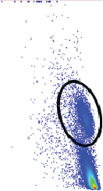

1010100345

Untreated

FSC

APC

-103 0

500

105

104

-103

-103

0

2.0k

1.5k

1.0k

Count

SSC

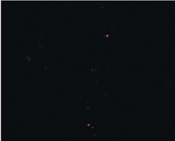

MergeCy5-NP

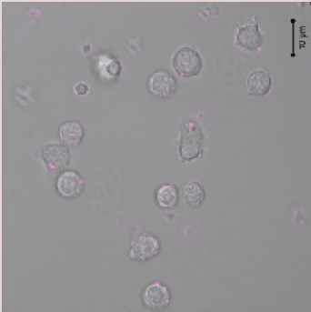

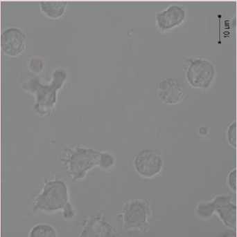

proliferation of lymphocytes stimulated (bottom panel). Left panel: Merge, composition of the two recorded channels (DIC– Differential interference contrast – and red,

lymphocytes after 30 min Cy5-NP incubation. The results show lymphocytes population is not affected when Cy5-NPs were used.(C)Nanofected population (red) after

fluorescence microscopy to confirm Cy5-NPs internalization by freshly isolated lymphocytes (top panel) and demonstration of Cy5-NPs dilution after 7 days caused by

μCy5-NPs). Right panel: red channel, Cy5-NPs. Scale bar, 10m.(B)Analysis of the specific lymphocyte populations depending on treatment provided. Freshly isolated

lymphocytes were subjected to the same procedure without nanoparticles (represented in left panel) and they were considered as untreated cells; right panel shows

30 min of Cy5-NPs incubation versus untreated cells (blue) represented by dot plots.(D)Fluorescence intensity dilution over days in PHA-induced lymphocytes (open

Figure 3. Demonstration of Cy5 labeling lymphocytes and proliferation detection and monitoring of proliferating lymphocytes (also see facing page).(A)Confocal

histograms) versus untreated cells (filled gray histogram). Results are from a representative experiment.

Cy5-NP: Fluorescence nanoparticle; DIC: Differential interference contrast.

try. MFI is more robust than mean values and heterogeneity from cell to cell is considered [27]. On the other hand, because it is known that used hard-to-transfect cells are specialized in avoiding uptake, we considered that NPs could be remained associated to membrane cells. Thus, we included an additional wash step in the nanofection protocol. Hence, we have discriminated between NPs absorbed on the cell membrane or NPs internalized inside the cell, providing solid correlation between fluorescent signal observed and proliferation. Regarding cell cycle stage, differences in cellular NP uptake levels have been previously reported [26]. However, these differences are not evident during the first 5 h of exposure. Consequently, as shorter incubation time is needed in this methodology (only 30 min), there is no influence of cell cycle phase in the uptake of these NPs.

Changing parameters such as concentration and time of incubation, the nanofection load can be controlled in a robust manner in order to reach an optimum MFI initial value. We have demonstrated that 25,000 NPs and short period of nanofection time (30 min) were adequate to achieve satisfactory MFI values to monitor cell proliferation during 7 days. Likewise, same MFI values could be accomplished applying lower number NPs added per cell and higher incubation time. Even so, the highest ratio that has been used for this method is 50,000 NPs added per cell. However, in previous work, higher concentration without observing any cytotoxic effect was successfully used [18]. Accordingly, the use of this method allows the fluorescence labeling of cells with high intensity and reproducibility (very low variance). In fact, this is a method of broad application as the unique cell requirement to be able to monitor cell proliferation using this nanotracker is efficient internalization [27].

Because these NPs are not exocytosed by cells as previously was reported [28], make them an excellent candidate for cell proliferation monitoring, as the only thing diluting the signal is the division of the cell in two daughter cells. The fact that these NPs are not toxic for any cell lines tested so far is also of remarkable importance as they do not affect the cell function. Indeed, lymphocyte viability after NP internalization and PHA-induced proliferation has been demonstrated. This observation suggests that NPs are nontoxic in systems cultured with less serum (such as PMBC), as it was previously reported [29], allowing this methodology to be considered in different physiological media.

It is important to mention that, due to the fact that these fluorescent NPs are labeled with a far red dye, then a multicolor flow cytometry assay can be set up as before reported [19], but without interference of the

1010100-103543

Day 0Day 7Day 3

Fluorescence intensity (APC)

100

40

80

60

20

0

Events (% of max)

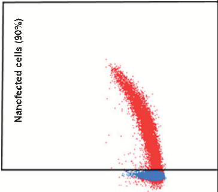

-1010101003543

Nanofected cells (90%)

Fluorescence intensity (APC)

105

104

103

-103

0

SSC

future science group

www.futuremedicine.com 10.2217/nnm-2017-0118

nanodevices with other fluorophores labeled reagents (such as fluorescein-labeled antibodies), therefore avoiding cell autofluorescence.

Finally, we have proposed the use of NP-based cell tracker as a potential tool to monitor lymphocyte proliferation minimizing toxicity, and thereby being required lower initial lymphocytes number to assess. Our methodology has also proven beneficial for in vitro studies as possible alternative for the current cell tracking using fluorescent protein and membrane dyes [21,30].

#### Conclusion

The method has been validated in several adherent cells and also in suspension cells including hard-to-transfect cells. Even more interesting is the fact that monitoring of cell proliferation of lymphocytes has been successfully achieved (so far the only efficient method to do this lymphocytes monitoring is CFSE staining). The method was also validated in a cell-based assay which determined the induced cellular arrest through MMC effect, showing the power of the method for long-term cellular assays. Furthermore, this new method does not alter the cell cycle hence presenting no cytotoxic effects. This fact corresponds to previously findings where NPs were never found associated with any components of the mitotic apparatus and no abnormal cell division was detected after their internalization [31].

In conclusion, an alternative method to monitor cell proliferation, which can be used with a large variety of cell lines for long-term cellular assays, is presented. We

propose the use of NPs as an accessible tool to track cell proliferation for any laboratory which could access nanotechnology-based approaches.

Acknowledgements

The authors thank SciToons team (http://scitoons.com/en/ home_en/) for their advice to prepare artwork included in Figure 2A.

Financial & competing interests disclosure

This research was partially supported by Marie Curie Career Integration Grants within the 7th European Community Framework Programme (FP7-PEOPLE-2011-CIG Project Number 294142 and FP7-PEOPLE-2012-CIG Project Number 322276), the Consejería de Economía, Innovación, Ciencia y Empleo de la Junta de Andalucía (Convocatoria de Proyectos de Investigación de Excelencia para el año 2012, BIO-1778) and the Ministry of Economy and Competitiveness (National Programme for Research Aimed at the Challenges of Society, BIO2016-80519-R). JD Unciti-Broceta thanks Spanish Ministerio de Economía y Competitividad for a Torres Quevedo fellowship (PTQ-13-06046) and T Valero-Griñan thanks the Consejería de Economía, Innovación, Ciencia y Empleo de la Junta de Andalucía for an EU funded FP7 postdoc Talentia Fellowship (FP7-TALENTIA- POSTDOC-267226). The authors have no other relevant affiliations or financial involvement with any organization or entity with a financial interest in or financial conflict with the subject matter or materials discussed in the manuscript apart from those disclosed.

No writing assistance was utilized in the production of this manuscript.

|Summary points|
|---|
|• An efficient nanotechnology fluorescence-based method to track cell proliferation has been validated. • Polystyrene nanoparticles (NPs) have been successfully synthesized, PEGylated, funtionalized, fluorescently labeled and characterized. • These NPs have been assessed for in vitro long-term monitoring of cell proliferation in several adherent and suspension cells including hard-to-transfect cells and isolated human primary lymphocytes. • These NPs are stable and not toxic for any cell lines tested so far. |

#### References

- 1 Sonnenschein C, Soto AM. The Society of Cells: Cancer and Control of Cell Proliferation. Bios Scientific Publishers Limited, UK (1999).
- 2 Rhind N, Russell P. Signaling pathways that regulate cell division. Cold Spring Harb. Perspect. Biol. 4(10), pii: a005942

(2012).

- 3 Hanahan D, Weinberg RA. Hallmarks of cancer: the next generation. Cell 144(5), 646–674 (2011).
- 4 Rezaei N, Bonilla FA, Seppänen M et al. Introduction on primary immunodeficiency diseases. In: Primary Immunodeficiency Diseases: Definition, Diagnosis, and Management. Rezaei

N, Aghamohammadi A, Notarangelo LD (Eds). Springer Berlin Heidelberg, Berlin, Heidelberg, 1–81

(2017).

- 5 Progatzky F, Dallman MJ, Lo Celso C. From seeing to believing: labelling strategies for in vivo cell-tracking experiments. Interface Focus 3(3), 20130001 (2013).
- 6 Tario JD, Humphrey K, Bantly AD, Muirhead KA, Moore JS, Wallace PK. Optimized staining and proliferation modeling methods for cell division monitoring using cell tracking dyes. J. Vis. Exp. (70), e4287 (2012).
- 7 Loos C, Syrovets T, Musyanovych A et al. Functionalized polystyrene nanoparticles as a platform for studying bio– nano interactions. Beilstein J. Nanotechnol. 5, 2403–2412

(2014).

10.2217/nnm-2017-0118 Nanomedicine (Lond.) (Epub ahead of print) future science group

- 8 Borger JG, Cardenas-Maestre JM, Zamoyska R, SanchezMartin RM. Novel strategy for microsphere-mediated DNA transfection. Bioconjug. Chem. 22(10), 1904–1908 (2011).
- 9 Yusop RM, Unciti-Broceta A, Johansson EM V, SánchezMartín RM, Bradley M. Palladium-mediated intracellular chemistry. Nat. Chem. 3(3), 241–245 (2011).
- 10 Unciti-Broceta A, Díaz-Mochón JJ, Sánchez-Martín RM, Bradley M. The use of solid supports to generate nucleic acid carriers. Acc. Chem. Res. 45(7), 1140–1152 (2012).
- 11 Cardenas-Maestre JM, Panadero-Fajardo S, Perez-Lopez AM et al. Sulfhydryl reactive microspheres for the efficient delivery of thiolated bioactive cargoes. J. Mater. Chem. 21(34), 12735 (2011).
- 12 Tsakiridis A, Alexander LM, Gennet N et al. Microspherebased tracing and molecular delivery in embryonic stem cells. Biomaterials 30(29), 5853–5861 (2009).
- 13 Alexander LM, Pernagallo S, Livigni A, Sánchez-Martín RM, Brickman JM, Bradley M. Investigation of microspheremediated cellular delivery by chemical, microscopic and gene expression analysis. Mol. BioSyst. 6(2), 399–409 (2010).
- 14 Kim JA, Åberg C, Salvati A, Dawson KA. Role of cell cycle on the cellular uptake and dilution of nanoparticles in a cell population. Nat. Nanotechnol. 7(1), 62–68 (2011).
- 15 Cárdenas-Maestre JM, Pérez-López AM, Bradley M, Sánchez-Martín RM. Microsphere-based intracellular sensing of Caspase-3/7 in apoptotic living cells. Macromol. Biosci. 14(7), 923–928 (2014).
- 16 Unciti-Broceta A, Johansson EM V, Yusop RM, SánchezMartín RM, Bradley M. Synthesis of polystyrene microspheres and functionalization with Pd0 nanoparticles to perform bioorthogonal organometallic chemistry in living cells. Nat. Protoc. 7(6), 1207–1218 (2012).
- 17 Díaz-Mochón JJ, Bialy L, Bradley M. Full orthogonality between Dde and Fmoc: the direct synthesis of PNA–peptide conjugates. Org. Lett. 6(7), 1127–1129 (2004).
- 18 Unciti-Broceta JD, Cano-Cortés V, Altea-Manzano P, Pernagallo S, Diaz-Mochon JJ, Sanchez-Martin RM. Number of nanoparticles per cell through a spectrophotometric method – a key parameter to assess nanoparticle-based cellular assays. Sci. Rep. 5, 10091 (2015).
- 19 Geng X-F, Fang M, Liu S-P, Li Y. Quantum dot-based molecular imaging of cancer cell growth using a clone formation assay. Mol. Med. Rep. 14(4), 3007–12 (2016).

- 20 Parish CR. Fluorescent dyes for lymphocyte migration and proliferation studies. Immunol. Cell Biol. 77(6), 499–508

(1999).

- 21 Parish CR, Glidden MH, Quah BJC et al. Use of the intracellular fluorescent dye CFSE to monitor lymphocyte migration and proliferation. In: Current Protocols in Immunology. John Wiley & Sons, Inc., NJ, USA, 4.9.1– 4.9.13 (2009).
- 22 Quah BJC, Warren HS, Parish CR. Monitoring lymphocyte proliferation in vitro and in vivo with the intracellular fluorescent dye carboxyfluorescein diacetate succinimidyl ester. Nat. Protoc. 2(9), 2049–2056 (2007).
- 23 Chung S, Kim S-H, Seo Y, Kim S-K, Lee JY. Quantitative analysis of cell proliferation by a dye dilution assay: application to cell lines and cocultures. Cytom. Part A doi:10.1002/cyto.a.23105 (2017) (Epub ahead of print).
- 24 Kemp SJ, Thorley AJ, Gorelik J et al. Immortalization of human alveolar epithelial cells to investigate nanoparticle uptake. Am. J. Respir. Cell Mol. Biol. 39(5), 591–597 (2008).
- 25 Fazlollahi F, Angelow S, Yacobi NR et al. Polystyrene nanoparticle trafficking across MDCK-II. Nanomed. Nanotechnol. Biol. Med. 7(5), 588–594 (2011).
- 26 He C, Hu Y, Yin L, Tang C, Yin C. Effects of particle size and surface charge on cellular uptake and biodistribution of polymeric nanoparticles. Biomaterials 31(13), 3657–3666

(2010).

- 27 Treuel L, Jiang X, Nienhaus GU. New views on cellular uptake and trafficking of manufactured nanoparticles. J. R Soc. Interface 10(82), 20120939 (2013).
- 28 Kim JA, Åberg C, Salvati A, Dawson KA. Role of cell cycle on the cellular uptake and dilution of nanoparticles in a cell population. Nat. Nanotechnol. 7(1), 62–68 (2011).
- 29 Hsiao I-L, Huang Y-J. Effects of serum on cytotoxicity of nano- and micro-sized ZnO particles. J. Nanopart. Res. 15(9), 1829 (2013).
- 30 Tario JD, Muirhead KA, Pan D, Munson ME, Wallace PK, Wallace PK. Tracking immune cell proliferation and cytotoxic potential using flow cytometry. Methods Mol. Biol. 699, 119–164 (2011).
- 31 Liu Y, Li W, Lao F et al. Intracellular dynamics of cationic and anionic polystyrene nanoparticles without direct interaction with mitotic spindle and chromosomes. Biomaterials 32(32), 8291–8303 (2011).

future science group www.futuremedicine.com 10.2217/nnm-2017-0118

